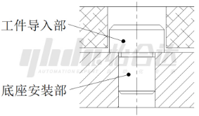
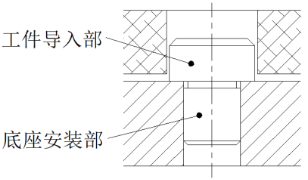
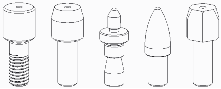
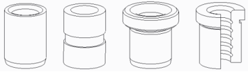
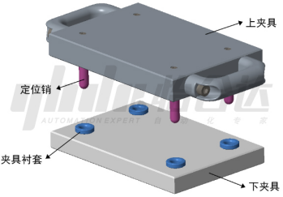

# 销和衬套-产品知识介绍

### **一、定义**

 销：

​    1.定位销：是以工件孔作为定位基准或者配合衬套使用，参与限制物体自由度的零件，是确定和保证零件之间正确的相对位置的最常用定位零件。在制造业生产和装配期间实现工件的定位和固定作用。

​    2.连接销：可以用于轴和轮毂或其它零件之间的连接，并可传递不大的载荷。

 

​    衬套：

​    衬套与定位销组合使用，实现导向作用的定位零件。衬套硬度略低于定位销，有效保护定位销快速磨损，保证定位精度。衬套磨损后易于更换，有效保护底板或工件的损坏。

### **二、特点**

 1.工作表面高精度

 2.足够强度和刚性

 3.较高耐磨性

 4.良好工艺性（加工/装配/更换）

 5.结构和功能选型多种多样

### **三、应用行业**

医疗、半导体、锂电池、电子电器、智能手机、机器人、机床制造和机械加工、高精密模具、汽车自动化装备制造等领域。

### **四、形状种类**

**销类**

说明：销类产品在具体使用时，根据两端在定位和连接中所承担的角色，人为习惯地将销子两端分别称之为安装端和工件端。安装端起安装固定作用不经常拆卸，工件端起定位和传递相对运动方向的作用，通常实现“插”，“拔”的频繁性动作，工件端是销子使用寿命和精度保持性的最重要部位。

 1.工件导入部

​    ①头部大小：大头型、小头型

​    ②头部截面：圆头型、多棱型（菱形/三角形）

​    ③头部形状：直杆、锥角形、圆弧形、球面、平头、带肩

2.底座安装部：压入型、内螺纹型、外螺纹型、环槽型、切口型

3.功能用途：标准销、铰链销、悬臂销、台阶螺栓、滚动轴销、夹具用定位销

**衬套**

 1.连接方式：标准型、带肩型、法兰型、防脱落型（环槽/切口）

 2.结构特点：薄壁型、长圆孔型、自润滑型、铜合金型

### **五、选型建议**

 1.根据工况选择合理尺寸公差和精度要求的产品型号。

 2.如对产品防锈能力有较高要求，请优先考虑选用SUS304不锈钢和表面防锈涂层处理的产品系列，表面涂层的防锈能力：镀硬铬/镀镍>发黑>无表面处理；

### **六、保养说明**

 1.定期喷涂防锈油，保持低温度、湿度的工作和存储环境。

 2.带外螺纹或内螺纹紧固的销子，建议参照连接螺栓的强度等级选取合理的初期紧固力，如果螺纹部长期处于过载状态，将会缩短产品使用寿命甚至出现过载断裂。

 3.保证销子和衬套的安装孔尺寸公差和表面粗糙度可以延长产品使用寿命。

### **七、应用案例**

 定位销和衬套应用案例：

​    如图所示是一套加工制造用夹具的示意图，通过定位销和衬套的配合使用，可以实现工件在机床上准确的重复定位精度。

​    夹具衬套的内径公差为G6,压入安装后也可以保证内径公差H7。

​    定位销经过淬火工艺，表面研磨和做镀硬铬的表面处理，可以大大延长产品耐磨性，精度稳定性，从而提升产品使用寿命。

### **八、使用与维护**

为了延长定位销与衬套使用寿命，合理的使用方式与维护保养必不可少。以下将通过四个方面对定位销与衬套使用与维护进行说明。

1、防锈要求

在选择产品时需考虑应用场合，若对防锈有要求，优先考虑SUS304不锈钢或者表面有防锈处理的产品系列。材质防锈能力：SUS304＞SUS440C＞SKS3/40Cr/45钢；表面处理防锈能力：镀硬铬/镀镍＞发黑＞无表面处理产品。除了选择适合的产品外，在使用过程中，定期喷涂防锈油，保持低温、低湿的工作和存储环境，将大大提高产品使用寿命。

2、工件孔的技术要求

对于产品本身，保证定位销和衬套安装孔的尺寸精度和表面粗糙度，可以延长产品使用寿命，减少后期更换和维护次数。对于工件安装孔，保证尺寸精度和表面粗糙度，可以避免安装时出现不匹配和损坏工件的情况发生。

3、外螺纹产品安装要求

参照螺栓的强度等级选取合理的初期紧固力，如果螺纹部长期处于过载状态，将会缩短产品使用寿命甚至出现过载断裂的情况。

下表为紧固力矩推荐表：

| 外螺纹紧固力矩推荐（N·m）                         |             |             |            |
| ------------------------------------------------- | ----------- | ----------- | ---------- |
| 螺纹规格                                          | 强度分类    |             |            |
| 8.8                                               | 10.9        | 12.9        |            |
| 碳钢/合金钢                                       | 35CrM0/40Cr | 35CrM0/40Cr |            |
| HRC20-30                                          | HRC30-35    | HRC35-40    |            |
| M3                                                | 0.8～1.0    | 1.2～1.5    | 1.5～1.8   |
| M4                                                | 2.0～2.5    | 3.0～3.5    | 3.5～4.0   |
| M5                                                | 4.0～4.5    | 6.5～7.0    | 7.5～8.0   |
| M6                                                | 7.5～8.0    | 11.0～11.8  | 13.0～13.8 |
| M8                                                | 19.0～19.5  | 28.0～28.6  | 33.0～33.5 |
| M10                                               | 30～38      | 50～58      | 60～68     |
| M12                                               | 60～68      | 90～98      | 110～116   |
| M16                                               | 140～167    | 220～246    | 260～287   |
| M20                                               | 300～336    | 450～479    | 530～560   |
| *表中数据为实验测试数据，非标准值，仅供参考使用。 |             |             |            |

4、标准型安装要求

标准型的安装部位与工件为过盈/过渡配合，需要施加外力进行安装，安装时请注意保持施力方向与安装孔平行，不可侧向敲击安装，否则会有断裂风险。对于易变形材质产品安装时，需选用特定材质工具（如：铜锤、非金属锤头等），避免产品变形损坏，影响使用。