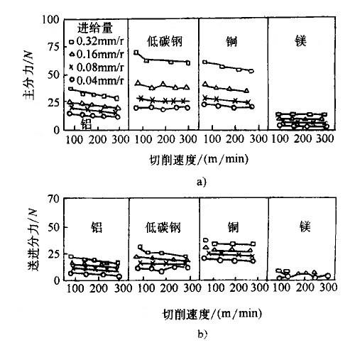

# 有色金属材料的性能

- 主要特性
- 物理性能
- 力学性能
- 金属材料车削数据的比较
- 金属材料耐腐蚀性的比较(一个月内减重(mg/dm^3))

## 主要特性

| 序号 | 名称         | 主要特性                                                     |
| ---- | ------------ | ------------------------------------------------------------ |
| 1    | 铜及其合金   | 有优良的导电性、导热性，较好的耐蚀性，较高的强度和高的塑性，易加工成形和铸造各种零件 |
| 2    | 铝及其合金   | 密度小 (ρ≈2.7 g/cm³)，比强度高，耐蚀性好，导电性、导热性、反光性良好，塑性好，易加工成形和铸造各种零件 |
| 3    | 钛及其合金   | 密度小 (ρ≈4.5 g/cm³)，比强度高，高温强度高，硬度高，耐蚀性良好 |
| 4    | 镁及其合金   | 密度小 (ρ≈1.7 g/cm³)，比强度和比刚度高，能承受大的冲击载荷，有良好的机械加工性能和抛光性能，对有机酸、碱类和液体燃料有较高的耐蚀性 |
| 5    | 镍及其合金   | 有高的力学性能，耐热性、耐蚀性好，具有特殊的电、磁和热膨胀性能 |
| 6    | 锌及其合金   | 有较高的力学性能，熔点低，易于加工成形和压铸成零件           |
| 7    | 锡铅及其合金 | 熔点低，耐磨、减摩性能好，耐蚀性好，铅的抗 X - 射线和 γ- 射线穿透力强 |

## 物理性能

| 名称 | 符号 | 原子量   | 室温密度 ρ/(g/cm³) | 熔点 /℃ | 沸点 /℃ | 室温比热容 /[J/(kg・K)] | 线胀系数 αL/(10⁻⁶/K) | 电阻率 ρ/(nΩ・m) | 电导率 κ/(% IACS) | 热导率 λ/[W/(m・K)] | 晶体结构 |
| ---- | ---- | -------- | ------------------ | ------- | ------- | ----------------------- | -------------------- | ---------------- | ----------------- | ------------------- | -------- |
| 银   | Ag   | 107.868  | 10.49              | 961.9   | 2163    | 235                     | 19.0                 | 14.7             | 108.4             | 428                 | 面心立方 |
| 铝   | Al   | 2.98154  | 2.6989             | 660.4   | 2494    | 900                     | 23.6                 | 26.55            | 64.96             | 247                 | 面心立方 |
| 金   | Au   | 196.9665 | 19.302             | 1064.43 | 2857    | 128                     | 14.2                 | 23.5             | 73.4              | 317.9               | 面心立方 |
| 铍   | Be   | 9.0122   | 1.848              | 1283    | 2770    | 1886                    | 11.6                 | 40               | 38~43             | 190                 | 密排六方 |
| 铋   | Bi   | 208.98   | 9.808              | 271.4   | 1564    | 122                     | 13.2                 | 1050             | -                 | 8.2                 | 菱方     |
| 铈   | Ce   | 140.12   | 8.16               | 798     | 3443    | 192                     | 6.3                  | 828              | -                 | 11.3                | 密排六方 |
| 镉   | Cd   | 112.4    | 8.642              | 321.1   | 767     | 230                     | 31.3                 | 72.7             | 25                | 96.8                | 密排六方 |
| 钴   | Co   | 58.9332  | 8.832              | 1495    | 2900    | 414                     | 13.8                 | 52.5             | 27.6              | 69.04               | 密排六方 |
| 铜   | Cu   | 63.54    | 8.93               | 1084.88 | 2595    | 386                     | 16.7                 | 16.73            | 103.06            | 398                 | 面心立方 |
| 汞   | Hg   | 200.59   | 14.193             | -38.87  | 356.58  | 139.6                   | -                    | 958              | -                 | 9.6                 | 简单菱方 |
| 镁   | Mg   | 24.312   | 1.738              | 650     | 1107    | 102.5                   | 25.2                 | 44.5             | 38.6              | 155.5               | 密排六方 |
| 钼   | Mo   | 95.94    | 10.22              | 2610    | 5560    | 276                     | 4                    | 52               | 34                | 142                 | 体心立方 |
| 铌   | Nb   | 92.9064  | 8.57               | 2468    | 4927    | 270                     | 7.31                 | 25               | 13.2              | 53                  | 体心立方 |
| 镍   | Ni   | 58.71    | 8.902              | 1453    | 2730    | 471                     | 13.3                 | 68.44            | 25.2              | 82.9                | 面心立方 |
| 铅   | Pb   | 207.19   | 11.34              | 327.4   | 1750    | 128.7                   | 29.3                 | 206.43           | -                 | 34                  | 面心立方 |
| 钯   | Pd   | 106.4    | 12.02              | 1552    | 3980    | 245                     | 11.76                | 108              | 16                | 70                  | 面心立方 |
| 铂   | Pt   | 195.09   | 21.45              | 1769    | 3800    | 132                     | 9.1                  | 106              | 16                | 71.1                | 面心立方 |
| 铑   | Rh   | 102.905  | 12.41              | 1963    | 3700    | 247                     | 8.3                  | 45.1             | -                 | 150                 | 面心立方 |
| 锑   | Sb   | 121.75   | 6.97               | 630.7   | 1587    | 207                     | 8~11                 | 370              | -                 | 25.9                | 菱方     |
| 锡   | Sn   | 118.69   | 5.765              | 231.9   | 2770    | 205                     | 23.1                 | 110              | 15.6              | 62                  | 正方     |
| 钽   | Ta   | 180.949  | 16.6               | 2996    | 5427    | 139.1                   | 6.5                  | 135              | 13                | 54.4                | 体心立方 |
| 钛   | Ti   | 47.9     | 4.507              | 1668±10 | 3260    | 522.3                   | 10.2                 | 420              | -                 | 11.4                | 密排六方 |
| 钨   | W    | 183.85   | 19.254             | 3410±20 | ~5700   | 160                     | 127                  | 53               | -                 | 190                 | 体心立方 |
| 钇   | Y    | 88.9059  | 4.469              | 1522    | 3338    | 298.4                   | 10.6                 | 596              | -                 | 17.2                | 密排六方 |
| 锌   | Zn   | 65.36    | 7.133              | 420     | 906     | 382                     | 15                   | 58.9             | 28.27             | 113                 | 密排六方 |
| 锆   | Zr   | 91.22    | 6.505              | 1852±   | 4377    | 300                     | 5.85                 | 450              | 4.1               | 21.1                | 密排六方 |

## 力学性能

#### 常用有色金属材料的力学性能

| 名称 | 符号 | 抗拉强度 σb/MPa | 屈服强度 σ0.2/MPa | 伸长率 δ(%) | 硬度 HBS    | 弹性模量 E/(GPa) | 备注       |
| ---- | ---- | --------------- | ----------------- | ----------- | ----------- | ---------------- | ---------- |
| 银   | Ag   | 125             | 35                | 50          | 25          | 71               | -          |
| 铝   | Al   | 40~50           | 15~20             | 50~70       | 20~35       | 62               | -          |
| 金   | Au   | 103             | 30~40             | 30~50       | 18          | 78               | -          |
| 铍   | Be   | 228~352         | 186~262           | 1~3.5       | 75~85       | 275~300          | -          |
| 铋   | Bi   | -               | 20                | -           | 7           | 32               | -          |
| 铈   | Ce   | 117             | 28                | 22          | 22HV        | 30               | γ 相       |
| 镉   | Cd   | 71              | 10                | 50          | 16~23       | 55               | -          |
| 钴   | Co   | 255             | -                 | 5           | 125         | 211              | -          |
| 铜   | Cu   | 209             | 33.3              | 60          | 37          | 128              | -          |
| 镁   | Mg   | 165~205         | 69~105            | 5~8         | 35          | 44               | -          |
| 钼   | Mo   | 600             | 450               | 60          | 300~400HV   | 320              | -          |
| 铌   | Nb   | 275             | 207               | 30          | 80HV        | 103              | 退火状态   |
| 镍   | Ni   | 317             | 59                | 30          | 60~80       | 207              | -          |
| 铅   | Pb   | 15~18           | 5~10              | 50          | 4~6         | 15~18            | -          |
| 钯   | Pd   | 185             | 32                | 40          | 32          | 114.8            | -          |
| 铂   | Pt   | 143             | 37                | 31          | 30          | 150              | -          |
| 铑   | Rh   | 951             | 70~100            | 30~35       | 55          | 293              | -          |
| 锑   | Sb   | 11.4            | -                 | -           | 30~58       | 77.759           | -          |
| 锡   | Sn   | 15~27           | 12                | 40~70       | 5           | 44.3             | -          |
| 钽   | Ta   | 392             | 362               | 46.5        | 120HV       | 186              | 粉末冶金法 |
| 钛   | Ti   | 235             | 140               | -           | 60~74       | 106              | -          |
| 钨   | W    | 1000~1200       | 750               | -           | (350~450)HV | 405~410          | -          |
| 钇   | Y    | 186             | 27                | 17          | 40HV        | 63.6             | -          |
| 锌   | Zn   | 110~150         | 90~100            | 40~60       | 30~42       | 130              | -          |
| 锆   | Zr   | 300~500         | 200~300           | 15~30       | 120         | 99               | -          |

#### 与常用金属材料的力学性能的比较

①刚性相同，相对质量ρ/E^(1/3)

| 合金代号      | 密度 ρ/(g/cm³) | 弹性模量 E/GPa | 抗拉强度 σb/MPa | 屈服强度 σ0.2/MPa | 伸长率 δ(%) | 疲劳极限 σ-1/MPa | σb/ρ | σ0.2/ρ | σ-1/ρ | 相对刚性 E/ρ³ | ①    |
| ------------- | -------------- | -------------- | --------------- | ----------------- | ----------- | ---------------- | ---- | ------ | ----- | ------------- | ---- |
| 20 钢         | 7.8            | 210            | 400             | 200               | 20          | 140              | 51   | 26     | 18    | 0.44          | 1.31 |
| 15CrA         | 7.8            | 210            | 650             | 350               | 15          | 260              | 83   | 45     | 33    | 0.44          | 1.31 |
| 40CrNiMoA     | 7.8            | 210            | 1000            | 850               | 12          | 410              | 130  | 110    | 53    | 0.44          | 1.31 |
| 铸铁          | 7.2            | 84             | 210             | 140               | -           | 70               | 29   | 20     | 9.7   | 0.22          | 1.64 |
| H62           | 8.4            | 105            | 300             | 150               | 40          | 120              | 36   | 18     | 14    | 0.18          | 1.78 |
| QAl9-4        | 7.5            | 116            | 550             | 300               | 12          | 210              | 73   | 40     | 28    | 0.28          | 1.54 |
| QBe2          | 8.2            | 133            | 1200            | 1000              | 2.5         | 200              | 146  | 122    | 24    | 0.24          | 1.61 |
| BZn15-20      | 8.7            | 126            | 380             | 140               | 35          | 130              | 44   | 16     | 15    | 0.19          | 1.74 |
| 2A12          | 2.8            | 72             | 460             | 380               | 15          | 115              | 164  | 136    | 41    | 3.3           | 0.67 |
| ZL104         | 2.7            | 72             | 250             | 200               | 4           | 90               | 93   | 72     | 33    | 3.7           | 0.65 |
| TC4           | 4.4            | 113            | 950             | 850               | 10          | 350              | 216  | 193    | 80    | 1.32          | 0.91 |
| MB7           | 1.8            | 43             | 300             | 200               | 8           | 130              | 167  | 110    | 72    | 7.3           | 0.51 |
| ZM5           | 1.8            | 43             | 250             | 100               | 5           | 100              | 139  | 110    | 56    | 7.3           | 0.51 |
| NCu28-2.5-1.5 | 8.8            | 180            | 450             | 240               | 25          | 170              | 51   | 27     | 19    | 0.27          | 1.56 |
| ZA4-1         | 6.7            | 130            | 280             | -                 | 2           | -                | 42   | -      | -     | 0.44          | 1.32 |

## 金属材料车削数据的比较

| 材料   | 进刀量 /mm | 切削速度 / (m/min) | 进给量 / (mm/r) |
| ------ | ---------- | ------------------ | --------------- |
| 钢     | 6.3        | 15 ~ 60            | 0.13 ~ 2.0      |
| 铸铁   | 6.3        | 15 ~ 35            | 0.13 ~ 2.0      |
| 铝合金 | 6.3        | 180 ~ 305          | 0.13 ~ 0.76     |
| 镁合金 | 12.7 以下  | ~ 305              | 0.13 ~ 2.5      |
| 锌合金 | 6.3        | 75 ~ 180           | 0.13 ~ 1.5      |

## 金属材料耐腐蚀性的比较(一个月内减重(mg/dm^3))

①合金化学成分百分数为质量分数。
②溶液成分百分数为体积分数。
③溶液成分百分数为质量分数。

| 合金种类    | 流水   | 海水         | 33% 醋酸② | 5% 氯化铵③ | 10% 硫酸钠③  | 33% 氢氧化钠③ |
| ----------- | ------ | ------------ | --------- | ---------- | ------------ | ------------- |
| 13% 铬钢①   | 不腐蚀 | 不腐蚀       | 2320      | 140        | 不腐蚀       | 不腐蚀        |
| 纯铁        | 1610   | 360          | 20230     | 840        | 250          | 基本上不腐蚀  |
| 黄铜        | 氧化   | 基本上不腐蚀 | 550       | 490        | 10           | 不腐蚀        |
| 磷青铜      | 30     | 110          | 450       | 3050       | 基本上不腐蚀 | 10            |
| 99.6% 纯铝① | 污染   | 污染         | 60        | 120        | 污染         | 71            |
| 硬铝        | 180    | 20           | 180       | 120        | 不腐蚀       | 74            |