结构钢

- 碳素结构钢(摘自GB/T 700)
- 优质碳素结构钢(摘自GB/T 699)
- 低合金高强度结构钢(摘自GB/T 1591)
- 合金结构钢(GB/T 3077-1999)和锻件用合金结构钢(GB/T 17107-1997)
- 易切削结构钢(摘自GB/T 8731-1988)
- 弹簧钢(摘自GB/T 1222)
- 耐候结构钢(摘自GB/T 4171-2008)
- 标准：GB/T 700-2006 碳素结构钢
- 标准：GB/T 699-2015 优质碳素结构钢
- 标准：GB/T 1591-2018 低合金高强度结构钢turalsteel.html)
- 标准：GB/T 3077-2015 合金结构钢
- 标准：GB/T 17107-1997 锻件用结构钢牌号和力学性能
- 标准：GB/T 8731-2008 易切削结构钢
- 标准：GB/T 1222-2016 弹簧钢
- 标准：GB/T 4171-2008 耐候结构钢

## 碳素结构钢(摘自GB/T 700)

#### 碳素结构钢(摘自GB/T 700-2006)

##### 牌号和化学成分

| 牌号 | 等级 | 厚度 (或直 径)/mm | 化学成分(质量分数)/%≤C(%) ≤ | 化学成分(质量分数)/%≤Mn(%) ≤ | 化学成分(质量分数)/%≤Si(%) ≤ | 化学成分(质量分数)/%≤P(%) ≤ | 化学成分(质量分数)/%≤S(%) ≤ | 脱氧方法 | 用途 (参考)                                                  |
| ---- | ---- | ----------------- | --------------------------- | ---------------------------- | ---------------------------- | --------------------------- | --------------------------- | -------- | ------------------------------------------------------------ |
| Q195 | —    | —                 | 0.12                        | 0.50                         | 0.30                         | 0.035                       | 0.040                       | F、Z     | 载荷小的零件、铁丝、垫铁、垫圈开口销、拉杆、冲压件及焊接件   |
| Q215 | A    | —                 | 0.15                        | 1.20                         | 0.35                         | 0.045                       | 0.050                       | F、Z     | 拉杆、套圈、垫圈、渗碳零件及焊接件                           |
| Q215 | B    | —                 | 0.15                        | 1.20                         | 0.35                         | 0.045                       | 0.045                       | F、Z     | 拉杆、套圈、垫圈、渗碳零件及焊接件                           |
| Q235 | A    | —                 | 0.22                        | 1.40                         | 0.35                         | 0.045                       | 0.050                       | F、Z     | 金属结构件，心部强度要求不高的渗碳或氰化零件，拉杆、连杆、吊钩、车钩、螺栓、螺母、套筒、轴及焊接件 |
| Q235 | B    | —                 | 0.20                        | 1.40                         | 0.35                         | 0.045                       | 0.045                       | F、Z     | 金属结构件，心部强度要求不高的渗碳或氰化零件，拉杆、连杆、吊钩、车钩、螺栓、螺母、套筒、轴及焊接件 |
| Q235 | C    | —                 | 0.17                        | 1.40                         | 0.35                         | 0.040                       | 0.040                       | Z        | 金属结构件，心部强度要求不高的渗碳或氰化零件，拉杆、连杆、吊钩、车钩、螺栓、螺母、套筒、轴及焊接件；C、D 级用于重要的焊接结构 |
| Q235 | D    | —                 | 0.17                        | 1.40                         | 0.35                         | 0.035                       | 0.035                       | TZ       | 金属结构件，心部强度要求不高的渗碳或氰化零件，拉杆、连杆、吊钩、车钩、螺栓、螺母、套筒、轴及焊接件；C、D 级用于重要的焊接结构 |
| Q275 | A    | —                 | 0.24                        | 1.50                         | 0.35                         | 0.045                       | 0.050                       | F、Z     | 转轴、心轴、吊钩、拉杆、摇杆楔等强度要求不高的零件，焊接性尚可 |
| Q275 | B    | ≤40               | 0.21                        | 1.50                         | 0.35                         | 0.045                       | 0.045                       | Z        | 转轴、心轴、吊钩、拉杆、摇杆楔等强度要求不高的零件，焊接性尚可 |
| Q275 | B    | >40               | 0.22                        | 1.50                         | 0.35                         | 0.045                       | 0.045                       | Z        | 转轴、心轴、吊钩、拉杆、摇杆楔等强度要求不高的零件，焊接性尚可 |
| Q275 | C    | —                 | 0.20                        | 1.50                         | 0.35                         | 0.040                       | 0.040                       | Z        | 轴类、链轮、齿轮、吊钩等强度要求较高的零件                   |
| Q275 | D    | —                 | 0.20                        | 1.50                         | 0.35                         | 0.035                       | 0.035                       | TZ       | 轴类、链轮、齿轮、吊钩等强度要求较高的零件                   |

注：1.本标准适用于一般交货状态(钢材一般以热轧、控轧或正火状态交货)，通常用于焊接、铆接、栓接工程构件用热轧钢板、钢带、型钢和棒钢。2.经需方同意，Q235B的含碳量可不大于0.22%。3.在保证钢材力学性能符合本标准的情况下，各牌号A级钢的碳、锰、硅含量可不作为交货条件，但应在质量证明书中注明其含量。4.镇静钢脱氧完全，性能较半镇静钢和沸腾钢优良。沸腾钢脱氧不完全，化学成分不均匀，内部杂质较多，耐腐蚀性和机械强度较差，冲击韧度较低，冷脆倾向及时效敏感较大，不适于在高冲击负荷和低温下工作，但成材率高，成本低，没有集中缩孔，表面质量及深冲性能好，一般结构可大量采用。新标准取消半镇静钢。

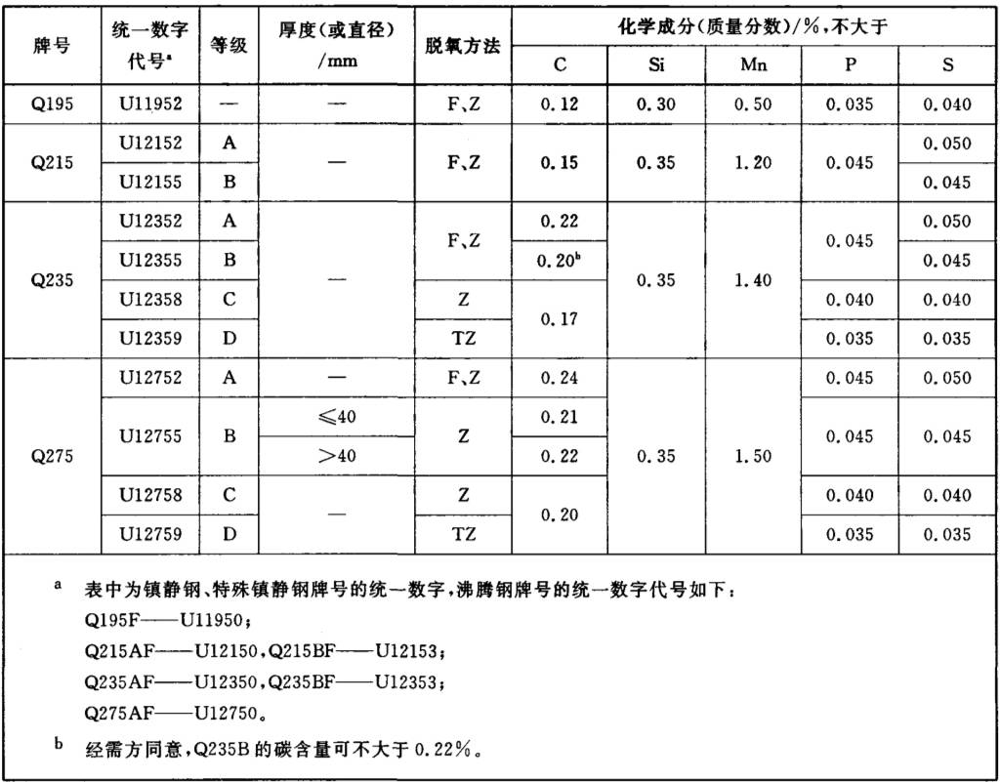

##### 力学性能

**碳素结构钢的力学性能****(****GB****/****T 700****—****2006****)**

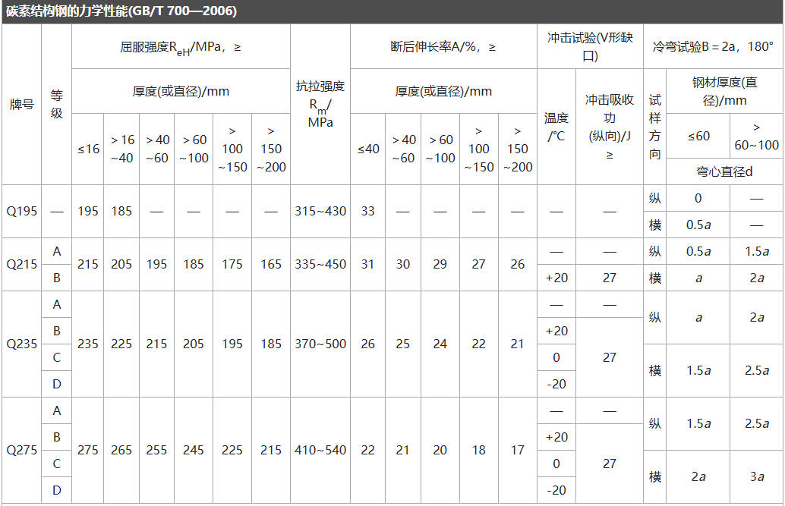

注：1.冷弯试验中 B 为试样宽度，a 为钢材厚度(直径)。

2.Q195的屈服强度仅供参考，不作为交货条件。

3.进行拉伸和冷弯试验时，型钢和钢棒取纵向试样，钢板和钢带取横向试样，断后伸长率允许比表中降低2%(绝对值)。窄钢带取横向试样，如果受宽度限制时可取纵向试样。

4.各牌号 A 级钢冷弯试验合格时，抗拉强度上限可以不作为交货条件。

5.用 Q195和 Q235B 沸腾钢轧制的钢材，其厚度(直径)不大于25mm。

6.厚度不小于12mm或直径不小于16mm的钢材应进行冲击试验，厚度为6~12mm或直径为12~16mm的钢材，经供需双方协议可进行冲击试验。

7.厚度大于100mm的钢材，抗拉强度下限允许降低20MPa。宽带钢(包括剪切钢板)抗拉强度上限不作为交货条件。

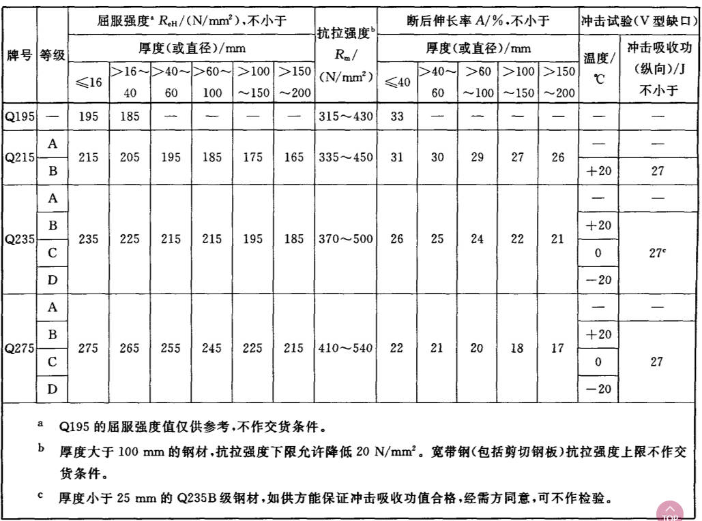

#### 碳素结构钢(摘自GB/T 700-1988)

##### 碳素结构钢的牌号和化学成分

注：1.钢中残余元素Cr、Ni、Cu含量应各不大于ω＝0.30％，如供方能保证，可不作分析。
2.氧气转炉钢的氮含量应不大于ω=0.008％。
3.F表示沸腾钢，b表示半镇静钢，Z表示镇静钢，TZ表示特殊镇静钢。

①Q235A、B级沸腾钢Mn含量上限为ω=0.60％。
②沸腾钢si含量不大于ω＝0.07％，半镇静钢Si含量不大于0.17％，镇静钢Si含量下限值为ω=0.12％。

| 牌号 | 等级 | **化学成分质量分数%** |             |      |       |       | **脱氧方法** |
| ---- | ---- | --------------------- | ----------- | ---- | ----- | ----- | ------------ |
|      |      | C                     | Mn          | Si②≤ | S≤    | P≤    |              |
| Q195 | —    | 0.06～0.12            | 0.25～0.50  | 0.3  | 0.05  | 0.045 | F、b、Z      |
| Q215 | A    | 0.09～0.15            | 0.25～0.55  | 0.3  | 0.05  | 0.045 | F、b、Z      |
| Q215 | B    | 0.09～0.15            | 0.25～0.55  | 0.3  | 0.045 | 0.045 | F、b、Z      |
| Q235 | A    | 0.14～0.22            | 0.30～0.65① | 0.3  | 0.05  | 0.045 | F、b、Z      |
| Q235 | B    | 0.12～0.20            | 0.30～0.70① | 0.3  | 0.045 | 0.045 | F、b、Z      |
| Q235 | C    | ≤0.18                 | 0.35～0.80  | 0.3  | 0.04  | 0.04  | Z            |
| Q235 | D    | ≤0.17                 | 0.35～0.80  | 0.3  | 0.035 | 0.035 | TZ           |
| Q255 | A    | 0.18～0.28            | 0.40～0.70  | 0.3  | 0.05  | 0.045 | Z            |
| Q255 | B    | 0.18～0.28            | 0.40～0.70  | 0.3  | 0.045 | 0.045 | Z            |
| Q275 | —    | 0.28～0.38            | 0.50～0.80  | 0.35 | 0.05  | 0.045 | Z            |

##### 碳素结构钢的力学性能

注：1.牌号Q195的屈服点，仅供参考，不作为交货条件。
2.进行拉伸或弯曲试验时，钢板、钢带应取横向试样，伸长率允许较上表降低1％(绝对值)，型钢应取纵向试样。
3.牌号A级钢的冷弯试验，在需方要求时才进行。当冷弯试验合格时，抗拉强度上限可以不作为交货条件。
4.冷弯试验中，B为试样宽度，a为钢材厚度(直径)。

| 牌号 | 等级 | **拉伸试验**          |          |          |           |            |       |                    |                       |          |          |           |            |       |
| ---- | ---- | --------------------- | -------- | -------- | --------- | ---------- | ----- | ------------------ | --------------------- | -------- | -------- | --------- | ---------- | ----- |
|      |      | **屈服点σs/MPa，≥**   |          |          |           |            |       | **抗拉强度σb/MPa** | **伸长率δ5(%)，≥**    |          |          |           |            |       |
|      |      | **钢材厚度或直径/mm** |          |          |           |            |       |                    | **钢材厚度或直径/mm** |          |          |           |            |       |
|      |      | ≤16                   | ＞16～40 | ＞40～60 | ＞60～100 | ＞100～150 | ＞150 |                    | ≤16                   | ＞16～40 | ＞40～60 | ＞60～100 | ＞100～150 | ＞150 |
| Q195 |      | -195                  | -185     |          |           |            |       | 315～430           | 33                    | 32       |          |           |            |       |
| Q215 | A    | 215                   | 205      | 195      | 185       | 175        | 165   | 335～450           | 31                    | 30       | 39       | 38        | 37         | 36    |
| Q215 | B    | 215                   | 205      | 195      | 185       | 175        | 165   | 335～450           | 31                    | 30       | 29       | 28        | 27         | 26    |
| Q235 | A    | 235                   | 225      | 215      | 205       | 195        | 185   | 375～500           | 26                    | 25       | 24       | 23        | 22         | 21    |
| Q235 | B    | 235                   | 225      | 215      | 205       | 195        | 185   | 375～500           | 26                    | 25       | 24       | 23        | 22         | 21    |
| Q235 | C    | 235                   | 225      | 215      | 205       | 195        | 185   | 375～500           | 26                    | 25       | 24       | 23        | 22         | 21    |
| Q235 | D    | 235                   | 225      | 215      | 205       | 195        | 185   | 375～500           | 26                    | 25       | 24       | 23        | 22         | 21    |
| Q255 | A    | 255                   | 245      | 235      | 225       | 215        | 205   | 410～550           | 24                    | 23       | 22       | 21        | 20         | 19    |
| Q255 | B    | 255                   | 245      | 235      | 225       | 215        | 205   | 410～550           | 24                    | 23       | 22       | 21        | 20         | 19    |
| Q275 |      | 275                   | 265      | 255      | 245       | 235        | 225   | 490～630           | 20                    | 19       | 18       | 17        | 16         | 15    |

| 牌号 | 等级 | 冲击试验 |                            | 冷弯试验，B=2a，180° | 冷弯试验，B=2a，180° | 冷弯试验，B=2a，180° |
| ---- | ---- | -------- | -------------------------- | -------------------- | -------------------- | -------------------- |
|      |      | 温度/℃   | V型(纵向)冲击吸收功AK/J，≥ | 钢材厚度或直径/mm    |                      |                      |
|      |      |          |                            | ≤60                  | ＞60～100            | ＞100～200           |
|      |      |          |                            | 弯芯直径d/mm         | 弯芯直径d/mm         | 弯芯直径d/mm         |
| Q195 |      |          |                            | 纵0，横0.5a          |                      |                      |
| Q215 | A    |          |                            | 纵0.50a，横a         | 纵1.5a，横2a         | 纵2a，横2.5a         |
| Q215 | B    | 20       | 27                         | 纵0.50a，横a         | 纵1.5a，横2a         | 纵2a，横2.5a         |
| Q235 | A    |          |                            | 纵a，横1.5a          | 纵2a，横2.5a         | 纵2.5a，横3a         |
| Q235 | B    | 20       | 27                         | 纵a，横1.5a          | 纵2a，横2.5a         | 纵2.5a，横3a         |
| Q235 | C    | 0        | 27                         | 纵a，横1.5a          | 纵2a，横2.5a         | 纵2.5a，横3a         |
| Q235 | D    | -20      | 27                         | 纵a，横1.5a          | 纵2a，横2.5a         | 纵2.5a，横3a         |
| Q255 | A    |          |                            | 2a                   | 3a                   | 3.5a                 |
| Q255 | B    | 20       | 27                         | 2a                   | 3a                   | 3.5a                 |
| Q275 |      |          |                            | 3a                   | 4a                   | 4.5a                 |

##### 碳素结构钢的特性和应用

| 新牌号 | 旧牌号 | 主要特征                                                     | 应用举例                                                     |
| ------ | ------ | ------------------------------------------------------------ | ------------------------------------------------------------ |
| Q195   | A1     | 具有高的塑性、韧性和焊接性能，良好的压力加工性能，但强度低   | 用于制造地脚螺栓、犁铧、烟筒、屋面板、铆钉、低碳钢丝、薄板、焊管、拉杆、吊钩、支架、焊接结构 |
| Q215   | A2、C2 | 具有高的塑性、韧性和焊接性能，良好的压力加工性能，但强度低   | 用于制造地脚螺栓、犁铧、烟筒、屋面板、铆钉、低碳钢丝、薄板、焊管、拉杆、吊钩、支架、焊接结构 |
| Q235   | A3、C3 | 具有高的塑性、韧性和焊接性能、冷冲压性能，以及一定的强度、好的冷弯性能 | 广泛用于一般要求的零件和焊接结构。如受力不大的拉杆、连杆、销、轴、螺钉、螺母、套圈、支架、机座、建筑结构、桥梁等 |
| Q255   | A4、C4 | 具有较好的强度、塑性、和韧性，较好的焊接性能和冷、热压力加工性能 | 用于制造要求强度不太高的零件，如螺栓、键、摇杆、轴、拉杆和钢结构用各种型钢、钢板等 |
| Q275   | C5     | 具有较好的强度、塑性、和韧性和切削加工性能、一定的焊接性能。小型零件可以淬火强化 | 用于制造要求强度较高的零件，如齿轮、轴、链轮、键、螺栓、螺母、农机用型钢、输送链和链节 |

##### 碳素结构钢的中外牌号对照

| 中国GB/T 700 | 国际标准 ISO  | 原苏联 гOCT    | 美国 ASTM           | 美国\|UNS | 日本JIS              | 德国DIN         | 英国BS         | 法国NF         |
| ------------ | ------------- | -------------- | ------------------- | --------- | -------------------- | --------------- | -------------- | -------------- |
| Q195         | HR2(σs195)    | CT1Kп          | Gr·B(σs185)         |           | SS330(SS34) (σs205)  | St33            | 040A10         | A33            |
| Q195         | HR2(σs195)    | CT1Cп          |                     |           | SPHC(σs205)          |                 |                |                |
| Q195         | HR2(σs195)    | CT1пC          |                     |           | SPHD(σs205)          |                 |                |                |
| Q215-A       | HR1(σs215)    | CT2Kп-2(σs215) | Gr·C(σs205)         |           | SS330(SS34) (σs205)  | Fe360A(σs215)   | 040A12         | Fe360A(σs215)  |
| Q215-A       |               | CT2Cп-2(σs215) | Gr·58(σs220)        |           | SPHC(σs215)          | USt34-2         | Fe360C(σs215)  | A34-2NE        |
| Q215 A       |               | CT2пC-2(σs215) |                     |           |                      | RSt34-2         |                |                |
| Q215-B       |               | CT2Kп-3(σs215) | Gr·C(σs205)         |           | SS330(SS34)(σs205)   |                 | 040A12         |                |
| Q215-B       |               | CT2Cп-3(σs215) | Gr·58(σs220)        |           | SPHC(σb270)          |                 |                |                |
| Q215-B       |               | CT2пC-3(σs215) |                     |           | SPHD(σb270)          |                 |                |                |
| Q235-A       | Fe360A(σs235) | CT3Kп-2(σs235) | Gr·D(σs230)         | K02502    | SS400(SS41)(σs245)   | Fe360B(σs235)   | 080A15         | Fe360B(σs235)  |
| Q235-A       |               | CT3Cп-2(σs245) |                     |           | SM400A(SM41A)(σs245) | Fe360C(σs235)   | Fe360B(σs235)  | Fe360C(σs235)  |
| Q235-A       |               | CT3пC-2(σs255) |                     |           |                      | USt37-2,RSt37-2 | Fe360C(σs235)  |                |
| Q235-B       | Fe360D(σs235) | CT3Kп-3(σs235) | Gr·D(σs230)         | K02502    | SS400(SS41)(σs245)   | Fe360B(σs235)   | 080A15         | Fe360B(σs235)  |
| Q235-B       |               | CT3Cп-3(σs245) |                     |           | SM400A(SM41A)(σs245) | Fe360C(σs235)   | Fe360B(σs235)  | Fe360C(σs235)  |
| Q235-B       |               | CT3пC-3(σs255) |                     |           |                      |                 | Fe360C(σs235)  |                |
| Q235-C       | Fe360D(σs235) | CT3Kп-4(σs235) | Gr·D(σs230)         |           | SM400A(SM41A)(σs245) | Fe360C(σs235)   | 080A15         |                |
| Q235-C       |               | CT3Cп-4(σs245) | Gr·65               |           | SM400B(SM41B)(σs245) |                 | Fe360C(σs235)  | Fe360C(σs235)  |
| Q235-C       |               | CT3пC-4(σs255) | (σs240)             |           |                      |                 |                |                |
| Q235-D       | Fe360D(σs235) | CT3Kп-4(σs235) |                     |           | SM400A               | Fe360D1(σs235)  | Fe360D1(σs235) | Fe360D1(σs235) |
| Q235-D       |               | CT3Cп-4(σs245) |                     |           | (SM41A)(σs245)       | Fe360D2(σs235)  | Fe360D2(σs275) | Fe360D2(σs235) |
| Q235-D       |               | CT3пC-4(σs255) |                     |           |                      |                 |                |                |
| Q255-A       |               | CT4Kп-2(σs255) | Gr·36〔250〕(σs250) | K02502    | SS400(SS41)(σs245)   | St44-2          |                |                |
| Q255-A       |               | CT4Cп-2(σs265) |                     |           | SM400A(SM41A)(σs245) | St44-3          |                |                |
| Q255-A       |               | CT4пC-2(σs265) |                     |           |                      |                 |                |                |
| Q255-B       |               | CT4Kп-3(σs255) | Gr·36〔250〕(σs250) |           | SS400(SS41)(σs245)   | St52-3          |                |                |
| Q255-B       |               | CT4Cп-3(σs265) |                     |           | SM400A(SM41A)(σs245) |                 |                |                |
| Q255-B       |               | CT4пC-3(σs265) |                     |           |                      |                 |                |                |
| Q275         | Fe430A(σs275) | CT5Kп-2(σs285) |                     |           | SS490(SS50)(σs285)   | St50-2          |                |                |
| Q275         |               | CT5Cп-2(σs295) |                     |           |                      |                 |                |                |

## 优质碳素结构钢(摘自GB/T 699)

#### 优质碳素结构钢(摘自GB/T 699-2015)

##### 钢的牌号、 统一数字代号及化学成分

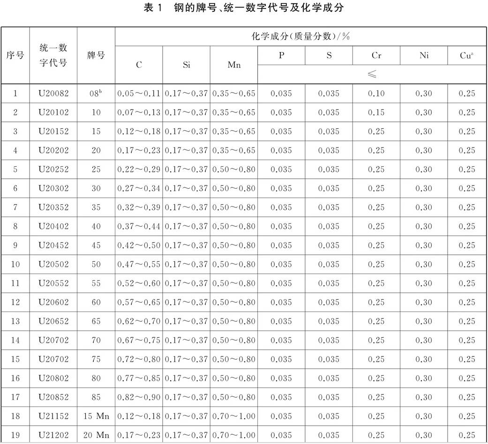

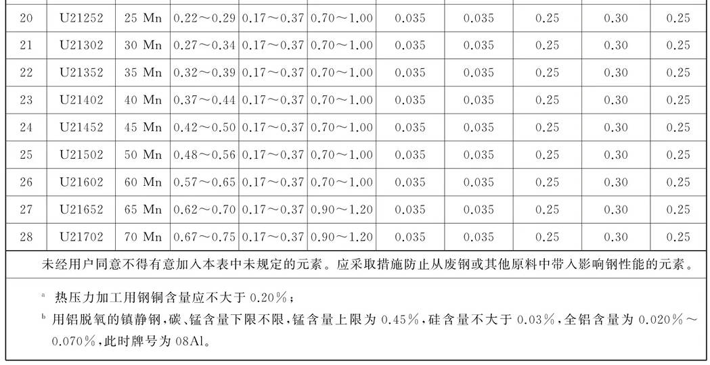

##### 力学性能

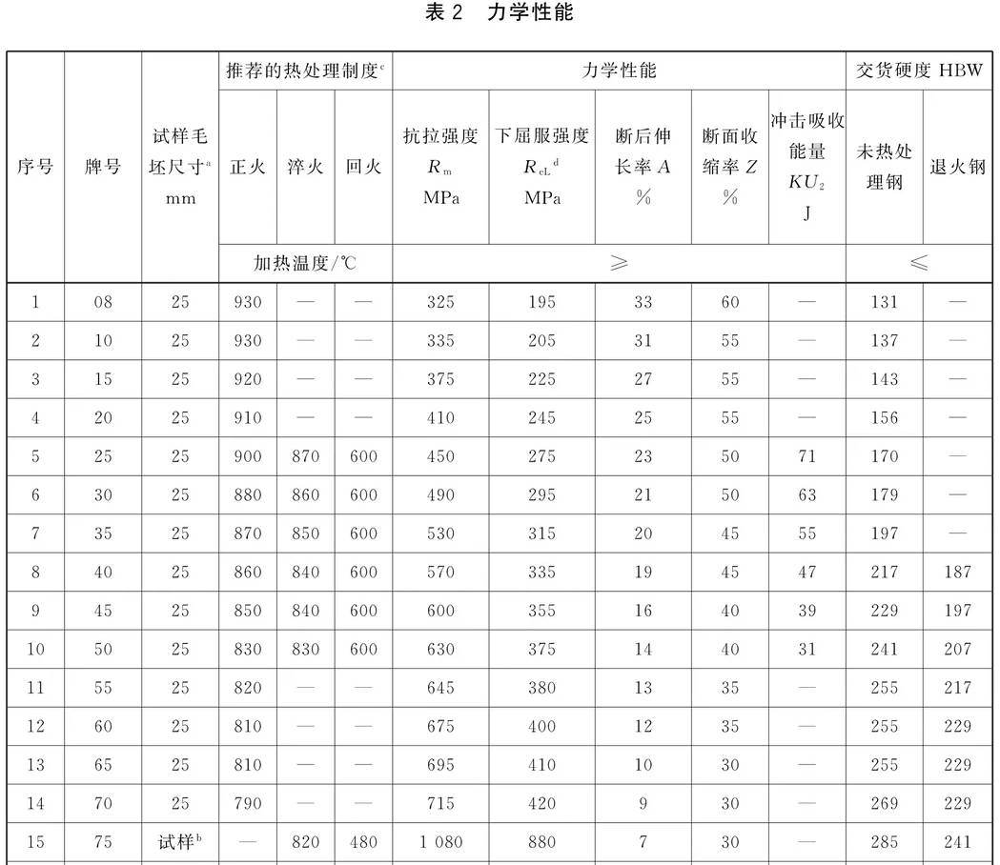

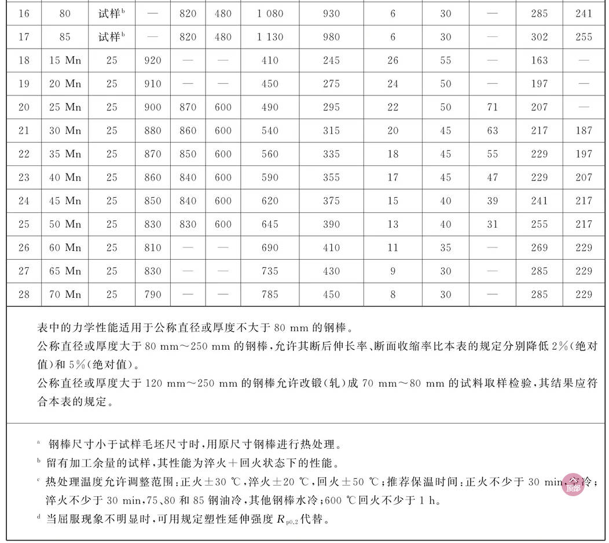

<table cellspacing="0" cellpadding="0" style="width:938.25pt; border-collapse:collapse"><tr><td colspan="19" style="width:830.9pt; border:0.75pt solid #aaaaaa; padding:3.38pt; vertical-align:top; background-color:#4d4d4d">
优质碳素结构钢的化学成分和力学性能(GB/T 699—1999、GB/T 17107—1997)
</td></tr><tr><td rowspan="5" style="width:35.75pt; border:0.75pt solid #aaaaaa; padding:3.38pt; vertical-align:middle; background-color:#ffffff">
钢号
</td><td colspan="3" style="width:125.75pt; border:0.75pt solid #aaaaaa; padding:3.38pt; vertical-align:middle; background-color:#ffffff">
化学成分(质量分数)/%
</td><td rowspan="5" style="width:31.85pt; border:0.75pt solid #aaaaaa; padding:3.38pt; vertical-align:middle; background-color:#ffffff">
标

准

号
</td><td colspan="4" rowspan="3" style="width:76.6pt; border:0.75pt solid #aaaaaa; padding:3.38pt; vertical-align:middle; background-color:#ffffff">
推荐热处理

/℃
</td><td rowspan="5" style="width:67.15pt; border:0.75pt solid #aaaaaa; padding:3.38pt; vertical-align:middle; background-color:#ffffff">
试样尺寸(GB/T699)

或截面尺寸(GB/T17107)

/mm
</td><td colspan="6" style="width:160pt; border:0.75pt solid #aaaaaa; padding:3.38pt; vertical-align:middle; background-color:#ffffff">
力学性能
</td><td colspan="2" rowspan="2" style="width:64pt; border:0.75pt solid #aaaaaa; padding:3.38pt; vertical-align:middle; background-color:#ffffff">
交货状

态硬度

HBS10/3000
</td><td rowspan="5" style="width:217.3pt; border:0.75pt solid #aaaaaa; padding:3.38pt; vertical-align:middle; background-color:#ffffff">
特性和用途
</td></tr><tr style="height:26.05pt"><td rowspan="4" style="width:36.85pt; border:0.75pt solid #aaaaaa; padding:3.38pt; vertical-align:middle; background-color:#f5f5f5">
C
</td><td rowspan="4" style="width:36.95pt; border:0.75pt solid #aaaaaa; padding:3.38pt; vertical-align:middle; background-color:#f5f5f5">
Si
</td><td rowspan="4" style="width:36.95pt; border:0.75pt solid #aaaaaa; padding:3.38pt; vertical-align:middle; background-color:#f5f5f5">
Mn
</td><td colspan="2" rowspan="2" style="width:45.4pt; border:0.75pt solid #aaaaaa; padding:3.38pt; vertical-align:middle; background-color:#f5f5f5">
σb
</td><td rowspan="2" style="width:29.55pt; border:0.75pt solid #aaaaaa; padding:3.38pt; vertical-align:middle; background-color:#f5f5f5">
σs

(σ0.2)
</td><td rowspan="2" style="width:16.35pt; border:0.75pt solid #aaaaaa; padding:3.38pt; vertical-align:middle; background-color:#f5f5f5">
δ5
</td><td rowspan="2" style="width:17.25pt; border:0.75pt solid #aaaaaa; padding:3.38pt; vertical-align:middle; background-color:#f5f5f5">
ψ
</td><td rowspan="2" style="width:21.45pt; border:0.75pt solid #aaaaaa; padding:3.38pt; vertical-align:middle; background-color:#f5f5f5">
AkU
</td></tr><tr style="height:26.05pt"><td rowspan="2" style="width:26.95pt; border:0.75pt solid #aaaaaa; padding:3.38pt; vertical-align:middle; background-color:#ffffff">
未热

处理
</td><td rowspan="2" style="width:29.55pt; border:0.75pt solid #aaaaaa; padding:3.38pt; vertical-align:middle; background-color:#ffffff">
退火

钢
</td></tr><tr><td rowspan="2" style="width:21.3pt; border:0.75pt solid #aaaaaa; padding:3.38pt; vertical-align:middle; background-color:#f5f5f5">
正

火
</td><td rowspan="2" style="width:18.05pt; border:0.75pt solid #aaaaaa; padding:3.38pt; vertical-align:middle; background-color:#f5f5f5">
淬

火
</td><td colspan="2" rowspan="2" style="width:22.25pt; border:0.75pt solid #aaaaaa; padding:3.38pt; vertical-align:middle; background-color:#f5f5f5">
回

火
</td><td colspan="3" style="width:82.45pt; border:0.75pt solid #aaaaaa; padding:3.38pt; vertical-align:middle; background-color:#f5f5f5">
/MPa
</td><td colspan="2" style="width:41.1pt; border:0.75pt solid #aaaaaa; padding:3.38pt; vertical-align:middle; background-color:#f5f5f5">
/%
</td><td style="width:21.45pt; border:0.75pt solid #aaaaaa; padding:3.38pt; vertical-align:middle; background-color:#f5f5f5">
/J
</td></tr><tr><td colspan="6" style="width:160pt; border:0.75pt solid #aaaaaa; padding:3.38pt; vertical-align:middle; background-color:#ffffff">
≥
</td><td colspan="2" style="width:64pt; border:0.75pt solid #aaaaaa; padding:3.38pt; vertical-align:middle; background-color:#ffffff">
≤
</td></tr><tr><td style="width:35.75pt; border:0.75pt solid #aaaaaa; padding:3.38pt; vertical-align:middle; background-color:#f5f5f5">
08F
</td><td style="width:36.85pt; border:0.75pt solid #aaaaaa; padding:3.38pt; vertical-align:middle; background-color:#f5f5f5">
0.05~

0.11
</td><td style="width:36.95pt; border:0.75pt solid #aaaaaa; padding:3.38pt; vertical-align:middle; background-color:#f5f5f5">
≤0.03
</td><td style="width:36.95pt; border:0.75pt solid #aaaaaa; padding:3.38pt; vertical-align:middle; background-color:#f5f5f5">
0.25~0.50
</td><td rowspan="7" style="width:31.85pt; border:0.75pt solid #aaaaaa; padding:3.38pt; vertical-align:middle; background-color:#f5f5f5">
GB/T 699
</td><td style="width:21.3pt; border:0.75pt solid #aaaaaa; padding:3.38pt; vertical-align:middle; background-color:#f5f5f5">
930
</td><td style="width:18.05pt; border:0.75pt solid #aaaaaa; padding:3.38pt; vertical-align:middle; background-color:#f5f5f5">
&#xa0;
</td><td colspan="2" style="width:22.25pt; border:0.75pt solid #aaaaaa; padding:3.38pt; vertical-align:middle; background-color:#f5f5f5">
&#xa0;
</td><td rowspan="7" style="width:67.15pt; border:0.75pt solid #aaaaaa; padding:3.38pt; vertical-align:middle; background-color:#f5f5f5">
25
</td><td colspan="2" style="width:45.4pt; border:0.75pt solid #aaaaaa; padding:3.38pt; vertical-align:middle; background-color:#f5f5f5">
295
</td><td style="width:29.55pt; border:0.75pt solid #aaaaaa; padding:3.38pt; vertical-align:middle; background-color:#f5f5f5">
175
</td><td style="width:16.35pt; border:0.75pt solid #aaaaaa; padding:3.38pt; vertical-align:middle; background-color:#f5f5f5">
35
</td><td style="width:17.25pt; border:0.75pt solid #aaaaaa; padding:3.38pt; vertical-align:middle; background-color:#f5f5f5">
60
</td><td style="width:21.45pt; border:0.75pt solid #aaaaaa; padding:3.38pt; vertical-align:middle; background-color:#f5f5f5">
—
</td><td style="width:26.95pt; border:0.75pt solid #aaaaaa; padding:3.38pt; vertical-align:middle; background-color:#f5f5f5">
131
</td><td style="width:29.55pt; border:0.75pt solid #aaaaaa; padding:3.38pt; vertical-align:middle; background-color:#f5f5f5">
—
</td><td rowspan="3" style="width:217.3pt; border:0.75pt solid #aaaaaa; padding:3.38pt; vertical-align:middle; background-color:#f5f5f5">
这种钢强度不大，而塑性和韧性甚高，有良好的冲压、拉延和弯曲性能，焊接性好。可制作深拉、冲压等零件，如机罩、壳盖、管子、垫片；心部强度要求不高的渗碳和氰化零件，如套筒、短轴、离合器盘
</td></tr><tr><td style="width:35.75pt; border:0.75pt solid #aaaaaa; padding:3.38pt; vertical-align:middle; background-color:#ffffff">
08
</td><td style="width:36.85pt; border:0.75pt solid #aaaaaa; padding:3.38pt; vertical-align:middle; background-color:#ffffff">
0.05~

0.11
</td><td style="width:36.95pt; border:0.75pt solid #aaaaaa; padding:3.38pt; vertical-align:middle; background-color:#ffffff">
0.17~0.37
</td><td style="width:36.95pt; border:0.75pt solid #aaaaaa; padding:3.38pt; vertical-align:middle; background-color:#ffffff">
0.35~0.65
</td><td style="width:21.3pt; border:0.75pt solid #aaaaaa; padding:3.38pt; vertical-align:middle; background-color:#ffffff">
930
</td><td style="width:18.05pt; border:0.75pt solid #aaaaaa; padding:3.38pt; vertical-align:middle; background-color:#ffffff">
&#xa0;
</td><td colspan="2" style="width:22.25pt; border:0.75pt solid #aaaaaa; padding:3.38pt; vertical-align:middle; background-color:#ffffff">
&#xa0;
</td><td colspan="2" style="width:45.4pt; border:0.75pt solid #aaaaaa; padding:3.38pt; vertical-align:middle; background-color:#ffffff">
325
</td><td style="width:29.55pt; border:0.75pt solid #aaaaaa; padding:3.38pt; vertical-align:middle; background-color:#ffffff">
195
</td><td style="width:16.35pt; border:0.75pt solid #aaaaaa; padding:3.38pt; vertical-align:middle; background-color:#ffffff">
33
</td><td style="width:17.25pt; border:0.75pt solid #aaaaaa; padding:3.38pt; vertical-align:middle; background-color:#ffffff">
60
</td><td style="width:21.45pt; border:0.75pt solid #aaaaaa; padding:3.38pt; vertical-align:middle; background-color:#ffffff">
—
</td><td style="width:26.95pt; border:0.75pt solid #aaaaaa; padding:3.38pt; vertical-align:middle; background-color:#ffffff">
131
</td><td style="width:29.55pt; border:0.75pt solid #aaaaaa; padding:3.38pt; vertical-align:middle; background-color:#ffffff">
—
</td></tr><tr><td style="width:35.75pt; border:0.75pt solid #aaaaaa; padding:3.38pt; vertical-align:middle; background-color:#f5f5f5">
10F
</td><td style="width:36.85pt; border:0.75pt solid #aaaaaa; padding:3.38pt; vertical-align:middle; background-color:#f5f5f5">
0.07~

0.13
</td><td style="width:36.95pt; border:0.75pt solid #aaaaaa; padding:3.38pt; vertical-align:middle; background-color:#f5f5f5">
≤0.07
</td><td style="width:36.95pt; border:0.75pt solid #aaaaaa; padding:3.38pt; vertical-align:middle; background-color:#f5f5f5">
0.25~0.50
</td><td style="width:21.3pt; border:0.75pt solid #aaaaaa; padding:3.38pt; vertical-align:middle; background-color:#f5f5f5">
930
</td><td style="width:18.05pt; border:0.75pt solid #aaaaaa; padding:3.38pt; vertical-align:middle; background-color:#f5f5f5">
&#xa0;
</td><td colspan="2" style="width:22.25pt; border:0.75pt solid #aaaaaa; padding:3.38pt; vertical-align:middle; background-color:#f5f5f5">
&#xa0;
</td><td colspan="2" style="width:45.4pt; border:0.75pt solid #aaaaaa; padding:3.38pt; vertical-align:middle; background-color:#f5f5f5">
315
</td><td style="width:29.55pt; border:0.75pt solid #aaaaaa; padding:3.38pt; vertical-align:middle; background-color:#f5f5f5">
185
</td><td style="width:16.35pt; border:0.75pt solid #aaaaaa; padding:3.38pt; vertical-align:middle; background-color:#f5f5f5">
33
</td><td style="width:17.25pt; border:0.75pt solid #aaaaaa; padding:3.38pt; vertical-align:middle; background-color:#f5f5f5">
55
</td><td style="width:21.45pt; border:0.75pt solid #aaaaaa; padding:3.38pt; vertical-align:middle; background-color:#f5f5f5">
—
</td><td style="width:26.95pt; border:0.75pt solid #aaaaaa; padding:3.38pt; vertical-align:middle; background-color:#f5f5f5">
137
</td><td style="width:29.55pt; border:0.75pt solid #aaaaaa; padding:3.38pt; vertical-align:middle; background-color:#f5f5f5">
—
</td></tr><tr><td style="width:35.75pt; border:0.75pt solid #aaaaaa; padding:3.38pt; vertical-align:middle; background-color:#ffffff">
10
</td><td style="width:36.85pt; border:0.75pt solid #aaaaaa; padding:3.38pt; vertical-align:middle; background-color:#ffffff">
0.07~

0.13
</td><td style="width:36.95pt; border:0.75pt solid #aaaaaa; padding:3.38pt; vertical-align:middle; background-color:#ffffff">
0.17~0.37
</td><td style="width:36.95pt; border:0.75pt solid #aaaaaa; padding:3.38pt; vertical-align:middle; background-color:#ffffff">
0.35~0.65
</td><td style="width:21.3pt; border:0.75pt solid #aaaaaa; padding:3.38pt; vertical-align:middle; background-color:#ffffff">
930
</td><td style="width:18.05pt; border:0.75pt solid #aaaaaa; padding:3.38pt; vertical-align:middle; background-color:#ffffff">
&#xa0;
</td><td colspan="2" style="width:22.25pt; border:0.75pt solid #aaaaaa; padding:3.38pt; vertical-align:middle; background-color:#ffffff">
&#xa0;
</td><td colspan="2" style="width:45.4pt; border:0.75pt solid #aaaaaa; padding:3.38pt; vertical-align:middle; background-color:#ffffff">
335
</td><td style="width:29.55pt; border:0.75pt solid #aaaaaa; padding:3.38pt; vertical-align:middle; background-color:#ffffff">
205
</td><td style="width:16.35pt; border:0.75pt solid #aaaaaa; padding:3.38pt; vertical-align:middle; background-color:#ffffff">
31
</td><td style="width:17.25pt; border:0.75pt solid #aaaaaa; padding:3.38pt; vertical-align:middle; background-color:#ffffff">
55
</td><td style="width:21.45pt; border:0.75pt solid #aaaaaa; padding:3.38pt; vertical-align:middle; background-color:#ffffff">
—
</td><td style="width:26.95pt; border:0.75pt solid #aaaaaa; padding:3.38pt; vertical-align:middle; background-color:#ffffff">
137
</td><td style="width:29.55pt; border:0.75pt solid #aaaaaa; padding:3.38pt; vertical-align:middle; background-color:#ffffff">
—
</td><td style="width:217.3pt; border:0.75pt solid #aaaaaa; padding:3.38pt; vertical-align:middle; background-color:#ffffff">
屈服点和抗拉强度比值较低，塑性和韧性均高，在冷状态下容易模压成形。一般用于制作拉杆、卡头、垫片、铆钉。无回火脆性倾向，焊接性甚好，冷拉或正火状态的切削加工性能比退火状态好
</td></tr><tr><td style="width:35.75pt; border:0.75pt solid #aaaaaa; padding:3.38pt; vertical-align:middle; background-color:#f5f5f5">
15F
</td><td style="width:36.85pt; border:0.75pt solid #aaaaaa; padding:3.38pt; vertical-align:middle; background-color:#f5f5f5">
0.12~0.18
</td><td style="width:36.95pt; border:0.75pt solid #aaaaaa; padding:3.38pt; vertical-align:middle; background-color:#f5f5f5">
≤0.07
</td><td style="width:36.95pt; border:0.75pt solid #aaaaaa; padding:3.38pt; vertical-align:middle; background-color:#f5f5f5">
0.25~0.50
</td><td style="width:21.3pt; border:0.75pt solid #aaaaaa; padding:3.38pt; vertical-align:middle; background-color:#f5f5f5">
920
</td><td style="width:18.05pt; border:0.75pt solid #aaaaaa; padding:3.38pt; vertical-align:middle; background-color:#f5f5f5">
&#xa0;
</td><td colspan="2" style="width:22.25pt; border:0.75pt solid #aaaaaa; padding:3.38pt; vertical-align:middle; background-color:#f5f5f5">
&#xa0;
</td><td colspan="2" style="width:45.4pt; border:0.75pt solid #aaaaaa; padding:3.38pt; vertical-align:middle; background-color:#f5f5f5">
355
</td><td style="width:29.55pt; border:0.75pt solid #aaaaaa; padding:3.38pt; vertical-align:middle; background-color:#f5f5f5">
205
</td><td style="width:16.35pt; border:0.75pt solid #aaaaaa; padding:3.38pt; vertical-align:middle; background-color:#f5f5f5">
29
</td><td style="width:17.25pt; border:0.75pt solid #aaaaaa; padding:3.38pt; vertical-align:middle; background-color:#f5f5f5">
55
</td><td style="width:21.45pt; border:0.75pt solid #aaaaaa; padding:3.38pt; vertical-align:middle; background-color:#f5f5f5">
—
</td><td style="width:26.95pt; border:0.75pt solid #aaaaaa; padding:3.38pt; vertical-align:middle; background-color:#f5f5f5">
143
</td><td style="width:29.55pt; border:0.75pt solid #aaaaaa; padding:3.38pt; vertical-align:middle; background-color:#f5f5f5">
—
</td><td style="width:217.3pt; border:0.75pt solid #aaaaaa; padding:3.38pt; vertical-align:middle; background-color:#f5f5f5">
塑性好，可制作钣金及冲压零件，如管子、垫片；心部强度要求不高的渗碳和氰化零件，如套筒、短轴、靠模、离合器盘。还可制作摇杆、吊钩、螺栓等。焊接性能好
</td></tr><tr><td style="width:35.75pt; border:0.75pt solid #aaaaaa; padding:3.38pt; vertical-align:middle; background-color:#ffffff">
15
</td><td style="width:36.85pt; border:0.75pt solid #aaaaaa; padding:3.38pt; vertical-align:middle; background-color:#ffffff">
0.12~0.18
</td><td style="width:36.95pt; border:0.75pt solid #aaaaaa; padding:3.38pt; vertical-align:middle; background-color:#ffffff">
0.17~0.37
</td><td style="width:36.95pt; border:0.75pt solid #aaaaaa; padding:3.38pt; vertical-align:middle; background-color:#ffffff">
0.35~0.65
</td><td style="width:21.3pt; border:0.75pt solid #aaaaaa; padding:3.38pt; vertical-align:middle; background-color:#ffffff">
920
</td><td style="width:18.05pt; border:0.75pt solid #aaaaaa; padding:3.38pt; vertical-align:middle; background-color:#ffffff">
&#xa0;
</td><td colspan="2" style="width:22.25pt; border:0.75pt solid #aaaaaa; padding:3.38pt; vertical-align:middle; background-color:#ffffff">
&#xa0;
</td><td colspan="2" style="width:45.4pt; border:0.75pt solid #aaaaaa; padding:3.38pt; vertical-align:middle; background-color:#ffffff">
375
</td><td style="width:29.55pt; border:0.75pt solid #aaaaaa; padding:3.38pt; vertical-align:middle; background-color:#ffffff">
225
</td><td style="width:16.35pt; border:0.75pt solid #aaaaaa; padding:3.38pt; vertical-align:middle; background-color:#ffffff">
27
</td><td style="width:17.25pt; border:0.75pt solid #aaaaaa; padding:3.38pt; vertical-align:middle; background-color:#ffffff">
55
</td><td style="width:21.45pt; border:0.75pt solid #aaaaaa; padding:3.38pt; vertical-align:middle; background-color:#ffffff">
—
</td><td style="width:26.95pt; border:0.75pt solid #aaaaaa; padding:3.38pt; vertical-align:middle; background-color:#ffffff">
143
</td><td style="width:29.55pt; border:0.75pt solid #aaaaaa; padding:3.38pt; vertical-align:middle; background-color:#ffffff">
—
</td><td style="width:217.3pt; border:0.75pt solid #aaaaaa; padding:3.38pt; vertical-align:middle; background-color:#ffffff">
塑性、韧性、焊接性能和冷冲性能均极好，但强度较低。用于受力不大韧性要求较高的零件、渗碳零件、紧固件、冲模锻件及不要热处理的低负荷零件，如螺栓、螺钉、拉条、法兰盘及化工容器、蒸汽锅炉，冷拉或正火状态的切削性能比退火状态好
</td></tr><tr><td rowspan="4" style="width:35.75pt; border:0.75pt solid #aaaaaa; padding:3.38pt; vertical-align:middle; background-color:#f5f5f5">
20
</td><td style="width:36.85pt; border:0.75pt solid #aaaaaa; padding:3.38pt; vertical-align:middle; background-color:#f5f5f5">
0.17~0.23
</td><td style="width:36.95pt; border:0.75pt solid #aaaaaa; padding:3.38pt; vertical-align:middle; background-color:#f5f5f5">
0.17~0.37
</td><td style="width:36.95pt; border:0.75pt solid #aaaaaa; padding:3.38pt; vertical-align:middle; background-color:#f5f5f5">
0.35~0.65
</td><td style="width:21.3pt; border:0.75pt solid #aaaaaa; padding:3.38pt; vertical-align:middle; background-color:#f5f5f5">
910
</td><td style="width:18.05pt; border:0.75pt solid #aaaaaa; padding:3.38pt; vertical-align:middle; background-color:#f5f5f5">
&#xa0;
</td><td colspan="2" style="width:22.25pt; border:0.75pt solid #aaaaaa; padding:3.38pt; vertical-align:middle; background-color:#f5f5f5">
&#xa0;
</td><td colspan="2" style="width:45.4pt; border:0.75pt solid #aaaaaa; padding:3.38pt; vertical-align:middle; background-color:#f5f5f5">
410
</td><td style="width:29.55pt; border:0.75pt solid #aaaaaa; padding:3.38pt; vertical-align:middle; background-color:#f5f5f5">
245
</td><td style="width:16.35pt; border:0.75pt solid #aaaaaa; padding:3.38pt; vertical-align:middle; background-color:#f5f5f5">
25
</td><td style="width:17.25pt; border:0.75pt solid #aaaaaa; padding:3.38pt; vertical-align:middle; background-color:#f5f5f5">
55
</td><td style="width:21.45pt; border:0.75pt solid #aaaaaa; padding:3.38pt; vertical-align:middle; background-color:#f5f5f5">
—
</td><td colspan="2" rowspan="4" style="width:64pt; border:0.75pt solid #aaaaaa; padding:3.38pt; vertical-align:middle; background-color:#f5f5f5">
103~156
</td><td rowspan="4" style="width:217.3pt; border:0.75pt solid #aaaaaa; padding:3.38pt; vertical-align:middle; background-color:#f5f5f5">
冷变形塑性高，一般供弯曲、压延用，为了获得好的深冲压延性能，板材应正火或高温回火

用于不经受很大应力而要求很高韧性的机械零件，如杠杆、轴套、螺钉、起重钩等。还可用于表面硬度高而心部强度要求不高的渗碳与氰化零件。冷拉或正火状态的切削加工性较退火状态好
</td></tr><tr><td rowspan="3" style="width:36.85pt; border:0.75pt solid #aaaaaa; padding:3.38pt; vertical-align:middle; background-color:#ffffff">
0.17~0.24
</td><td rowspan="3" style="width:36.95pt; border:0.75pt solid #aaaaaa; padding:3.38pt; vertical-align:middle; background-color:#ffffff">
0.17~0.37
</td><td rowspan="3" style="width:36.95pt; border:0.75pt solid #aaaaaa; padding:3.38pt; vertical-align:middle; background-color:#ffffff">
0.35~0.65
</td><td rowspan="3" style="width:31.85pt; border:0.75pt solid #aaaaaa; padding:3.38pt; vertical-align:middle; background-color:#ffffff">
GB/T 17107
</td><td colspan="4" rowspan="3" style="width:76.6pt; border:0.75pt solid #aaaaaa; padding:3.38pt; vertical-align:middle; background-color:#ffffff">
正火或正火+

回火
</td><td style="width:67.15pt; border:0.75pt solid #aaaaaa; padding:3.38pt; vertical-align:middle; background-color:#ffffff">
≤100
</td><td colspan="2" style="width:45.4pt; border:0.75pt solid #aaaaaa; padding:3.38pt; vertical-align:middle; background-color:#ffffff">
340
</td><td style="width:29.55pt; border:0.75pt solid #aaaaaa; padding:3.38pt; vertical-align:middle; background-color:#ffffff">
215
</td><td style="width:16.35pt; border:0.75pt solid #aaaaaa; padding:3.38pt; vertical-align:middle; background-color:#ffffff">
24
</td><td style="width:17.25pt; border:0.75pt solid #aaaaaa; padding:3.38pt; vertical-align:middle; background-color:#ffffff">
50
</td><td style="width:21.45pt; border:0.75pt solid #aaaaaa; padding:3.38pt; vertical-align:middle; background-color:#ffffff">
43
</td></tr><tr><td style="width:67.15pt; border:0.75pt solid #aaaaaa; padding:3.38pt; vertical-align:middle; background-color:#f5f5f5">
＞100

~250
</td><td colspan="2" style="width:45.4pt; border:0.75pt solid #aaaaaa; padding:3.38pt; vertical-align:middle; background-color:#f5f5f5">
330
</td><td style="width:29.55pt; border:0.75pt solid #aaaaaa; padding:3.38pt; vertical-align:middle; background-color:#f5f5f5">
195
</td><td style="width:16.35pt; border:0.75pt solid #aaaaaa; padding:3.38pt; vertical-align:middle; background-color:#f5f5f5">
23
</td><td style="width:17.25pt; border:0.75pt solid #aaaaaa; padding:3.38pt; vertical-align:middle; background-color:#f5f5f5">
45
</td><td style="width:21.45pt; border:0.75pt solid #aaaaaa; padding:3.38pt; vertical-align:middle; background-color:#f5f5f5">
39
</td></tr><tr><td style="width:67.15pt; border:0.75pt solid #aaaaaa; padding:3.38pt; vertical-align:middle; background-color:#ffffff">
＞250

~500
</td><td colspan="2" style="width:45.4pt; border:0.75pt solid #aaaaaa; padding:3.38pt; vertical-align:middle; background-color:#ffffff">
320
</td><td style="width:29.55pt; border:0.75pt solid #aaaaaa; padding:3.38pt; vertical-align:middle; background-color:#ffffff">
185
</td><td style="width:16.35pt; border:0.75pt solid #aaaaaa; padding:3.38pt; vertical-align:middle; background-color:#ffffff">
22
</td><td style="width:17.25pt; border:0.75pt solid #aaaaaa; padding:3.38pt; vertical-align:middle; background-color:#ffffff">
40
</td><td style="width:21.45pt; border:0.75pt solid #aaaaaa; padding:3.38pt; vertical-align:middle; background-color:#ffffff">
39
</td></tr><tr><td rowspan="4" style="width:35.75pt; border:0.75pt solid #aaaaaa; padding:3.38pt; vertical-align:middle; background-color:#f5f5f5">
25
</td><td style="width:36.85pt; border:0.75pt solid #aaaaaa; padding:3.38pt; vertical-align:middle; background-color:#f5f5f5">
0.22~0.29
</td><td style="width:36.95pt; border:0.75pt solid #aaaaaa; padding:3.38pt; vertical-align:middle; background-color:#f5f5f5">
0.17~0.37
</td><td style="width:36.95pt; border:0.75pt solid #aaaaaa; padding:3.38pt; vertical-align:middle; background-color:#f5f5f5">
0.50~0.80
</td><td style="width:31.85pt; border:0.75pt solid #aaaaaa; padding:3.38pt; vertical-align:middle; background-color:#f5f5f5">
GB/T 699
</td><td style="width:21.3pt; border:0.75pt solid #aaaaaa; padding:3.38pt; vertical-align:middle; background-color:#f5f5f5">
900
</td><td colspan="2" style="width:21.25pt; border:0.75pt solid #aaaaaa; padding:3.38pt; vertical-align:middle; background-color:#f5f5f5">
870
</td><td style="width:19.05pt; border:0.75pt solid #aaaaaa; padding:3.38pt; vertical-align:middle; background-color:#f5f5f5">
600
</td><td style="width:67.15pt; border:0.75pt solid #aaaaaa; padding:3.38pt; vertical-align:middle; background-color:#f5f5f5">
25
</td><td colspan="2" style="width:45.4pt; border:0.75pt solid #aaaaaa; padding:3.38pt; vertical-align:middle; background-color:#f5f5f5">
450
</td><td style="width:29.55pt; border:0.75pt solid #aaaaaa; padding:3.38pt; vertical-align:middle; background-color:#f5f5f5">
275
</td><td style="width:16.35pt; border:0.75pt solid #aaaaaa; padding:3.38pt; vertical-align:middle; background-color:#f5f5f5">
23
</td><td style="width:17.25pt; border:0.75pt solid #aaaaaa; padding:3.38pt; vertical-align:middle; background-color:#f5f5f5">
50
</td><td style="width:21.45pt; border:0.75pt solid #aaaaaa; padding:3.38pt; vertical-align:middle; background-color:#f5f5f5">
71
</td><td style="width:26.95pt; border:0.75pt solid #aaaaaa; padding:3.38pt; vertical-align:middle; background-color:#f5f5f5">
170
</td><td style="width:29.55pt; border:0.75pt solid #aaaaaa; padding:3.38pt; vertical-align:middle; background-color:#f5f5f5">
—
</td><td rowspan="4" style="width:217.3pt; border:0.75pt solid #aaaaaa; padding:3.38pt; vertical-align:middle; background-color:#f5f5f5">
性能与20钢相似，钢的焊接性及冷应变塑性均高，无回火脆性倾向，用于制造焊接设备，以及经锻造、热冲压和机械加工的不承受高应力的零件，如轴、辊子、连接器、垫圈、螺栓、螺钉、螺母
</td></tr><tr><td rowspan="3" style="width:36.85pt; border:0.75pt solid #aaaaaa; padding:3.38pt; vertical-align:middle; background-color:#ffffff">
0.22~0.30
</td><td rowspan="3" style="width:36.95pt; border:0.75pt solid #aaaaaa; padding:3.38pt; vertical-align:middle; background-color:#ffffff">
0.17~0.37
</td><td rowspan="3" style="width:36.95pt; border:0.75pt solid #aaaaaa; padding:3.38pt; vertical-align:middle; background-color:#ffffff">
0.50~0.80
</td><td rowspan="3" style="width:31.85pt; border:0.75pt solid #aaaaaa; padding:3.38pt; vertical-align:middle; background-color:#ffffff">
GB/T 17107
</td><td colspan="4" rowspan="3" style="width:76.6pt; border:0.75pt solid #aaaaaa; padding:3.38pt; vertical-align:middle; background-color:#ffffff">
正火或正火+

回火
</td><td style="width:67.15pt; border:0.75pt solid #aaaaaa; padding:3.38pt; vertical-align:middle; background-color:#ffffff">
≤100
</td><td colspan="2" style="width:45.4pt; border:0.75pt solid #aaaaaa; padding:3.38pt; vertical-align:middle; background-color:#ffffff">
420
</td><td style="width:29.55pt; border:0.75pt solid #aaaaaa; padding:3.38pt; vertical-align:middle; background-color:#ffffff">
235
</td><td style="width:16.35pt; border:0.75pt solid #aaaaaa; padding:3.38pt; vertical-align:middle; background-color:#ffffff">
22
</td><td style="width:17.25pt; border:0.75pt solid #aaaaaa; padding:3.38pt; vertical-align:middle; background-color:#ffffff">
50
</td><td style="width:21.45pt; border:0.75pt solid #aaaaaa; padding:3.38pt; vertical-align:middle; background-color:#ffffff">
39
</td><td colspan="2" rowspan="3" style="width:64pt; border:0.75pt solid #aaaaaa; padding:3.38pt; vertical-align:middle; background-color:#ffffff">
112~170
</td></tr><tr><td style="width:67.15pt; border:0.75pt solid #aaaaaa; padding:3.38pt; vertical-align:middle; background-color:#f5f5f5">
＞100

~250
</td><td colspan="2" style="width:45.4pt; border:0.75pt solid #aaaaaa; padding:3.38pt; vertical-align:middle; background-color:#f5f5f5">
390
</td><td style="width:29.55pt; border:0.75pt solid #aaaaaa; padding:3.38pt; vertical-align:middle; background-color:#f5f5f5">
215
</td><td style="width:16.35pt; border:0.75pt solid #aaaaaa; padding:3.38pt; vertical-align:middle; background-color:#f5f5f5">
20
</td><td style="width:17.25pt; border:0.75pt solid #aaaaaa; padding:3.38pt; vertical-align:middle; background-color:#f5f5f5">
48
</td><td style="width:21.45pt; border:0.75pt solid #aaaaaa; padding:3.38pt; vertical-align:middle; background-color:#f5f5f5">
31
</td></tr><tr><td style="width:67.15pt; border:0.75pt solid #aaaaaa; padding:3.38pt; vertical-align:middle; background-color:#ffffff">
＞250

~500
</td><td colspan="2" style="width:45.4pt; border:0.75pt solid #aaaaaa; padding:3.38pt; vertical-align:middle; background-color:#ffffff">
380
</td><td style="width:29.55pt; border:0.75pt solid #aaaaaa; padding:3.38pt; vertical-align:middle; background-color:#ffffff">
205
</td><td style="width:16.35pt; border:0.75pt solid #aaaaaa; padding:3.38pt; vertical-align:middle; background-color:#ffffff">
18
</td><td style="width:17.25pt; border:0.75pt solid #aaaaaa; padding:3.38pt; vertical-align:middle; background-color:#ffffff">
40
</td><td style="width:21.45pt; border:0.75pt solid #aaaaaa; padding:3.38pt; vertical-align:middle; background-color:#ffffff">
31
</td></tr><tr><td rowspan="4" style="width:35.75pt; border:0.75pt solid #aaaaaa; padding:3.38pt; vertical-align:middle; background-color:#f5f5f5">
30
</td><td style="width:36.85pt; border:0.75pt solid #aaaaaa; padding:3.38pt; vertical-align:middle; background-color:#f5f5f5">
0.27~0.34
</td><td style="width:36.95pt; border:0.75pt solid #aaaaaa; padding:3.38pt; vertical-align:middle; background-color:#f5f5f5">
0.17~0.37
</td><td style="width:36.95pt; border:0.75pt solid #aaaaaa; padding:3.38pt; vertical-align:middle; background-color:#f5f5f5">
0.50~0.80
</td><td style="width:31.85pt; border:0.75pt solid #aaaaaa; padding:3.38pt; vertical-align:middle; background-color:#f5f5f5">
GB/T 699
</td><td style="width:21.3pt; border:0.75pt solid #aaaaaa; padding:3.38pt; vertical-align:middle; background-color:#f5f5f5">
880
</td><td colspan="2" style="width:21.25pt; border:0.75pt solid #aaaaaa; padding:3.38pt; vertical-align:middle; background-color:#f5f5f5">
860
</td><td style="width:19.05pt; border:0.75pt solid #aaaaaa; padding:3.38pt; vertical-align:middle; background-color:#f5f5f5">
600
</td><td style="width:67.15pt; border:0.75pt solid #aaaaaa; padding:3.38pt; vertical-align:middle; background-color:#f5f5f5">
25
</td><td colspan="2" style="width:45.4pt; border:0.75pt solid #aaaaaa; padding:3.38pt; vertical-align:middle; background-color:#f5f5f5">
490
</td><td style="width:29.55pt; border:0.75pt solid #aaaaaa; padding:3.38pt; vertical-align:middle; background-color:#f5f5f5">
295
</td><td style="width:16.35pt; border:0.75pt solid #aaaaaa; padding:3.38pt; vertical-align:middle; background-color:#f5f5f5">
21
</td><td style="width:17.25pt; border:0.75pt solid #aaaaaa; padding:3.38pt; vertical-align:middle; background-color:#f5f5f5">
50
</td><td style="width:21.45pt; border:0.75pt solid #aaaaaa; padding:3.38pt; vertical-align:middle; background-color:#f5f5f5">
63
</td><td style="width:26.95pt; border:0.75pt solid #aaaaaa; padding:3.38pt; vertical-align:middle; background-color:#f5f5f5">
179
</td><td style="width:29.55pt; border:0.75pt solid #aaaaaa; padding:3.38pt; vertical-align:middle; background-color:#f5f5f5">
—
</td><td rowspan="4" style="width:217.3pt; border:0.75pt solid #aaaaaa; padding:3.38pt; vertical-align:middle; background-color:#f5f5f5">
一般在正火状态下使用，截面尺寸不大时，淬火并回火后呈索氏体组织，从而可获得良好的综合力学性能，用于制作螺钉、拉杆、轴、套筒、机座
</td></tr><tr><td rowspan="3" style="width:36.85pt; border:0.75pt solid #aaaaaa; padding:3.38pt; vertical-align:middle; background-color:#ffffff">
0.27~0.35
</td><td rowspan="3" style="width:36.95pt; border:0.75pt solid #aaaaaa; padding:3.38pt; vertical-align:middle; background-color:#ffffff">
0.17~0.37
</td><td rowspan="3" style="width:36.95pt; border:0.75pt solid #aaaaaa; padding:3.38pt; vertical-align:middle; background-color:#ffffff">
0.50~0.80
</td><td rowspan="3" style="width:31.85pt; border:0.75pt solid #aaaaaa; padding:3.38pt; vertical-align:middle; background-color:#ffffff">
GB/T 17107
</td><td colspan="4" rowspan="3" style="width:76.6pt; border:0.75pt solid #aaaaaa; padding:3.38pt; vertical-align:middle; background-color:#ffffff">
正火或正火+

回火
</td><td style="width:67.15pt; border:0.75pt solid #aaaaaa; padding:3.38pt; vertical-align:middle; background-color:#ffffff">
≤100
</td><td colspan="2" style="width:45.4pt; border:0.75pt solid #aaaaaa; padding:3.38pt; vertical-align:middle; background-color:#ffffff">
470
</td><td style="width:29.55pt; border:0.75pt solid #aaaaaa; padding:3.38pt; vertical-align:middle; background-color:#ffffff">
245
</td><td style="width:16.35pt; border:0.75pt solid #aaaaaa; padding:3.38pt; vertical-align:middle; background-color:#ffffff">
19
</td><td style="width:17.25pt; border:0.75pt solid #aaaaaa; padding:3.38pt; vertical-align:middle; background-color:#ffffff">
48
</td><td style="width:21.45pt; border:0.75pt solid #aaaaaa; padding:3.38pt; vertical-align:middle; background-color:#ffffff">
31
</td><td colspan="2" rowspan="3" style="width:64pt; border:0.75pt solid #aaaaaa; padding:3.38pt; vertical-align:middle; background-color:#ffffff">
126~179
</td></tr><tr><td style="width:67.15pt; border:0.75pt solid #aaaaaa; padding:3.38pt; vertical-align:middle; background-color:#f5f5f5">
＞100

~300
</td><td colspan="2" style="width:45.4pt; border:0.75pt solid #aaaaaa; padding:3.38pt; vertical-align:middle; background-color:#f5f5f5">
460
</td><td style="width:29.55pt; border:0.75pt solid #aaaaaa; padding:3.38pt; vertical-align:middle; background-color:#f5f5f5">
235
</td><td style="width:16.35pt; border:0.75pt solid #aaaaaa; padding:3.38pt; vertical-align:middle; background-color:#f5f5f5">
19
</td><td style="width:17.25pt; border:0.75pt solid #aaaaaa; padding:3.38pt; vertical-align:middle; background-color:#f5f5f5">
46
</td><td style="width:21.45pt; border:0.75pt solid #aaaaaa; padding:3.38pt; vertical-align:middle; background-color:#f5f5f5">
27
</td></tr><tr><td style="width:67.15pt; border:0.75pt solid #aaaaaa; padding:3.38pt; vertical-align:middle; background-color:#ffffff">
＞300

~500
</td><td colspan="2" style="width:45.4pt; border:0.75pt solid #aaaaaa; padding:3.38pt; vertical-align:middle; background-color:#ffffff">
450
</td><td style="width:29.55pt; border:0.75pt solid #aaaaaa; padding:3.38pt; vertical-align:middle; background-color:#ffffff">
225
</td><td style="width:16.35pt; border:0.75pt solid #aaaaaa; padding:3.38pt; vertical-align:middle; background-color:#ffffff">
18
</td><td style="width:17.25pt; border:0.75pt solid #aaaaaa; padding:3.38pt; vertical-align:middle; background-color:#ffffff">
40
</td><td style="width:21.45pt; border:0.75pt solid #aaaaaa; padding:3.38pt; vertical-align:middle; background-color:#ffffff">
27
</td></tr><tr><td rowspan="9" style="width:35.75pt; border:0.75pt solid #aaaaaa; padding:3.38pt; vertical-align:middle; background-color:#f5f5f5">
35
</td><td style="width:36.85pt; border:0.75pt solid #aaaaaa; padding:3.38pt; vertical-align:middle; background-color:#f5f5f5">
0.32~0.39
</td><td style="width:36.95pt; border:0.75pt solid #aaaaaa; padding:3.38pt; vertical-align:middle; background-color:#f5f5f5">
0.17~0.37
</td><td style="width:36.95pt; border:0.75pt solid #aaaaaa; padding:3.38pt; vertical-align:middle; background-color:#f5f5f5">
0.50~0.80
</td><td style="width:31.85pt; border:0.75pt solid #aaaaaa; padding:3.38pt; vertical-align:middle; background-color:#f5f5f5">
GB/T 699
</td><td style="width:21.3pt; border:0.75pt solid #aaaaaa; padding:3.38pt; vertical-align:middle; background-color:#f5f5f5">
870
</td><td colspan="2" style="width:21.25pt; border:0.75pt solid #aaaaaa; padding:3.38pt; vertical-align:middle; background-color:#f5f5f5">
850
</td><td style="width:19.05pt; border:0.75pt solid #aaaaaa; padding:3.38pt; vertical-align:middle; background-color:#f5f5f5">
600
</td><td style="width:67.15pt; border:0.75pt solid #aaaaaa; padding:3.38pt; vertical-align:middle; background-color:#f5f5f5">
25
</td><td colspan="2" style="width:45.4pt; border:0.75pt solid #aaaaaa; padding:3.38pt; vertical-align:middle; background-color:#f5f5f5">
530
</td><td style="width:29.55pt; border:0.75pt solid #aaaaaa; padding:3.38pt; vertical-align:middle; background-color:#f5f5f5">
315
</td><td style="width:16.35pt; border:0.75pt solid #aaaaaa; padding:3.38pt; vertical-align:middle; background-color:#f5f5f5">
20
</td><td style="width:17.25pt; border:0.75pt solid #aaaaaa; padding:3.38pt; vertical-align:middle; background-color:#f5f5f5">
45
</td><td style="width:21.45pt; border:0.75pt solid #aaaaaa; padding:3.38pt; vertical-align:middle; background-color:#f5f5f5">
55
</td><td style="width:26.95pt; border:0.75pt solid #aaaaaa; padding:3.38pt; vertical-align:middle; background-color:#f5f5f5">
197
</td><td style="width:29.55pt; border:0.75pt solid #aaaaaa; padding:3.38pt; vertical-align:middle; background-color:#f5f5f5">
—
</td><td rowspan="9" style="width:217.3pt; border:0.75pt solid #aaaaaa; padding:3.38pt; vertical-align:middle; background-color:#f5f5f5">
有好的塑性和中等的强度，切削加工性较好，多在正火和调质状态下使用。下使用。焊接性能尚可，但焊前要预热，焊后需进行回火处理，一般不进行焊接。用于制作曲轴、转轴、杠杆、连杆、圆盘、套筒、钩环、飞轮、机身、法兰、螺栓、螺母
</td></tr><tr><td rowspan="8" style="width:36.85pt; border:0.75pt solid #aaaaaa; padding:3.38pt; vertical-align:middle; background-color:#ffffff">
0.32~0.40
</td><td rowspan="8" style="width:36.95pt; border:0.75pt solid #aaaaaa; padding:3.38pt; vertical-align:middle; background-color:#ffffff">
0.17~0.37
</td><td rowspan="8" style="width:36.95pt; border:0.75pt solid #aaaaaa; padding:3.38pt; vertical-align:middle; background-color:#ffffff">
0.50~0.80
</td><td rowspan="8" style="width:31.85pt; border:0.75pt solid #aaaaaa; padding:3.38pt; vertical-align:middle; background-color:#ffffff">
GB/T 17107
</td><td colspan="4" rowspan="3" style="width:76.6pt; border:0.75pt solid #aaaaaa; padding:3.38pt; vertical-align:middle; background-color:#ffffff">
正火或正火+

回火
</td><td style="width:67.15pt; border:0.75pt solid #aaaaaa; padding:3.38pt; vertical-align:middle; background-color:#ffffff">
≤100
</td><td colspan="2" style="width:45.4pt; border:0.75pt solid #aaaaaa; padding:3.38pt; vertical-align:middle; background-color:#ffffff">
510
</td><td style="width:29.55pt; border:0.75pt solid #aaaaaa; padding:3.38pt; vertical-align:middle; background-color:#ffffff">
265
</td><td style="width:16.35pt; border:0.75pt solid #aaaaaa; padding:3.38pt; vertical-align:middle; background-color:#ffffff">
18
</td><td style="width:17.25pt; border:0.75pt solid #aaaaaa; padding:3.38pt; vertical-align:middle; background-color:#ffffff">
43
</td><td style="width:21.45pt; border:0.75pt solid #aaaaaa; padding:3.38pt; vertical-align:middle; background-color:#ffffff">
28
</td><td colspan="2" rowspan="2" style="width:64pt; border:0.75pt solid #aaaaaa; padding:3.38pt; vertical-align:middle; background-color:#ffffff">
149~187
</td></tr><tr><td style="width:67.15pt; border:0.75pt solid #aaaaaa; padding:3.38pt; vertical-align:middle; background-color:#f5f5f5">
＞100

~300
</td><td colspan="2" style="width:45.4pt; border:0.75pt solid #aaaaaa; padding:3.38pt; vertical-align:middle; background-color:#f5f5f5">
490
</td><td style="width:29.55pt; border:0.75pt solid #aaaaaa; padding:3.38pt; vertical-align:middle; background-color:#f5f5f5">
255
</td><td style="width:16.35pt; border:0.75pt solid #aaaaaa; padding:3.38pt; vertical-align:middle; background-color:#f5f5f5">
18
</td><td style="width:17.25pt; border:0.75pt solid #aaaaaa; padding:3.38pt; vertical-align:middle; background-color:#f5f5f5">
40
</td><td style="width:21.45pt; border:0.75pt solid #aaaaaa; padding:3.38pt; vertical-align:middle; background-color:#f5f5f5">
24
</td></tr><tr><td style="width:67.15pt; border:0.75pt solid #aaaaaa; padding:3.38pt; vertical-align:middle; background-color:#ffffff">
＞300

~500
</td><td colspan="2" style="width:45.4pt; border:0.75pt solid #aaaaaa; padding:3.38pt; vertical-align:middle; background-color:#ffffff">
470
</td><td style="width:29.55pt; border:0.75pt solid #aaaaaa; padding:3.38pt; vertical-align:middle; background-color:#ffffff">
235
</td><td style="width:16.35pt; border:0.75pt solid #aaaaaa; padding:3.38pt; vertical-align:middle; background-color:#ffffff">
17
</td><td style="width:17.25pt; border:0.75pt solid #aaaaaa; padding:3.38pt; vertical-align:middle; background-color:#ffffff">
37
</td><td style="width:21.45pt; border:0.75pt solid #aaaaaa; padding:3.38pt; vertical-align:middle; background-color:#ffffff">
24
</td><td colspan="2" style="width:64pt; border:0.75pt solid #aaaaaa; padding:3.38pt; vertical-align:middle; background-color:#ffffff">
147~187
</td></tr><tr><td colspan="4" rowspan="2" style="width:76.6pt; border:0.75pt solid #aaaaaa; padding:3.38pt; vertical-align:middle; background-color:#f5f5f5">
调&#xa0;&#xa0;质
</td><td style="width:67.15pt; border:0.75pt solid #aaaaaa; padding:3.38pt; vertical-align:middle; background-color:#f5f5f5">
≤100
</td><td colspan="2" style="width:45.4pt; border:0.75pt solid #aaaaaa; padding:3.38pt; vertical-align:middle; background-color:#f5f5f5">
550
</td><td style="width:29.55pt; border:0.75pt solid #aaaaaa; padding:3.38pt; vertical-align:middle; background-color:#f5f5f5">
295
</td><td style="width:16.35pt; border:0.75pt solid #aaaaaa; padding:3.38pt; vertical-align:middle; background-color:#f5f5f5">
19
</td><td style="width:17.25pt; border:0.75pt solid #aaaaaa; padding:3.38pt; vertical-align:middle; background-color:#f5f5f5">
48
</td><td style="width:21.45pt; border:0.75pt solid #aaaaaa; padding:3.38pt; vertical-align:middle; background-color:#f5f5f5">
47
</td><td colspan="2" style="width:64pt; border:0.75pt solid #aaaaaa; padding:3.38pt; vertical-align:middle; background-color:#f5f5f5">
156~207
</td></tr><tr><td style="width:67.15pt; border:0.75pt solid #aaaaaa; padding:3.38pt; vertical-align:middle; background-color:#ffffff">
＞100

~300
</td><td colspan="2" style="width:45.4pt; border:0.75pt solid #aaaaaa; padding:3.38pt; vertical-align:middle; background-color:#ffffff">
530
</td><td style="width:29.55pt; border:0.75pt solid #aaaaaa; padding:3.38pt; vertical-align:middle; background-color:#ffffff">
275
</td><td style="width:16.35pt; border:0.75pt solid #aaaaaa; padding:3.38pt; vertical-align:middle; background-color:#ffffff">
18
</td><td style="width:17.25pt; border:0.75pt solid #aaaaaa; padding:3.38pt; vertical-align:middle; background-color:#ffffff">
40
</td><td style="width:21.45pt; border:0.75pt solid #aaaaaa; padding:3.38pt; vertical-align:middle; background-color:#ffffff">
39
</td><td colspan="2" style="width:64pt; border:0.75pt solid #aaaaaa; padding:3.38pt; vertical-align:middle; background-color:#ffffff">
156~207
</td></tr><tr><td colspan="4" rowspan="3" style="width:76.6pt; border:0.75pt solid #aaaaaa; padding:3.38pt; vertical-align:middle; background-color:#f5f5f5">
正火+回火
</td><td style="width:67.15pt; border:0.75pt solid #aaaaaa; padding:3.38pt; vertical-align:middle; background-color:#f5f5f5">
100~300
</td><td rowspan="3" style="width:18.85pt; border:0.75pt solid #aaaaaa; padding:3.38pt; vertical-align:middle; background-color:#f5f5f5">
切

向
</td><td style="width:19.05pt; border:0.75pt solid #aaaaaa; padding:3.38pt; vertical-align:middle; background-color:#f5f5f5">
470
</td><td style="width:29.55pt; border:0.75pt solid #aaaaaa; padding:3.38pt; vertical-align:middle; background-color:#f5f5f5">
245
</td><td style="width:16.35pt; border:0.75pt solid #aaaaaa; padding:3.38pt; vertical-align:middle; background-color:#f5f5f5">
13
</td><td style="width:17.25pt; border:0.75pt solid #aaaaaa; padding:3.38pt; vertical-align:middle; background-color:#f5f5f5">
30
</td><td style="width:21.45pt; border:0.75pt solid #aaaaaa; padding:3.38pt; vertical-align:middle; background-color:#f5f5f5">
20
</td><td colspan="2" style="width:64pt; border:0.75pt solid #aaaaaa; padding:3.38pt; vertical-align:middle; background-color:#f5f5f5">
—
</td></tr><tr><td style="width:67.15pt; border:0.75pt solid #aaaaaa; padding:3.38pt; vertical-align:middle; background-color:#ffffff">
＞300

~500
</td><td style="width:19.05pt; border:0.75pt solid #aaaaaa; padding:3.38pt; vertical-align:middle; background-color:#ffffff">
450
</td><td style="width:29.55pt; border:0.75pt solid #aaaaaa; padding:3.38pt; vertical-align:middle; background-color:#ffffff">
225
</td><td style="width:16.35pt; border:0.75pt solid #aaaaaa; padding:3.38pt; vertical-align:middle; background-color:#ffffff">
12
</td><td style="width:17.25pt; border:0.75pt solid #aaaaaa; padding:3.38pt; vertical-align:middle; background-color:#ffffff">
28
</td><td style="width:21.45pt; border:0.75pt solid #aaaaaa; padding:3.38pt; vertical-align:middle; background-color:#ffffff">
20
</td><td colspan="2" style="width:64pt; border:0.75pt solid #aaaaaa; padding:3.38pt; vertical-align:middle; background-color:#ffffff">
—
</td></tr><tr><td style="width:67.15pt; border:0.75pt solid #aaaaaa; padding:3.38pt; vertical-align:middle; background-color:#f5f5f5">
＞500

~750
</td><td style="width:19.05pt; border:0.75pt solid #aaaaaa; padding:3.38pt; vertical-align:middle; background-color:#f5f5f5">
430
</td><td style="width:29.55pt; border:0.75pt solid #aaaaaa; padding:3.38pt; vertical-align:middle; background-color:#f5f5f5">
215
</td><td style="width:16.35pt; border:0.75pt solid #aaaaaa; padding:3.38pt; vertical-align:middle; background-color:#f5f5f5">
11
</td><td style="width:17.25pt; border:0.75pt solid #aaaaaa; padding:3.38pt; vertical-align:middle; background-color:#f5f5f5">
24
</td><td style="width:21.45pt; border:0.75pt solid #aaaaaa; padding:3.38pt; vertical-align:middle; background-color:#f5f5f5">
16
</td><td colspan="2" style="width:64pt; border:0.75pt solid #aaaaaa; padding:3.38pt; vertical-align:middle; background-color:#f5f5f5">
—
</td></tr><tr><td rowspan="7" style="width:35.75pt; border:0.75pt solid #aaaaaa; padding:3.38pt; vertical-align:middle; background-color:#ffffff">
40
</td><td style="width:36.85pt; border:0.75pt solid #aaaaaa; padding:3.38pt; vertical-align:middle; background-color:#ffffff">
0.37~0.44
</td><td style="width:36.95pt; border:0.75pt solid #aaaaaa; padding:3.38pt; vertical-align:middle; background-color:#ffffff">
0.17~0.37
</td><td style="width:36.95pt; border:0.75pt solid #aaaaaa; padding:3.38pt; vertical-align:middle; background-color:#ffffff">
0.50~0.80
</td><td style="width:31.85pt; border:0.75pt solid #aaaaaa; padding:3.38pt; vertical-align:middle; background-color:#ffffff">
GB/T 699
</td><td style="width:21.3pt; border:0.75pt solid #aaaaaa; padding:3.38pt; vertical-align:middle; background-color:#ffffff">
860
</td><td colspan="2" style="width:21.25pt; border:0.75pt solid #aaaaaa; padding:3.38pt; vertical-align:middle; background-color:#ffffff">
840
</td><td style="width:19.05pt; border:0.75pt solid #aaaaaa; padding:3.38pt; vertical-align:middle; background-color:#ffffff">
600
</td><td style="width:67.15pt; border:0.75pt solid #aaaaaa; padding:3.38pt; vertical-align:middle; background-color:#ffffff">
25
</td><td colspan="2" style="width:45.4pt; border:0.75pt solid #aaaaaa; padding:3.38pt; vertical-align:middle; background-color:#ffffff">
570
</td><td style="width:29.55pt; border:0.75pt solid #aaaaaa; padding:3.38pt; vertical-align:middle; background-color:#ffffff">
335
</td><td style="width:16.35pt; border:0.75pt solid #aaaaaa; padding:3.38pt; vertical-align:middle; background-color:#ffffff">
19
</td><td style="width:17.25pt; border:0.75pt solid #aaaaaa; padding:3.38pt; vertical-align:middle; background-color:#ffffff">
45
</td><td style="width:21.45pt; border:0.75pt solid #aaaaaa; padding:3.38pt; vertical-align:middle; background-color:#ffffff">
47
</td><td style="width:26.95pt; border:0.75pt solid #aaaaaa; padding:3.38pt; vertical-align:middle; background-color:#ffffff">
217
</td><td style="width:29.55pt; border:0.75pt solid #aaaaaa; padding:3.38pt; vertical-align:middle; background-color:#ffffff">
187
</td><td rowspan="7" style="width:217.3pt; border:0.75pt solid #aaaaaa; padding:3.38pt; vertical-align:middle; background-color:#ffffff">
有较高的强度，加工性能良好，冷变形时塑性中等，焊接性能差，焊前需预热，焊后应进行热处理，多在正火和调质状态下使用，用于制造辊子、轴、曲柄销、活塞杆等
</td></tr><tr><td rowspan="6" style="width:36.85pt; border:0.75pt solid #aaaaaa; padding:3.38pt; vertical-align:middle; background-color:#f5f5f5">
0.37~0.45
</td><td rowspan="6" style="width:36.95pt; border:0.75pt solid #aaaaaa; padding:3.38pt; vertical-align:middle; background-color:#f5f5f5">
0.17~0.37
</td><td rowspan="6" style="width:36.95pt; border:0.75pt solid #aaaaaa; padding:3.38pt; vertical-align:middle; background-color:#f5f5f5">
0.50~0.80
</td><td rowspan="6" style="width:31.85pt; border:0.75pt solid #aaaaaa; padding:3.38pt; vertical-align:middle; background-color:#f5f5f5">
GB/T 17107
</td><td colspan="4" rowspan="3" style="width:76.6pt; border:0.75pt solid #aaaaaa; padding:3.38pt; vertical-align:middle; background-color:#f5f5f5">
正火+回火
</td><td style="width:67.15pt; border:0.75pt solid #aaaaaa; padding:3.38pt; vertical-align:middle; background-color:#f5f5f5">
≤100
</td><td colspan="2" style="width:45.4pt; border:0.75pt solid #aaaaaa; padding:3.38pt; vertical-align:middle; background-color:#f5f5f5">
550
</td><td style="width:29.55pt; border:0.75pt solid #aaaaaa; padding:3.38pt; vertical-align:middle; background-color:#f5f5f5">
275
</td><td style="width:16.35pt; border:0.75pt solid #aaaaaa; padding:3.38pt; vertical-align:middle; background-color:#f5f5f5">
17
</td><td style="width:17.25pt; border:0.75pt solid #aaaaaa; padding:3.38pt; vertical-align:middle; background-color:#f5f5f5">
40
</td><td style="width:21.45pt; border:0.75pt solid #aaaaaa; padding:3.38pt; vertical-align:middle; background-color:#f5f5f5">
24
</td><td colspan="2" rowspan="3" style="width:64pt; border:0.75pt solid #aaaaaa; padding:3.38pt; vertical-align:middle; background-color:#f5f5f5">
143~207
</td></tr><tr><td style="width:67.15pt; border:0.75pt solid #aaaaaa; padding:3.38pt; vertical-align:middle; background-color:#ffffff">
＞100

~250
</td><td colspan="2" style="width:45.4pt; border:0.75pt solid #aaaaaa; padding:3.38pt; vertical-align:middle; background-color:#ffffff">
530
</td><td style="width:29.55pt; border:0.75pt solid #aaaaaa; padding:3.38pt; vertical-align:middle; background-color:#ffffff">
265
</td><td style="width:16.35pt; border:0.75pt solid #aaaaaa; padding:3.38pt; vertical-align:middle; background-color:#ffffff">
17
</td><td style="width:17.25pt; border:0.75pt solid #aaaaaa; padding:3.38pt; vertical-align:middle; background-color:#ffffff">
36
</td><td style="width:21.45pt; border:0.75pt solid #aaaaaa; padding:3.38pt; vertical-align:middle; background-color:#ffffff">
24
</td></tr><tr><td style="width:67.15pt; border:0.75pt solid #aaaaaa; padding:3.38pt; vertical-align:top; background-color:#f5f5f5">
＞250

~500
</td><td colspan="2" style="width:45.4pt; border:0.75pt solid #aaaaaa; padding:3.38pt; vertical-align:middle; background-color:#f5f5f5">
510
</td><td style="width:29.55pt; border:0.75pt solid #aaaaaa; padding:3.38pt; vertical-align:middle; background-color:#f5f5f5">
255
</td><td style="width:16.35pt; border:0.75pt solid #aaaaaa; padding:3.38pt; vertical-align:middle; background-color:#f5f5f5">
16
</td><td style="width:17.25pt; border:0.75pt solid #aaaaaa; padding:3.38pt; vertical-align:middle; background-color:#f5f5f5">
32
</td><td style="width:21.45pt; border:0.75pt solid #aaaaaa; padding:3.38pt; vertical-align:middle; background-color:#f5f5f5">
20
</td></tr><tr><td colspan="4" rowspan="3" style="width:76.6pt; border:0.75pt solid #aaaaaa; padding:3.38pt; vertical-align:middle; background-color:#ffffff">
调质
</td><td style="width:67.15pt; border:0.75pt solid #aaaaaa; padding:3.38pt; vertical-align:middle; background-color:#ffffff">
≤100
</td><td colspan="2" style="width:45.4pt; border:0.75pt solid #aaaaaa; padding:3.38pt; vertical-align:middle; background-color:#ffffff">
615
</td><td style="width:29.55pt; border:0.75pt solid #aaaaaa; padding:3.38pt; vertical-align:middle; background-color:#ffffff">
340
</td><td style="width:16.35pt; border:0.75pt solid #aaaaaa; padding:3.38pt; vertical-align:middle; background-color:#ffffff">
18
</td><td style="width:17.25pt; border:0.75pt solid #aaaaaa; padding:3.38pt; vertical-align:middle; background-color:#ffffff">
40
</td><td style="width:21.45pt; border:0.75pt solid #aaaaaa; padding:3.38pt; vertical-align:middle; background-color:#ffffff">
39
</td><td colspan="2" style="width:64pt; border:0.75pt solid #aaaaaa; padding:3.38pt; vertical-align:middle; background-color:#ffffff">
196~241
</td></tr><tr><td style="width:67.15pt; border:0.75pt solid #aaaaaa; padding:3.38pt; vertical-align:top; background-color:#f5f5f5">
＞100

~250
</td><td colspan="2" style="width:45.4pt; border:0.75pt solid #aaaaaa; padding:3.38pt; vertical-align:middle; background-color:#f5f5f5">
590
</td><td style="width:29.55pt; border:0.75pt solid #aaaaaa; padding:3.38pt; vertical-align:middle; background-color:#f5f5f5">
295
</td><td style="width:16.35pt; border:0.75pt solid #aaaaaa; padding:3.38pt; vertical-align:middle; background-color:#f5f5f5">
17
</td><td style="width:17.25pt; border:0.75pt solid #aaaaaa; padding:3.38pt; vertical-align:middle; background-color:#f5f5f5">
35
</td><td style="width:21.45pt; border:0.75pt solid #aaaaaa; padding:3.38pt; vertical-align:middle; background-color:#f5f5f5">
31
</td><td colspan="2" style="width:64pt; border:0.75pt solid #aaaaaa; padding:3.38pt; vertical-align:middle; background-color:#f5f5f5">
189~229
</td></tr><tr><td style="width:67.15pt; border:0.75pt solid #aaaaaa; padding:3.38pt; vertical-align:top; background-color:#ffffff">
＞250

~500
</td><td colspan="2" style="width:45.4pt; border:0.75pt solid #aaaaaa; padding:3.38pt; vertical-align:middle; background-color:#ffffff">
560
</td><td style="width:29.55pt; border:0.75pt solid #aaaaaa; padding:3.38pt; vertical-align:middle; background-color:#ffffff">
275
</td><td style="width:16.35pt; border:0.75pt solid #aaaaaa; padding:3.38pt; vertical-align:middle; background-color:#ffffff">
17
</td><td style="width:17.25pt; border:0.75pt solid #aaaaaa; padding:3.38pt; vertical-align:middle; background-color:#ffffff">
—
</td><td style="width:21.45pt; border:0.75pt solid #aaaaaa; padding:3.38pt; vertical-align:middle; background-color:#ffffff">
—
</td><td colspan="2" style="width:64pt; border:0.75pt solid #aaaaaa; padding:3.38pt; vertical-align:middle; background-color:#ffffff">
163~219
</td></tr><tr><td rowspan="9" style="width:35.75pt; border:0.75pt solid #aaaaaa; padding:3.38pt; vertical-align:middle; background-color:#f5f5f5">
45
</td><td style="width:36.85pt; border:0.75pt solid #aaaaaa; padding:3.38pt; vertical-align:middle; background-color:#f5f5f5">
0.42~0.50
</td><td style="width:36.95pt; border:0.75pt solid #aaaaaa; padding:3.38pt; vertical-align:middle; background-color:#f5f5f5">
0.17~0.37
</td><td style="width:36.95pt; border:0.75pt solid #aaaaaa; padding:3.38pt; vertical-align:middle; background-color:#f5f5f5">
0.50~0.80
</td><td style="width:31.85pt; border:0.75pt solid #aaaaaa; padding:3.38pt; vertical-align:middle; background-color:#f5f5f5">
GB/T 699
</td><td style="width:21.3pt; border:0.75pt solid #aaaaaa; padding:3.38pt; vertical-align:middle; background-color:#f5f5f5">
850
</td><td colspan="2" style="width:21.25pt; border:0.75pt solid #aaaaaa; padding:3.38pt; vertical-align:middle; background-color:#f5f5f5">
840
</td><td style="width:19.05pt; border:0.75pt solid #aaaaaa; padding:3.38pt; vertical-align:middle; background-color:#f5f5f5">
600
</td><td style="width:67.15pt; border:0.75pt solid #aaaaaa; padding:3.38pt; vertical-align:middle; background-color:#f5f5f5">
25
</td><td colspan="2" style="width:45.4pt; border:0.75pt solid #aaaaaa; padding:3.38pt; vertical-align:middle; background-color:#f5f5f5">
600
</td><td style="width:29.55pt; border:0.75pt solid #aaaaaa; padding:3.38pt; vertical-align:middle; background-color:#f5f5f5">
355
</td><td style="width:16.35pt; border:0.75pt solid #aaaaaa; padding:3.38pt; vertical-align:middle; background-color:#f5f5f5">
16
</td><td style="width:17.25pt; border:0.75pt solid #aaaaaa; padding:3.38pt; vertical-align:middle; background-color:#f5f5f5">
40
</td><td style="width:21.45pt; border:0.75pt solid #aaaaaa; padding:3.38pt; vertical-align:middle; background-color:#f5f5f5">
39
</td><td style="width:26.95pt; border:0.75pt solid #aaaaaa; padding:3.38pt; vertical-align:middle; background-color:#f5f5f5">
229
</td><td style="width:29.55pt; border:0.75pt solid #aaaaaa; padding:3.38pt; vertical-align:middle; background-color:#f5f5f5">
197
</td><td rowspan="9" style="width:217.3pt; border:0.75pt solid #aaaaaa; padding:3.38pt; vertical-align:middle; background-color:#f5f5f5">
强度较高，塑性、韧性尚好，切削性良好，用于制作承受载荷较大的小截面调质件和应力较小的大型正火零件，以及对心部强度要求不高的表面淬火件，如曲轴、传动轴、齿轮、蜗杆、键、销等。水淬时有形成裂纹的倾向，形状复杂的零件应在热水或油中淬火。焊接性差，但仍可焊接，焊前预热，焊后退火
</td></tr><tr><td rowspan="8" style="width:36.85pt; border:0.75pt solid #aaaaaa; padding:3.38pt; vertical-align:middle; background-color:#ffffff">
0.42~0.50
</td><td rowspan="8" style="width:36.95pt; border:0.75pt solid #aaaaaa; padding:3.38pt; vertical-align:middle; background-color:#ffffff">
0.17~0.37
</td><td rowspan="8" style="width:36.95pt; border:0.75pt solid #aaaaaa; padding:3.38pt; vertical-align:middle; background-color:#ffffff">
0.50~0.80
</td><td rowspan="8" style="width:31.85pt; border:0.75pt solid #aaaaaa; padding:3.38pt; vertical-align:middle; background-color:#ffffff">
GB/T 17107
</td><td colspan="4" rowspan="3" style="width:76.6pt; border:0.75pt solid #aaaaaa; padding:3.38pt; vertical-align:middle; background-color:#ffffff">
正火或正火

+回火
</td><td style="width:67.15pt; border:0.75pt solid #aaaaaa; padding:3.38pt; vertical-align:middle; background-color:#ffffff">
≤100
</td><td colspan="2" style="width:45.4pt; border:0.75pt solid #aaaaaa; padding:3.38pt; vertical-align:middle; background-color:#ffffff">
590
</td><td style="width:29.55pt; border:0.75pt solid #aaaaaa; padding:3.38pt; vertical-align:middle; background-color:#ffffff">
295
</td><td style="width:16.35pt; border:0.75pt solid #aaaaaa; padding:3.38pt; vertical-align:middle; background-color:#ffffff">
15
</td><td style="width:17.25pt; border:0.75pt solid #aaaaaa; padding:3.38pt; vertical-align:middle; background-color:#ffffff">
38
</td><td style="width:21.45pt; border:0.75pt solid #aaaaaa; padding:3.38pt; vertical-align:middle; background-color:#ffffff">
23
</td><td colspan="2" style="width:64pt; border:0.75pt solid #aaaaaa; padding:3.38pt; vertical-align:middle; background-color:#ffffff">
170~217
</td></tr><tr><td style="width:67.15pt; border:0.75pt solid #aaaaaa; padding:3.38pt; vertical-align:middle; background-color:#f5f5f5">
＞100

~300
</td><td colspan="2" style="width:45.4pt; border:0.75pt solid #aaaaaa; padding:3.38pt; vertical-align:middle; background-color:#f5f5f5">
570
</td><td style="width:29.55pt; border:0.75pt solid #aaaaaa; padding:3.38pt; vertical-align:middle; background-color:#f5f5f5">
285
</td><td style="width:16.35pt; border:0.75pt solid #aaaaaa; padding:3.38pt; vertical-align:middle; background-color:#f5f5f5">
15
</td><td style="width:17.25pt; border:0.75pt solid #aaaaaa; padding:3.38pt; vertical-align:middle; background-color:#f5f5f5">
35
</td><td style="width:21.45pt; border:0.75pt solid #aaaaaa; padding:3.38pt; vertical-align:middle; background-color:#f5f5f5">
19
</td><td colspan="2" style="width:64pt; border:0.75pt solid #aaaaaa; padding:3.38pt; vertical-align:middle; background-color:#f5f5f5">
163~217
</td></tr><tr><td style="width:67.15pt; border:0.75pt solid #aaaaaa; padding:3.38pt; vertical-align:middle; background-color:#ffffff">
＞300

~500
</td><td colspan="2" style="width:45.4pt; border:0.75pt solid #aaaaaa; padding:3.38pt; vertical-align:middle; background-color:#ffffff">
550
</td><td style="width:29.55pt; border:0.75pt solid #aaaaaa; padding:3.38pt; vertical-align:middle; background-color:#ffffff">
275
</td><td style="width:16.35pt; border:0.75pt solid #aaaaaa; padding:3.38pt; vertical-align:middle; background-color:#ffffff">
14
</td><td style="width:17.25pt; border:0.75pt solid #aaaaaa; padding:3.38pt; vertical-align:middle; background-color:#ffffff">
32
</td><td style="width:21.45pt; border:0.75pt solid #aaaaaa; padding:3.38pt; vertical-align:middle; background-color:#ffffff">
19
</td><td colspan="2" style="width:64pt; border:0.75pt solid #aaaaaa; padding:3.38pt; vertical-align:middle; background-color:#ffffff">
163~217
</td></tr><tr><td colspan="4" rowspan="2" style="width:76.6pt; border:0.75pt solid #aaaaaa; padding:3.38pt; vertical-align:middle; background-color:#f5f5f5">
调质
</td><td style="width:67.15pt; border:0.75pt solid #aaaaaa; padding:3.38pt; vertical-align:middle; background-color:#f5f5f5">
≤100
</td><td colspan="2" style="width:45.4pt; border:0.75pt solid #aaaaaa; padding:3.38pt; vertical-align:middle; background-color:#f5f5f5">
630
</td><td style="width:29.55pt; border:0.75pt solid #aaaaaa; padding:3.38pt; vertical-align:middle; background-color:#f5f5f5">
370
</td><td style="width:16.35pt; border:0.75pt solid #aaaaaa; padding:3.38pt; vertical-align:middle; background-color:#f5f5f5">
18
</td><td style="width:17.25pt; border:0.75pt solid #aaaaaa; padding:3.38pt; vertical-align:middle; background-color:#f5f5f5">
40
</td><td style="width:21.45pt; border:0.75pt solid #aaaaaa; padding:3.38pt; vertical-align:middle; background-color:#f5f5f5">
31
</td><td colspan="2" style="width:64pt; border:0.75pt solid #aaaaaa; padding:3.38pt; vertical-align:middle; background-color:#f5f5f5">
207~302
</td></tr><tr><td style="width:67.15pt; border:0.75pt solid #aaaaaa; padding:3.38pt; vertical-align:middle; background-color:#ffffff">
＞100

~250
</td><td colspan="2" style="width:45.4pt; border:0.75pt solid #aaaaaa; padding:3.38pt; vertical-align:middle; background-color:#ffffff">
590
</td><td style="width:29.55pt; border:0.75pt solid #aaaaaa; padding:3.38pt; vertical-align:middle; background-color:#ffffff">
345
</td><td style="width:16.35pt; border:0.75pt solid #aaaaaa; padding:3.38pt; vertical-align:middle; background-color:#ffffff">
17
</td><td style="width:17.25pt; border:0.75pt solid #aaaaaa; padding:3.38pt; vertical-align:middle; background-color:#ffffff">
35
</td><td style="width:21.45pt; border:0.75pt solid #aaaaaa; padding:3.38pt; vertical-align:middle; background-color:#ffffff">
31
</td><td colspan="2" style="width:64pt; border:0.75pt solid #aaaaaa; padding:3.38pt; vertical-align:middle; background-color:#ffffff">
197~286
</td></tr><tr><td colspan="4" rowspan="3" style="width:76.6pt; border:0.75pt solid #aaaaaa; padding:3.38pt; vertical-align:middle; background-color:#f5f5f5">
正火+回火
</td><td style="width:67.15pt; border:0.75pt solid #aaaaaa; padding:3.38pt; vertical-align:middle; background-color:#f5f5f5">
＞100

~300
</td><td rowspan="3" style="width:18.85pt; border:0.75pt solid #aaaaaa; padding:3.38pt; vertical-align:middle; background-color:#f5f5f5">
切

向
</td><td style="width:19.05pt; border:0.75pt solid #aaaaaa; padding:3.38pt; vertical-align:middle; background-color:#f5f5f5">
540
</td><td style="width:29.55pt; border:0.75pt solid #aaaaaa; padding:3.38pt; vertical-align:middle; background-color:#f5f5f5">
275
</td><td style="width:16.35pt; border:0.75pt solid #aaaaaa; padding:3.38pt; vertical-align:middle; background-color:#f5f5f5">
10
</td><td style="width:17.25pt; border:0.75pt solid #aaaaaa; padding:3.38pt; vertical-align:middle; background-color:#f5f5f5">
25
</td><td style="width:21.45pt; border:0.75pt solid #aaaaaa; padding:3.38pt; vertical-align:middle; background-color:#f5f5f5">
16
</td><td colspan="2" style="width:64pt; border:0.75pt solid #aaaaaa; padding:3.38pt; vertical-align:middle; background-color:#f5f5f5">
—
</td></tr><tr><td style="width:67.15pt; border:0.75pt solid #aaaaaa; padding:3.38pt; vertical-align:middle; background-color:#ffffff">
＞300

~500
</td><td style="width:19.05pt; border:0.75pt solid #aaaaaa; padding:3.38pt; vertical-align:middle; background-color:#ffffff">
520
</td><td style="width:29.55pt; border:0.75pt solid #aaaaaa; padding:3.38pt; vertical-align:middle; background-color:#ffffff">
265
</td><td style="width:16.35pt; border:0.75pt solid #aaaaaa; padding:3.38pt; vertical-align:middle; background-color:#ffffff">
10
</td><td style="width:17.25pt; border:0.75pt solid #aaaaaa; padding:3.38pt; vertical-align:middle; background-color:#ffffff">
23
</td><td style="width:21.45pt; border:0.75pt solid #aaaaaa; padding:3.38pt; vertical-align:middle; background-color:#ffffff">
16
</td><td colspan="2" style="width:64pt; border:0.75pt solid #aaaaaa; padding:3.38pt; vertical-align:middle; background-color:#ffffff">
—
</td></tr><tr><td style="width:67.15pt; border:0.75pt solid #aaaaaa; padding:3.38pt; vertical-align:middle; background-color:#f5f5f5">
＞500

~750
</td><td style="width:19.05pt; border:0.75pt solid #aaaaaa; padding:3.38pt; vertical-align:middle; background-color:#f5f5f5">
500
</td><td style="width:29.55pt; border:0.75pt solid #aaaaaa; padding:3.38pt; vertical-align:middle; background-color:#f5f5f5">
255
</td><td style="width:16.35pt; border:0.75pt solid #aaaaaa; padding:3.38pt; vertical-align:middle; background-color:#f5f5f5">
9
</td><td style="width:17.25pt; border:0.75pt solid #aaaaaa; padding:3.38pt; vertical-align:middle; background-color:#f5f5f5">
21
</td><td style="width:21.45pt; border:0.75pt solid #aaaaaa; padding:3.38pt; vertical-align:middle; background-color:#f5f5f5">
12
</td><td colspan="2" style="width:64pt; border:0.75pt solid #aaaaaa; padding:3.38pt; vertical-align:middle; background-color:#f5f5f5">
—
</td></tr><tr><td rowspan="5" style="width:35.75pt; border:0.75pt solid #aaaaaa; padding:3.38pt; vertical-align:middle; background-color:#ffffff">
50
</td><td rowspan="5" style="width:36.85pt; border:0.75pt solid #aaaaaa; padding:3.38pt; vertical-align:middle; background-color:#ffffff">
0.47~0.55
</td><td rowspan="5" style="width:36.95pt; border:0.75pt solid #aaaaaa; padding:3.38pt; vertical-align:middle; background-color:#ffffff">
0.17~0.37
</td><td rowspan="5" style="width:36.95pt; border:0.75pt solid #aaaaaa; padding:3.38pt; vertical-align:middle; background-color:#ffffff">
0.50~0.80
</td><td style="width:31.85pt; border:0.75pt solid #aaaaaa; padding:3.38pt; vertical-align:middle; background-color:#ffffff">
GB/T 699
</td><td style="width:21.3pt; border:0.75pt solid #aaaaaa; padding:3.38pt; vertical-align:middle; background-color:#ffffff">
830
</td><td colspan="2" style="width:21.25pt; border:0.75pt solid #aaaaaa; padding:3.38pt; vertical-align:middle; background-color:#ffffff">
830
</td><td style="width:19.05pt; border:0.75pt solid #aaaaaa; padding:3.38pt; vertical-align:middle; background-color:#ffffff">
600
</td><td style="width:67.15pt; border:0.75pt solid #aaaaaa; padding:3.38pt; vertical-align:middle; background-color:#ffffff">
25
</td><td colspan="2" style="width:45.4pt; border:0.75pt solid #aaaaaa; padding:3.38pt; vertical-align:middle; background-color:#ffffff">
630
</td><td style="width:29.55pt; border:0.75pt solid #aaaaaa; padding:3.38pt; vertical-align:middle; background-color:#ffffff">
375
</td><td style="width:16.35pt; border:0.75pt solid #aaaaaa; padding:3.38pt; vertical-align:middle; background-color:#ffffff">
14
</td><td style="width:17.25pt; border:0.75pt solid #aaaaaa; padding:3.38pt; vertical-align:middle; background-color:#ffffff">
40
</td><td style="width:21.45pt; border:0.75pt solid #aaaaaa; padding:3.38pt; vertical-align:middle; background-color:#ffffff">
31
</td><td style="width:26.95pt; border:0.75pt solid #aaaaaa; padding:3.38pt; vertical-align:middle; background-color:#ffffff">
241
</td><td style="width:29.55pt; border:0.75pt solid #aaaaaa; padding:3.38pt; vertical-align:middle; background-color:#ffffff">
207
</td><td rowspan="9" style="width:217.3pt; border:0.75pt solid #aaaaaa; padding:3.38pt; vertical-align:middle; background-color:#ffffff">
强度高，塑性、韧性较差、弹性较好，切削性中等，焊接性差，水淬有形成裂纹倾向。一般在正火、调质状态下使用，用于制作要求较高强度、耐磨性或弹性、动载荷及冲击负荷不大的零件，如齿轮、轧辊、机床主轴、连杆、次要弹簧等
</td></tr><tr><td rowspan="4" style="width:31.85pt; border:0.75pt solid #aaaaaa; padding:3.38pt; vertical-align:middle; background-color:#f5f5f5">
GB/T 17107
</td><td colspan="4" rowspan="4" style="width:76.6pt; border:0.75pt solid #aaaaaa; padding:3.38pt; vertical-align:middle; background-color:#f5f5f5">
正火+回火
</td><td style="width:67.15pt; border:0.75pt solid #aaaaaa; padding:3.38pt; vertical-align:middle; background-color:#f5f5f5">
≤100
</td><td colspan="2" style="width:45.4pt; border:0.75pt solid #aaaaaa; padding:3.38pt; vertical-align:middle; background-color:#f5f5f5">
610
</td><td style="width:29.55pt; border:0.75pt solid #aaaaaa; padding:3.38pt; vertical-align:middle; background-color:#f5f5f5">
310
</td><td style="width:16.35pt; border:0.75pt solid #aaaaaa; padding:3.38pt; vertical-align:middle; background-color:#f5f5f5">
13
</td><td style="width:17.25pt; border:0.75pt solid #aaaaaa; padding:3.38pt; vertical-align:middle; background-color:#f5f5f5">
35
</td><td style="width:21.45pt; border:0.75pt solid #aaaaaa; padding:3.38pt; vertical-align:middle; background-color:#f5f5f5">
23
</td><td colspan="2" style="width:64pt; border:0.75pt solid #aaaaaa; padding:3.38pt; vertical-align:middle; background-color:#f5f5f5">
—
</td></tr><tr><td style="width:67.15pt; border:0.75pt solid #aaaaaa; padding:3.38pt; vertical-align:middle; background-color:#ffffff">
＞100

~300
</td><td colspan="2" style="width:45.4pt; border:0.75pt solid #aaaaaa; padding:3.38pt; vertical-align:middle; background-color:#ffffff">
590
</td><td style="width:29.55pt; border:0.75pt solid #aaaaaa; padding:3.38pt; vertical-align:middle; background-color:#ffffff">
295
</td><td style="width:16.35pt; border:0.75pt solid #aaaaaa; padding:3.38pt; vertical-align:middle; background-color:#ffffff">
12
</td><td style="width:17.25pt; border:0.75pt solid #aaaaaa; padding:3.38pt; vertical-align:middle; background-color:#ffffff">
33
</td><td style="width:21.45pt; border:0.75pt solid #aaaaaa; padding:3.38pt; vertical-align:middle; background-color:#ffffff">
19
</td><td colspan="2" style="width:64pt; border:0.75pt solid #aaaaaa; padding:3.38pt; vertical-align:middle; background-color:#ffffff">
—
</td></tr><tr><td style="width:67.15pt; border:0.75pt solid #aaaaaa; padding:3.38pt; vertical-align:middle; background-color:#f5f5f5">
＞300

~500
</td><td colspan="2" style="width:45.4pt; border:0.75pt solid #aaaaaa; padding:3.38pt; vertical-align:middle; background-color:#f5f5f5">
570
</td><td style="width:29.55pt; border:0.75pt solid #aaaaaa; padding:3.38pt; vertical-align:middle; background-color:#f5f5f5">
285
</td><td style="width:16.35pt; border:0.75pt solid #aaaaaa; padding:3.38pt; vertical-align:middle; background-color:#f5f5f5">
12
</td><td style="width:17.25pt; border:0.75pt solid #aaaaaa; padding:3.38pt; vertical-align:middle; background-color:#f5f5f5">
30
</td><td style="width:21.45pt; border:0.75pt solid #aaaaaa; padding:3.38pt; vertical-align:middle; background-color:#f5f5f5">
19
</td><td colspan="2" style="width:64pt; border:0.75pt solid #aaaaaa; padding:3.38pt; vertical-align:middle; background-color:#f5f5f5">
—
</td></tr><tr><td style="width:67.15pt; border:0.75pt solid #aaaaaa; padding:3.38pt; vertical-align:middle; background-color:#ffffff">
＞500

~700
</td><td colspan="2" style="width:45.4pt; border:0.75pt solid #aaaaaa; padding:3.38pt; vertical-align:middle; background-color:#ffffff">
550
</td><td style="width:29.55pt; border:0.75pt solid #aaaaaa; padding:3.38pt; vertical-align:middle; background-color:#ffffff">
265
</td><td style="width:16.35pt; border:0.75pt solid #aaaaaa; padding:3.38pt; vertical-align:middle; background-color:#ffffff">
12
</td><td style="width:17.25pt; border:0.75pt solid #aaaaaa; padding:3.38pt; vertical-align:middle; background-color:#ffffff">
28
</td><td style="width:21.45pt; border:0.75pt solid #aaaaaa; padding:3.38pt; vertical-align:middle; background-color:#ffffff">
15
</td><td colspan="2" style="width:64pt; border:0.75pt solid #aaaaaa; padding:3.38pt; vertical-align:middle; background-color:#ffffff">
—
</td></tr><tr><td rowspan="4" style="width:35.75pt; border:0.75pt solid #aaaaaa; padding:3.38pt; vertical-align:middle; background-color:#f5f5f5">
55
</td><td style="width:36.85pt; border:0.75pt solid #aaaaaa; padding:3.38pt; vertical-align:middle; background-color:#f5f5f5">
0.52~0.60
</td><td style="width:36.95pt; border:0.75pt solid #aaaaaa; padding:3.38pt; vertical-align:middle; background-color:#f5f5f5">
0.17~0.37
</td><td style="width:36.95pt; border:0.75pt solid #aaaaaa; padding:3.38pt; vertical-align:middle; background-color:#f5f5f5">
0.50~0.80
</td><td style="width:31.85pt; border:0.75pt solid #aaaaaa; padding:3.38pt; vertical-align:middle; background-color:#f5f5f5">
GB/T 699
</td><td style="width:21.3pt; border:0.75pt solid #aaaaaa; padding:3.38pt; vertical-align:middle; background-color:#f5f5f5">
820
</td><td colspan="2" style="width:21.25pt; border:0.75pt solid #aaaaaa; padding:3.38pt; vertical-align:middle; background-color:#f5f5f5">
820
</td><td style="width:19.05pt; border:0.75pt solid #aaaaaa; padding:3.38pt; vertical-align:middle; background-color:#f5f5f5">
600
</td><td style="width:67.15pt; border:0.75pt solid #aaaaaa; padding:3.38pt; vertical-align:middle; background-color:#f5f5f5">
25
</td><td colspan="2" style="width:45.4pt; border:0.75pt solid #aaaaaa; padding:3.38pt; vertical-align:middle; background-color:#f5f5f5">
645
</td><td style="width:29.55pt; border:0.75pt solid #aaaaaa; padding:3.38pt; vertical-align:middle; background-color:#f5f5f5">
380
</td><td style="width:16.35pt; border:0.75pt solid #aaaaaa; padding:3.38pt; vertical-align:middle; background-color:#f5f5f5">
13
</td><td style="width:17.25pt; border:0.75pt solid #aaaaaa; padding:3.38pt; vertical-align:middle; background-color:#f5f5f5">
35
</td><td style="width:21.45pt; border:0.75pt solid #aaaaaa; padding:3.38pt; vertical-align:middle; background-color:#f5f5f5">
—
</td><td style="width:26.95pt; border:0.75pt solid #aaaaaa; padding:3.38pt; vertical-align:middle; background-color:#f5f5f5">
255
</td><td style="width:29.55pt; border:0.75pt solid #aaaaaa; padding:3.38pt; vertical-align:middle; background-color:#f5f5f5">
217
</td></tr><tr><td rowspan="3" style="width:36.85pt; border:0.75pt solid #aaaaaa; padding:3.38pt; vertical-align:middle; background-color:#ffffff">
0.52~0.60
</td><td rowspan="3" style="width:36.95pt; border:0.75pt solid #aaaaaa; padding:3.38pt; vertical-align:middle; background-color:#ffffff">
0.17~0.37
</td><td rowspan="3" style="width:36.95pt; border:0.75pt solid #aaaaaa; padding:3.38pt; vertical-align:middle; background-color:#ffffff">
0.50~0.80
</td><td rowspan="3" style="width:31.85pt; border:0.75pt solid #aaaaaa; padding:3.38pt; vertical-align:middle; background-color:#ffffff">
GB/T 17107
</td><td colspan="4" rowspan="3" style="width:76.6pt; border:0.75pt solid #aaaaaa; padding:3.38pt; vertical-align:middle; background-color:#ffffff">
正火+

回火
</td><td style="width:67.15pt; border:0.75pt solid #aaaaaa; padding:3.38pt; vertical-align:middle; background-color:#ffffff">
≤100
</td><td colspan="2" style="width:45.4pt; border:0.75pt solid #aaaaaa; padding:3.38pt; vertical-align:middle; background-color:#ffffff">
645
</td><td style="width:29.55pt; border:0.75pt solid #aaaaaa; padding:3.38pt; vertical-align:middle; background-color:#ffffff">
320
</td><td style="width:16.35pt; border:0.75pt solid #aaaaaa; padding:3.38pt; vertical-align:middle; background-color:#ffffff">
12
</td><td style="width:17.25pt; border:0.75pt solid #aaaaaa; padding:3.38pt; vertical-align:middle; background-color:#ffffff">
35
</td><td style="width:21.45pt; border:0.75pt solid #aaaaaa; padding:3.38pt; vertical-align:middle; background-color:#ffffff">
23
</td><td colspan="2" style="width:64pt; border:0.75pt solid #aaaaaa; padding:3.38pt; vertical-align:middle; background-color:#ffffff">
187~229
</td></tr><tr><td style="width:67.15pt; border:0.75pt solid #aaaaaa; padding:3.38pt; vertical-align:middle; background-color:#f5f5f5">
＞100

~300
</td><td colspan="2" style="width:45.4pt; border:0.75pt solid #aaaaaa; padding:3.38pt; vertical-align:middle; background-color:#f5f5f5">
625
</td><td style="width:29.55pt; border:0.75pt solid #aaaaaa; padding:3.38pt; vertical-align:middle; background-color:#f5f5f5">
310
</td><td style="width:16.35pt; border:0.75pt solid #aaaaaa; padding:3.38pt; vertical-align:middle; background-color:#f5f5f5">
11
</td><td style="width:17.25pt; border:0.75pt solid #aaaaaa; padding:3.38pt; vertical-align:middle; background-color:#f5f5f5">
28
</td><td style="width:21.45pt; border:0.75pt solid #aaaaaa; padding:3.38pt; vertical-align:middle; background-color:#f5f5f5">
19
</td><td colspan="2" style="width:64pt; border:0.75pt solid #aaaaaa; padding:3.38pt; vertical-align:middle; background-color:#f5f5f5">
187~229
</td></tr><tr><td style="width:67.15pt; border:0.75pt solid #aaaaaa; padding:3.38pt; vertical-align:middle; background-color:#ffffff">
＞300

~500
</td><td colspan="2" style="width:45.4pt; border:0.75pt solid #aaaaaa; padding:3.38pt; vertical-align:middle; background-color:#ffffff">
610
</td><td style="width:29.55pt; border:0.75pt solid #aaaaaa; padding:3.38pt; vertical-align:middle; background-color:#ffffff">
305
</td><td style="width:16.35pt; border:0.75pt solid #aaaaaa; padding:3.38pt; vertical-align:middle; background-color:#ffffff">
10
</td><td style="width:17.25pt; border:0.75pt solid #aaaaaa; padding:3.38pt; vertical-align:middle; background-color:#ffffff">
22
</td><td style="width:21.45pt; border:0.75pt solid #aaaaaa; padding:3.38pt; vertical-align:middle; background-color:#ffffff">
19
</td><td colspan="2" style="width:64pt; border:0.75pt solid #aaaaaa; padding:3.38pt; vertical-align:middle; background-color:#ffffff">
187~229
</td></tr><tr><td style="width:35.75pt; border:0.75pt solid #aaaaaa; padding:3.38pt; vertical-align:middle; background-color:#f5f5f5">
60
</td><td style="width:36.85pt; border:0.75pt solid #aaaaaa; padding:3.38pt; vertical-align:middle; background-color:#f5f5f5">
0.57~0.65
</td><td style="width:36.95pt; border:0.75pt solid #aaaaaa; padding:3.38pt; vertical-align:middle; background-color:#f5f5f5">
0.17~0.37
</td><td style="width:36.95pt; border:0.75pt solid #aaaaaa; padding:3.38pt; vertical-align:middle; background-color:#f5f5f5">
0.50~0.80
</td><td rowspan="6" style="width:31.85pt; border:0.75pt solid #aaaaaa; padding:3.38pt; vertical-align:middle; background-color:#f5f5f5">
GB/T 699
</td><td style="width:21.3pt; border:0.75pt solid #aaaaaa; padding:3.38pt; vertical-align:middle; background-color:#f5f5f5">
810
</td><td colspan="2" style="width:21.25pt; border:0.75pt solid #aaaaaa; padding:3.38pt; vertical-align:middle; background-color:#f5f5f5">
&#xa0;
</td><td style="width:19.05pt; border:0.75pt solid #aaaaaa; padding:3.38pt; vertical-align:middle; background-color:#f5f5f5">
&#xa0;
</td><td style="width:67.15pt; border:0.75pt solid #aaaaaa; padding:3.38pt; vertical-align:middle; background-color:#f5f5f5">
25
</td><td colspan="2" style="width:45.4pt; border:0.75pt solid #aaaaaa; padding:3.38pt; vertical-align:middle; background-color:#f5f5f5">
675
</td><td style="width:29.55pt; border:0.75pt solid #aaaaaa; padding:3.38pt; vertical-align:middle; background-color:#f5f5f5">
400
</td><td style="width:16.35pt; border:0.75pt solid #aaaaaa; padding:3.38pt; vertical-align:middle; background-color:#f5f5f5">
12
</td><td style="width:17.25pt; border:0.75pt solid #aaaaaa; padding:3.38pt; vertical-align:middle; background-color:#f5f5f5">
35
</td><td style="width:21.45pt; border:0.75pt solid #aaaaaa; padding:3.38pt; vertical-align:middle; background-color:#f5f5f5">
—
</td><td style="width:26.95pt; border:0.75pt solid #aaaaaa; padding:3.38pt; vertical-align:middle; background-color:#f5f5f5">
255
</td><td style="width:29.55pt; border:0.75pt solid #aaaaaa; padding:3.38pt; vertical-align:middle; background-color:#f5f5f5">
229
</td><td style="width:217.3pt; border:0.75pt solid #aaaaaa; padding:3.38pt; vertical-align:middle; background-color:#f5f5f5">
强度、硬度和弹性均相当高，切削性、焊接性差，水淬有裂纹倾向，小件才能进行淬火，大件多采用正火。用于制作轧辊、轴、轮箍、弹簧、离合器、钢丝绳等受力较大，要求耐磨性和一定弹性的零件
</td></tr><tr><td style="width:35.75pt; border:0.75pt solid #aaaaaa; padding:3.38pt; vertical-align:middle; background-color:#ffffff">
65
</td><td style="width:36.85pt; border:0.75pt solid #aaaaaa; padding:3.38pt; vertical-align:middle; background-color:#ffffff">
0.62~0.70
</td><td style="width:36.95pt; border:0.75pt solid #aaaaaa; padding:3.38pt; vertical-align:middle; background-color:#ffffff">
0.17~0.37
</td><td style="width:36.95pt; border:0.75pt solid #aaaaaa; padding:3.38pt; vertical-align:middle; background-color:#ffffff">
0.50~0.80
</td><td style="width:21.3pt; border:0.75pt solid #aaaaaa; padding:3.38pt; vertical-align:middle; background-color:#ffffff">
810
</td><td colspan="2" style="width:21.25pt; border:0.75pt solid #aaaaaa; padding:3.38pt; vertical-align:middle; background-color:#ffffff">
&#xa0;
</td><td style="width:19.05pt; border:0.75pt solid #aaaaaa; padding:3.38pt; vertical-align:middle; background-color:#ffffff">
&#xa0;
</td><td style="width:67.15pt; border:0.75pt solid #aaaaaa; padding:3.38pt; vertical-align:middle; background-color:#ffffff">
25
</td><td colspan="2" style="width:45.4pt; border:0.75pt solid #aaaaaa; padding:3.38pt; vertical-align:middle; background-color:#ffffff">
695
</td><td style="width:29.55pt; border:0.75pt solid #aaaaaa; padding:3.38pt; vertical-align:middle; background-color:#ffffff">
410
</td><td style="width:16.35pt; border:0.75pt solid #aaaaaa; padding:3.38pt; vertical-align:middle; background-color:#ffffff">
10
</td><td style="width:17.25pt; border:0.75pt solid #aaaaaa; padding:3.38pt; vertical-align:middle; background-color:#ffffff">
30
</td><td style="width:21.45pt; border:0.75pt solid #aaaaaa; padding:3.38pt; vertical-align:middle; background-color:#ffffff">
—
</td><td style="width:26.95pt; border:0.75pt solid #aaaaaa; padding:3.38pt; vertical-align:middle; background-color:#ffffff">
255
</td><td style="width:29.55pt; border:0.75pt solid #aaaaaa; padding:3.38pt; vertical-align:middle; background-color:#ffffff">
229
</td><td rowspan="2" style="width:217.3pt; border:0.75pt solid #aaaaaa; padding:3.38pt; vertical-align:middle; background-color:#ffffff">
经适当热处理后，可得到较高的强度与弹性。在淬火、中温回火状态下，用于制作截面较小、形状简单的弹簧及弹簧式零件，如气门弹簧，弹簧垫圈等。在正火状态下，用于制作耐磨性高的零件，如轧辊、轴、凸轮、钢丝绳等。淬透性差，水淬有裂纹倾向，截面尺寸小于15mm时一般油淬，截面较大时水淬
</td></tr><tr><td style="width:35.75pt; border:0.75pt solid #aaaaaa; padding:3.38pt; vertical-align:middle; background-color:#f5f5f5">
70
</td><td style="width:36.85pt; border:0.75pt solid #aaaaaa; padding:3.38pt; vertical-align:middle; background-color:#f5f5f5">
0.67~0.75
</td><td style="width:36.95pt; border:0.75pt solid #aaaaaa; padding:3.38pt; vertical-align:middle; background-color:#f5f5f5">
0.17~0.37
</td><td style="width:36.95pt; border:0.75pt solid #aaaaaa; padding:3.38pt; vertical-align:middle; background-color:#f5f5f5">
0.50~0.80
</td><td style="width:21.3pt; border:0.75pt solid #aaaaaa; padding:3.38pt; vertical-align:middle; background-color:#f5f5f5">
790
</td><td colspan="2" style="width:21.25pt; border:0.75pt solid #aaaaaa; padding:3.38pt; vertical-align:middle; background-color:#f5f5f5">
&#xa0;
</td><td style="width:19.05pt; border:0.75pt solid #aaaaaa; padding:3.38pt; vertical-align:middle; background-color:#f5f5f5">
&#xa0;
</td><td style="width:67.15pt; border:0.75pt solid #aaaaaa; padding:3.38pt; vertical-align:middle; background-color:#f5f5f5">
25
</td><td colspan="2" style="width:45.4pt; border:0.75pt solid #aaaaaa; padding:3.38pt; vertical-align:middle; background-color:#f5f5f5">
715
</td><td style="width:29.55pt; border:0.75pt solid #aaaaaa; padding:3.38pt; vertical-align:middle; background-color:#f5f5f5">
420
</td><td style="width:16.35pt; border:0.75pt solid #aaaaaa; padding:3.38pt; vertical-align:middle; background-color:#f5f5f5">
9
</td><td style="width:17.25pt; border:0.75pt solid #aaaaaa; padding:3.38pt; vertical-align:middle; background-color:#f5f5f5">
30
</td><td style="width:21.45pt; border:0.75pt solid #aaaaaa; padding:3.38pt; vertical-align:middle; background-color:#f5f5f5">
—
</td><td style="width:26.95pt; border:0.75pt solid #aaaaaa; padding:3.38pt; vertical-align:middle; background-color:#f5f5f5">
269
</td><td style="width:29.55pt; border:0.75pt solid #aaaaaa; padding:3.38pt; vertical-align:middle; background-color:#f5f5f5">
229
</td></tr><tr><td style="width:35.75pt; border:0.75pt solid #aaaaaa; padding:3.38pt; vertical-align:middle; background-color:#ffffff">
75
</td><td style="width:36.85pt; border:0.75pt solid #aaaaaa; padding:3.38pt; vertical-align:middle; background-color:#ffffff">
0.72~0.80
</td><td style="width:36.95pt; border:0.75pt solid #aaaaaa; padding:3.38pt; vertical-align:middle; background-color:#ffffff">
0.17~0.37
</td><td style="width:36.95pt; border:0.75pt solid #aaaaaa; padding:3.38pt; vertical-align:middle; background-color:#ffffff">
0.50~0.80
</td><td style="width:21.3pt; border:0.75pt solid #aaaaaa; padding:3.38pt; vertical-align:middle; background-color:#ffffff">
&#xa0;
</td><td colspan="2" style="width:21.25pt; border:0.75pt solid #aaaaaa; padding:3.38pt; vertical-align:middle; background-color:#ffffff">
820
</td><td style="width:19.05pt; border:0.75pt solid #aaaaaa; padding:3.38pt; vertical-align:middle; background-color:#ffffff">
480
</td><td style="width:67.15pt; border:0.75pt solid #aaaaaa; padding:3.38pt; vertical-align:middle; background-color:#ffffff">
试样
</td><td colspan="2" style="width:45.4pt; border:0.75pt solid #aaaaaa; padding:3.38pt; vertical-align:middle; background-color:#ffffff">
1080
</td><td style="width:29.55pt; border:0.75pt solid #aaaaaa; padding:3.38pt; vertical-align:middle; background-color:#ffffff">
880
</td><td style="width:16.35pt; border:0.75pt solid #aaaaaa; padding:3.38pt; vertical-align:middle; background-color:#ffffff">
7
</td><td style="width:17.25pt; border:0.75pt solid #aaaaaa; padding:3.38pt; vertical-align:middle; background-color:#ffffff">
30
</td><td style="width:21.45pt; border:0.75pt solid #aaaaaa; padding:3.38pt; vertical-align:middle; background-color:#ffffff">
—
</td><td style="width:26.95pt; border:0.75pt solid #aaaaaa; padding:3.38pt; vertical-align:middle; background-color:#ffffff">
285
</td><td style="width:29.55pt; border:0.75pt solid #aaaaaa; padding:3.38pt; vertical-align:middle; background-color:#ffffff">
241
</td><td rowspan="3" style="width:217.3pt; border:0.75pt solid #aaaaaa; padding:3.38pt; vertical-align:middle; background-color:#ffffff">
强度较70钢稍高，而弹性略低，其他性能相近，淬透性仍较差。用于制作截面不大(一般不大于20mm)、强度不太高的板弹簧、螺旋弹簧以及要求耐磨的零件
</td></tr><tr><td style="width:35.75pt; border:0.75pt solid #aaaaaa; padding:3.38pt; vertical-align:middle; background-color:#f5f5f5">
80
</td><td style="width:36.85pt; border:0.75pt solid #aaaaaa; padding:3.38pt; vertical-align:middle; background-color:#f5f5f5">
0.77~0.85
</td><td style="width:36.95pt; border:0.75pt solid #aaaaaa; padding:3.38pt; vertical-align:middle; background-color:#f5f5f5">
0.17~0.37
</td><td style="width:36.95pt; border:0.75pt solid #aaaaaa; padding:3.38pt; vertical-align:middle; background-color:#f5f5f5">
0.50~0.80
</td><td style="width:21.3pt; border:0.75pt solid #aaaaaa; padding:3.38pt; vertical-align:middle; background-color:#f5f5f5">
&#xa0;
</td><td colspan="2" style="width:21.25pt; border:0.75pt solid #aaaaaa; padding:3.38pt; vertical-align:middle; background-color:#f5f5f5">
820
</td><td style="width:19.05pt; border:0.75pt solid #aaaaaa; padding:3.38pt; vertical-align:middle; background-color:#f5f5f5">
480
</td><td style="width:67.15pt; border:0.75pt solid #aaaaaa; padding:3.38pt; vertical-align:middle; background-color:#f5f5f5">
试样
</td><td colspan="2" style="width:45.4pt; border:0.75pt solid #aaaaaa; padding:3.38pt; vertical-align:middle; background-color:#f5f5f5">
1080
</td><td style="width:29.55pt; border:0.75pt solid #aaaaaa; padding:3.38pt; vertical-align:middle; background-color:#f5f5f5">
930
</td><td style="width:16.35pt; border:0.75pt solid #aaaaaa; padding:3.38pt; vertical-align:middle; background-color:#f5f5f5">
6
</td><td style="width:17.25pt; border:0.75pt solid #aaaaaa; padding:3.38pt; vertical-align:middle; background-color:#f5f5f5">
30
</td><td style="width:21.45pt; border:0.75pt solid #aaaaaa; padding:3.38pt; vertical-align:middle; background-color:#f5f5f5">
—
</td><td style="width:26.95pt; border:0.75pt solid #aaaaaa; padding:3.38pt; vertical-align:middle; background-color:#f5f5f5">
285
</td><td style="width:29.55pt; border:0.75pt solid #aaaaaa; padding:3.38pt; vertical-align:middle; background-color:#f5f5f5">
241
</td></tr><tr><td style="width:35.75pt; border:0.75pt solid #aaaaaa; padding:3.38pt; vertical-align:middle; background-color:#ffffff">
85
</td><td style="width:36.85pt; border:0.75pt solid #aaaaaa; padding:3.38pt; vertical-align:middle; background-color:#ffffff">
0.82~0.90
</td><td style="width:36.95pt; border:0.75pt solid #aaaaaa; padding:3.38pt; vertical-align:middle; background-color:#ffffff">
0.17~0.37
</td><td style="width:36.95pt; border:0.75pt solid #aaaaaa; padding:3.38pt; vertical-align:middle; background-color:#ffffff">
0.50~0.80
</td><td style="width:21.3pt; border:0.75pt solid #aaaaaa; padding:3.38pt; vertical-align:middle; background-color:#ffffff">
&#xa0;
</td><td colspan="2" style="width:21.25pt; border:0.75pt solid #aaaaaa; padding:3.38pt; vertical-align:middle; background-color:#ffffff">
820
</td><td style="width:19.05pt; border:0.75pt solid #aaaaaa; padding:3.38pt; vertical-align:middle; background-color:#ffffff">
480
</td><td style="width:67.15pt; border:0.75pt solid #aaaaaa; padding:3.38pt; vertical-align:middle; background-color:#ffffff">
试样
</td><td colspan="2" style="width:45.4pt; border:0.75pt solid #aaaaaa; padding:3.38pt; vertical-align:middle; background-color:#ffffff">
1130
</td><td style="width:29.55pt; border:0.75pt solid #aaaaaa; padding:3.38pt; vertical-align:middle; background-color:#ffffff">
980
</td><td style="width:16.35pt; border:0.75pt solid #aaaaaa; padding:3.38pt; vertical-align:middle; background-color:#ffffff">
6
</td><td style="width:17.25pt; border:0.75pt solid #aaaaaa; padding:3.38pt; vertical-align:middle; background-color:#ffffff">
30
</td><td style="width:21.45pt; border:0.75pt solid #aaaaaa; padding:3.38pt; vertical-align:middle; background-color:#ffffff">
—
</td><td style="width:26.95pt; border:0.75pt solid #aaaaaa; padding:3.38pt; vertical-align:middle; background-color:#ffffff">
302
</td><td style="width:29.55pt; border:0.75pt solid #aaaaaa; padding:3.38pt; vertical-align:middle; background-color:#ffffff">
255
</td></tr><tr><td style="width:35.75pt; border:0.75pt solid #aaaaaa; padding:3.38pt; vertical-align:middle; background-color:#f5f5f5">
15Mn
</td><td style="width:36.85pt; border:0.75pt solid #aaaaaa; padding:3.38pt; vertical-align:middle; background-color:#f5f5f5">
0.12~0.18
</td><td style="width:36.95pt; border:0.75pt solid #aaaaaa; padding:3.38pt; vertical-align:middle; background-color:#f5f5f5">
0.17~0.37
</td><td style="width:36.95pt; border:0.75pt solid #aaaaaa; padding:3.38pt; vertical-align:middle; background-color:#f5f5f5">
0.70~1.00
</td><td rowspan="5" style="width:31.85pt; border:0.75pt solid #aaaaaa; padding:3.38pt; vertical-align:middle; background-color:#f5f5f5">
GB/T 699
</td><td style="width:21.3pt; border:0.75pt solid #aaaaaa; padding:3.38pt; vertical-align:middle; background-color:#f5f5f5">
920
</td><td colspan="2" style="width:21.25pt; border:0.75pt solid #aaaaaa; padding:3.38pt; vertical-align:middle; background-color:#f5f5f5">
&#xa0;
</td><td style="width:19.05pt; border:0.75pt solid #aaaaaa; padding:3.38pt; vertical-align:middle; background-color:#f5f5f5">
&#xa0;
</td><td rowspan="5" style="width:67.15pt; border:0.75pt solid #aaaaaa; padding:3.38pt; vertical-align:middle; background-color:#f5f5f5">
25
</td><td colspan="2" style="width:45.4pt; border:0.75pt solid #aaaaaa; padding:3.38pt; vertical-align:middle; background-color:#f5f5f5">
410
</td><td style="width:29.55pt; border:0.75pt solid #aaaaaa; padding:3.38pt; vertical-align:middle; background-color:#f5f5f5">
245
</td><td style="width:16.35pt; border:0.75pt solid #aaaaaa; padding:3.38pt; vertical-align:middle; background-color:#f5f5f5">
26
</td><td style="width:17.25pt; border:0.75pt solid #aaaaaa; padding:3.38pt; vertical-align:middle; background-color:#f5f5f5">
55
</td><td style="width:21.45pt; border:0.75pt solid #aaaaaa; padding:3.38pt; vertical-align:middle; background-color:#f5f5f5">
—
</td><td style="width:26.95pt; border:0.75pt solid #aaaaaa; padding:3.38pt; vertical-align:middle; background-color:#f5f5f5">
163
</td><td style="width:29.55pt; border:0.75pt solid #aaaaaa; padding:3.38pt; vertical-align:middle; background-color:#f5f5f5">
—
</td><td rowspan="3" style="width:217.3pt; border:0.75pt solid #aaaaaa; padding:3.38pt; vertical-align:middle; background-color:#f5f5f5">
是高锰低碳渗碳钢，性能与15钢相似，但淬透性、强度和塑性比15钢高。用于制作心部力学性能要求高的渗碳零件，如凸轮轴、齿轮、联轴器等，焊接性尚可
</td></tr><tr><td style="width:35.75pt; border:0.75pt solid #aaaaaa; padding:3.38pt; vertical-align:middle; background-color:#ffffff">
20Mn
</td><td style="width:36.85pt; border:0.75pt solid #aaaaaa; padding:3.38pt; vertical-align:middle; background-color:#ffffff">
0.17~0.23
</td><td style="width:36.95pt; border:0.75pt solid #aaaaaa; padding:3.38pt; vertical-align:middle; background-color:#ffffff">
0.17~0.37
</td><td style="width:36.95pt; border:0.75pt solid #aaaaaa; padding:3.38pt; vertical-align:middle; background-color:#ffffff">
0.70~1.00
</td><td style="width:21.3pt; border:0.75pt solid #aaaaaa; padding:3.38pt; vertical-align:middle; background-color:#ffffff">
910
</td><td colspan="2" style="width:21.25pt; border:0.75pt solid #aaaaaa; padding:3.38pt; vertical-align:middle; background-color:#ffffff">
&#xa0;
</td><td style="width:19.05pt; border:0.75pt solid #aaaaaa; padding:3.38pt; vertical-align:middle; background-color:#ffffff">
&#xa0;
</td><td colspan="2" style="width:45.4pt; border:0.75pt solid #aaaaaa; padding:3.38pt; vertical-align:middle; background-color:#ffffff">
450
</td><td style="width:29.55pt; border:0.75pt solid #aaaaaa; padding:3.38pt; vertical-align:middle; background-color:#ffffff">
275
</td><td style="width:16.35pt; border:0.75pt solid #aaaaaa; padding:3.38pt; vertical-align:middle; background-color:#ffffff">
24
</td><td style="width:17.25pt; border:0.75pt solid #aaaaaa; padding:3.38pt; vertical-align:middle; background-color:#ffffff">
50
</td><td style="width:21.45pt; border:0.75pt solid #aaaaaa; padding:3.38pt; vertical-align:middle; background-color:#ffffff">
—
</td><td style="width:26.95pt; border:0.75pt solid #aaaaaa; padding:3.38pt; vertical-align:middle; background-color:#ffffff">
197
</td><td style="width:29.55pt; border:0.75pt solid #aaaaaa; padding:3.38pt; vertical-align:middle; background-color:#ffffff">
—
</td></tr><tr><td style="width:35.75pt; border:0.75pt solid #aaaaaa; padding:3.38pt; vertical-align:middle; background-color:#f5f5f5">
25Mn
</td><td style="width:36.85pt; border:0.75pt solid #aaaaaa; padding:3.38pt; vertical-align:middle; background-color:#f5f5f5">
0.22~0.29
</td><td style="width:36.95pt; border:0.75pt solid #aaaaaa; padding:3.38pt; vertical-align:middle; background-color:#f5f5f5">
0.17~0.37
</td><td style="width:36.95pt; border:0.75pt solid #aaaaaa; padding:3.38pt; vertical-align:middle; background-color:#f5f5f5">
0.70~1.00
</td><td style="width:21.3pt; border:0.75pt solid #aaaaaa; padding:3.38pt; vertical-align:middle; background-color:#f5f5f5">
900
</td><td colspan="2" style="width:21.25pt; border:0.75pt solid #aaaaaa; padding:3.38pt; vertical-align:middle; background-color:#f5f5f5">
870
</td><td style="width:19.05pt; border:0.75pt solid #aaaaaa; padding:3.38pt; vertical-align:middle; background-color:#f5f5f5">
600
</td><td colspan="2" style="width:45.4pt; border:0.75pt solid #aaaaaa; padding:3.38pt; vertical-align:middle; background-color:#f5f5f5">
490
</td><td style="width:29.55pt; border:0.75pt solid #aaaaaa; padding:3.38pt; vertical-align:middle; background-color:#f5f5f5">
295
</td><td style="width:16.35pt; border:0.75pt solid #aaaaaa; padding:3.38pt; vertical-align:middle; background-color:#f5f5f5">
22
</td><td style="width:17.25pt; border:0.75pt solid #aaaaaa; padding:3.38pt; vertical-align:middle; background-color:#f5f5f5">
50
</td><td style="width:21.45pt; border:0.75pt solid #aaaaaa; padding:3.38pt; vertical-align:middle; background-color:#f5f5f5">
71
</td><td style="width:26.95pt; border:0.75pt solid #aaaaaa; padding:3.38pt; vertical-align:middle; background-color:#f5f5f5">
207
</td><td style="width:29.55pt; border:0.75pt solid #aaaaaa; padding:3.38pt; vertical-align:middle; background-color:#f5f5f5">
—
</td></tr><tr><td style="width:35.75pt; border:0.75pt solid #aaaaaa; padding:3.38pt; vertical-align:middle; background-color:#ffffff">
30Mn
</td><td style="width:36.85pt; border:0.75pt solid #aaaaaa; padding:3.38pt; vertical-align:middle; background-color:#ffffff">
0.27~0.34
</td><td style="width:36.95pt; border:0.75pt solid #aaaaaa; padding:3.38pt; vertical-align:middle; background-color:#ffffff">
0.17~0.37
</td><td style="width:36.95pt; border:0.75pt solid #aaaaaa; padding:3.38pt; vertical-align:middle; background-color:#ffffff">
0.70~1.00
</td><td style="width:21.3pt; border:0.75pt solid #aaaaaa; padding:3.38pt; vertical-align:middle; background-color:#ffffff">
880
</td><td colspan="2" style="width:21.25pt; border:0.75pt solid #aaaaaa; padding:3.38pt; vertical-align:middle; background-color:#ffffff">
860
</td><td style="width:19.05pt; border:0.75pt solid #aaaaaa; padding:3.38pt; vertical-align:middle; background-color:#ffffff">
600
</td><td colspan="2" style="width:45.4pt; border:0.75pt solid #aaaaaa; padding:3.38pt; vertical-align:middle; background-color:#ffffff">
540
</td><td style="width:29.55pt; border:0.75pt solid #aaaaaa; padding:3.38pt; vertical-align:middle; background-color:#ffffff">
315
</td><td style="width:16.35pt; border:0.75pt solid #aaaaaa; padding:3.38pt; vertical-align:middle; background-color:#ffffff">
20
</td><td style="width:17.25pt; border:0.75pt solid #aaaaaa; padding:3.38pt; vertical-align:middle; background-color:#ffffff">
45
</td><td style="width:21.45pt; border:0.75pt solid #aaaaaa; padding:3.38pt; vertical-align:middle; background-color:#ffffff">
63
</td><td style="width:26.95pt; border:0.75pt solid #aaaaaa; padding:3.38pt; vertical-align:middle; background-color:#ffffff">
217
</td><td style="width:29.55pt; border:0.75pt solid #aaaaaa; padding:3.38pt; vertical-align:middle; background-color:#ffffff">
187
</td><td rowspan="2" style="width:217.3pt; border:0.75pt solid #aaaaaa; padding:3.38pt; vertical-align:middle; background-color:#ffffff">
强度与淬透性比相应的碳钢高，冷变形时塑性尚好，切削加工性良好，有回火脆性倾向，锻后要立即回火，一般在正火状态下使用。用于制作螺栓、螺母、杠杆、转轴、心轴等
</td></tr><tr><td style="width:35.75pt; border:0.75pt solid #aaaaaa; padding:3.38pt; vertical-align:middle; background-color:#f5f5f5">
35Mn
</td><td style="width:36.85pt; border:0.75pt solid #aaaaaa; padding:3.38pt; vertical-align:middle; background-color:#f5f5f5">
0.32~0.39
</td><td style="width:36.95pt; border:0.75pt solid #aaaaaa; padding:3.38pt; vertical-align:middle; background-color:#f5f5f5">
0.17~0.37
</td><td style="width:36.95pt; border:0.75pt solid #aaaaaa; padding:3.38pt; vertical-align:middle; background-color:#f5f5f5">
0.70~1.00
</td><td style="width:21.3pt; border:0.75pt solid #aaaaaa; padding:3.38pt; vertical-align:middle; background-color:#f5f5f5">
870
</td><td colspan="2" style="width:21.25pt; border:0.75pt solid #aaaaaa; padding:3.38pt; vertical-align:middle; background-color:#f5f5f5">
850
</td><td style="width:19.05pt; border:0.75pt solid #aaaaaa; padding:3.38pt; vertical-align:middle; background-color:#f5f5f5">
600
</td><td colspan="2" style="width:45.4pt; border:0.75pt solid #aaaaaa; padding:3.38pt; vertical-align:middle; background-color:#f5f5f5">
560
</td><td style="width:29.55pt; border:0.75pt solid #aaaaaa; padding:3.38pt; vertical-align:middle; background-color:#f5f5f5">
335
</td><td style="width:16.35pt; border:0.75pt solid #aaaaaa; padding:3.38pt; vertical-align:middle; background-color:#f5f5f5">
18
</td><td style="width:17.25pt; border:0.75pt solid #aaaaaa; padding:3.38pt; vertical-align:middle; background-color:#f5f5f5">
45
</td><td style="width:21.45pt; border:0.75pt solid #aaaaaa; padding:3.38pt; vertical-align:middle; background-color:#f5f5f5">
55
</td><td style="width:26.95pt; border:0.75pt solid #aaaaaa; padding:3.38pt; vertical-align:middle; background-color:#f5f5f5">
229
</td><td style="width:29.55pt; border:0.75pt solid #aaaaaa; padding:3.38pt; vertical-align:middle; background-color:#f5f5f5">
197
</td></tr><tr><td rowspan="4" style="width:35.75pt; border:0.75pt solid #aaaaaa; padding:3.38pt; vertical-align:middle; background-color:#ffffff">
35Mn2
</td><td rowspan="4" style="width:36.85pt; border:0.75pt solid #aaaaaa; padding:3.38pt; vertical-align:middle; background-color:#ffffff">
0.32~0.39
</td><td rowspan="4" style="width:36.95pt; border:0.75pt solid #aaaaaa; padding:3.38pt; vertical-align:middle; background-color:#ffffff">
0.17~0.37
</td><td rowspan="4" style="width:36.95pt; border:0.75pt solid #aaaaaa; padding:3.38pt; vertical-align:middle; background-color:#ffffff">
1.40~1.80
</td><td rowspan="4" style="width:31.85pt; border:0.75pt solid #aaaaaa; padding:3.38pt; vertical-align:middle; background-color:#ffffff">
GB/T

17107
</td><td colspan="4" rowspan="2" style="width:76.6pt; border:0.75pt solid #aaaaaa; padding:3.38pt; vertical-align:middle; background-color:#ffffff">
正火+回火
</td><td style="width:67.15pt; border:0.75pt solid #aaaaaa; padding:3.38pt; vertical-align:middle; background-color:#ffffff">
≤100
</td><td colspan="2" style="width:45.4pt; border:0.75pt solid #aaaaaa; padding:3.38pt; vertical-align:middle; background-color:#ffffff">
620
</td><td style="width:29.55pt; border:0.75pt solid #aaaaaa; padding:3.38pt; vertical-align:middle; background-color:#ffffff">
315
</td><td style="width:16.35pt; border:0.75pt solid #aaaaaa; padding:3.38pt; vertical-align:middle; background-color:#ffffff">
18
</td><td style="width:17.25pt; border:0.75pt solid #aaaaaa; padding:3.38pt; vertical-align:middle; background-color:#ffffff">
45
</td><td style="width:21.45pt; border:0.75pt solid #aaaaaa; padding:3.38pt; vertical-align:middle; background-color:#ffffff">
—
</td><td colspan="2" style="width:64pt; border:0.75pt solid #aaaaaa; padding:3.38pt; vertical-align:middle; background-color:#ffffff">
207~241
</td><td rowspan="4" style="width:217.3pt; border:0.75pt solid #aaaaaa; padding:3.38pt; vertical-align:middle; background-color:#ffffff">
可在正火状态下应用，也可在淬火与回火状态下应用。切削加工性好，冷变形时的塑性中等，焊接性不良。用于制作承受疲劳负荷的零件，如轴辊及高应力下工作的螺钉、螺母等
</td></tr><tr><td style="width:67.15pt; border:0.75pt solid #aaaaaa; padding:3.38pt; vertical-align:middle; background-color:#f5f5f5">
＞100

~300
</td><td colspan="2" style="width:45.4pt; border:0.75pt solid #aaaaaa; padding:3.38pt; vertical-align:middle; background-color:#f5f5f5">
580
</td><td style="width:29.55pt; border:0.75pt solid #aaaaaa; padding:3.38pt; vertical-align:middle; background-color:#f5f5f5">
295
</td><td style="width:16.35pt; border:0.75pt solid #aaaaaa; padding:3.38pt; vertical-align:middle; background-color:#f5f5f5">
18
</td><td style="width:17.25pt; border:0.75pt solid #aaaaaa; padding:3.38pt; vertical-align:middle; background-color:#f5f5f5">
43
</td><td style="width:21.45pt; border:0.75pt solid #aaaaaa; padding:3.38pt; vertical-align:middle; background-color:#f5f5f5">
23
</td><td colspan="2" style="width:64pt; border:0.75pt solid #aaaaaa; padding:3.38pt; vertical-align:middle; background-color:#f5f5f5">
207~241
</td></tr><tr><td colspan="4" rowspan="2" style="width:76.6pt; border:0.75pt solid #aaaaaa; padding:3.38pt; vertical-align:middle; background-color:#ffffff">
调质
</td><td style="width:67.15pt; border:0.75pt solid #aaaaaa; padding:3.38pt; vertical-align:middle; background-color:#ffffff">
≤100
</td><td colspan="2" style="width:45.4pt; border:0.75pt solid #aaaaaa; padding:3.38pt; vertical-align:middle; background-color:#ffffff">
745
</td><td style="width:29.55pt; border:0.75pt solid #aaaaaa; padding:3.38pt; vertical-align:middle; background-color:#ffffff">
590
</td><td style="width:16.35pt; border:0.75pt solid #aaaaaa; padding:3.38pt; vertical-align:middle; background-color:#ffffff">
16
</td><td style="width:17.25pt; border:0.75pt solid #aaaaaa; padding:3.38pt; vertical-align:middle; background-color:#ffffff">
50
</td><td style="width:21.45pt; border:0.75pt solid #aaaaaa; padding:3.38pt; vertical-align:middle; background-color:#ffffff">
47
</td><td colspan="2" style="width:64pt; border:0.75pt solid #aaaaaa; padding:3.38pt; vertical-align:middle; background-color:#ffffff">
229~269
</td></tr><tr><td style="width:67.15pt; border:0.75pt solid #aaaaaa; padding:3.38pt; vertical-align:middle; background-color:#f5f5f5">
＞100

~300
</td><td colspan="2" style="width:45.4pt; border:0.75pt solid #aaaaaa; padding:3.38pt; vertical-align:middle; background-color:#f5f5f5">
690
</td><td style="width:29.55pt; border:0.75pt solid #aaaaaa; padding:3.38pt; vertical-align:middle; background-color:#f5f5f5">
490
</td><td style="width:16.35pt; border:0.75pt solid #aaaaaa; padding:3.38pt; vertical-align:middle; background-color:#f5f5f5">
16
</td><td style="width:17.25pt; border:0.75pt solid #aaaaaa; padding:3.38pt; vertical-align:middle; background-color:#f5f5f5">
45
</td><td style="width:21.45pt; border:0.75pt solid #aaaaaa; padding:3.38pt; vertical-align:middle; background-color:#f5f5f5">
47
</td><td colspan="2" style="width:64pt; border:0.75pt solid #aaaaaa; padding:3.38pt; vertical-align:middle; background-color:#f5f5f5">
229~269
</td></tr><tr><td style="width:35.75pt; border:0.75pt solid #aaaaaa; padding:3.38pt; vertical-align:middle; background-color:#ffffff">
40Mn
</td><td style="width:36.85pt; border:0.75pt solid #aaaaaa; padding:3.38pt; vertical-align:middle; background-color:#ffffff">
0.37~0.44
</td><td style="width:36.95pt; border:0.75pt solid #aaaaaa; padding:3.38pt; vertical-align:middle; background-color:#ffffff">
0.17~0.37
</td><td style="width:36.95pt; border:0.75pt solid #aaaaaa; padding:3.38pt; vertical-align:middle; background-color:#ffffff">
0.70~100
</td><td style="width:31.85pt; border:0.75pt solid #aaaaaa; padding:3.38pt; vertical-align:middle; background-color:#ffffff">
GB/T

699
</td><td style="width:21.3pt; border:0.75pt solid #aaaaaa; padding:3.38pt; vertical-align:middle; background-color:#ffffff">
860
</td><td colspan="2" style="width:21.25pt; border:0.75pt solid #aaaaaa; padding:3.38pt; vertical-align:middle; background-color:#ffffff">
840
</td><td style="width:19.05pt; border:0.75pt solid #aaaaaa; padding:3.38pt; vertical-align:middle; background-color:#ffffff">
600
</td><td style="width:67.15pt; border:0.75pt solid #aaaaaa; padding:3.38pt; vertical-align:middle; background-color:#ffffff">
25
</td><td colspan="2" style="width:45.4pt; border:0.75pt solid #aaaaaa; padding:3.38pt; vertical-align:middle; background-color:#ffffff">
590
</td><td style="width:29.55pt; border:0.75pt solid #aaaaaa; padding:3.38pt; vertical-align:middle; background-color:#ffffff">
355
</td><td style="width:16.35pt; border:0.75pt solid #aaaaaa; padding:3.38pt; vertical-align:middle; background-color:#ffffff">
17
</td><td style="width:17.25pt; border:0.75pt solid #aaaaaa; padding:3.38pt; vertical-align:middle; background-color:#ffffff">
45
</td><td style="width:21.45pt; border:0.75pt solid #aaaaaa; padding:3.38pt; vertical-align:middle; background-color:#ffffff">
47
</td><td style="width:26.95pt; border:0.75pt solid #aaaaaa; padding:3.38pt; vertical-align:middle; background-color:#ffffff">
229
</td><td style="width:29.55pt; border:0.75pt solid #aaaaaa; padding:3.38pt; vertical-align:middle; background-color:#ffffff">
207
</td><td style="width:217.3pt; border:0.75pt solid #aaaaaa; padding:3.38pt; vertical-align:middle; background-color:#ffffff">
&#xa0;
</td></tr><tr><td rowspan="2" style="width:35.75pt; border:0.75pt solid #aaaaaa; padding:3.38pt; vertical-align:middle; background-color:#f5f5f5">
45Mn2
</td><td rowspan="2" style="width:36.85pt; border:0.75pt solid #aaaaaa; padding:3.38pt; vertical-align:middle; background-color:#f5f5f5">
0.42~0.49
</td><td rowspan="2" style="width:36.95pt; border:0.75pt solid #aaaaaa; padding:3.38pt; vertical-align:middle; background-color:#f5f5f5">
0.17~0.37
</td><td rowspan="2" style="width:36.95pt; border:0.75pt solid #aaaaaa; padding:3.38pt; vertical-align:middle; background-color:#f5f5f5">
1.40~180
</td><td rowspan="2" style="width:31.85pt; border:0.75pt solid #aaaaaa; padding:3.38pt; vertical-align:middle; background-color:#f5f5f5">
GB/T

17107
</td><td colspan="4" rowspan="2" style="width:76.6pt; border:0.75pt solid #aaaaaa; padding:3.38pt; vertical-align:middle; background-color:#f5f5f5">
正火+回火
</td><td style="width:67.15pt; border:0.75pt solid #aaaaaa; padding:3.38pt; vertical-align:middle; background-color:#f5f5f5">
≤100
</td><td colspan="2" style="width:45.4pt; border:0.75pt solid #aaaaaa; padding:3.38pt; vertical-align:middle; background-color:#f5f5f5">
690
</td><td style="width:29.55pt; border:0.75pt solid #aaaaaa; padding:3.38pt; vertical-align:middle; background-color:#f5f5f5">
355
</td><td style="width:16.35pt; border:0.75pt solid #aaaaaa; padding:3.38pt; vertical-align:middle; background-color:#f5f5f5">
16
</td><td style="width:17.25pt; border:0.75pt solid #aaaaaa; padding:3.38pt; vertical-align:middle; background-color:#f5f5f5">
38
</td><td style="width:21.45pt; border:0.75pt solid #aaaaaa; padding:3.38pt; vertical-align:middle; background-color:#f5f5f5">
—
</td><td colspan="2" style="width:64pt; border:0.75pt solid #aaaaaa; padding:3.38pt; vertical-align:middle; background-color:#f5f5f5">
187~241
</td><td rowspan="3" style="width:217.3pt; border:0.75pt solid #aaaaaa; padding:3.38pt; vertical-align:middle; background-color:#f5f5f5">
用于制作受磨损的零件，如转轴、心轴、齿轮、啮合杆、螺栓、螺母、还可制作离合器盘、花键轴、万向节、凸轮轴、曲轴、汽车后轴、地脚螺栓等。焊接性较差
</td></tr><tr><td style="width:67.15pt; border:0.75pt solid #aaaaaa; padding:3.38pt; vertical-align:middle; background-color:#ffffff">
＞100

~300
</td><td colspan="2" style="width:45.4pt; border:0.75pt solid #aaaaaa; padding:3.38pt; vertical-align:middle; background-color:#ffffff">
670
</td><td style="width:29.55pt; border:0.75pt solid #aaaaaa; padding:3.38pt; vertical-align:middle; background-color:#ffffff">
335
</td><td style="width:16.35pt; border:0.75pt solid #aaaaaa; padding:3.38pt; vertical-align:middle; background-color:#ffffff">
15
</td><td style="width:17.25pt; border:0.75pt solid #aaaaaa; padding:3.38pt; vertical-align:middle; background-color:#ffffff">
35
</td><td style="width:21.45pt; border:0.75pt solid #aaaaaa; padding:3.38pt; vertical-align:middle; background-color:#ffffff">
—
</td><td colspan="2" style="width:64pt; border:0.75pt solid #aaaaaa; padding:3.38pt; vertical-align:middle; background-color:#ffffff">
187~241
</td></tr><tr><td style="width:35.75pt; border:0.75pt solid #aaaaaa; padding:3.38pt; vertical-align:middle; background-color:#f5f5f5">
45Mn
</td><td style="width:36.85pt; border:0.75pt solid #aaaaaa; padding:3.38pt; vertical-align:middle; background-color:#f5f5f5">
0.42~0.50
</td><td style="width:36.95pt; border:0.75pt solid #aaaaaa; padding:3.38pt; vertical-align:middle; background-color:#f5f5f5">
0.17~0.37
</td><td style="width:36.95pt; border:0.75pt solid #aaaaaa; padding:3.38pt; vertical-align:middle; background-color:#f5f5f5">
0.70~1.00
</td><td rowspan="2" style="width:31.85pt; border:0.75pt solid #aaaaaa; padding:3.38pt; vertical-align:middle; background-color:#f5f5f5">
GB/T 699
</td><td style="width:21.3pt; border:0.75pt solid #aaaaaa; padding:3.38pt; vertical-align:middle; background-color:#f5f5f5">
850
</td><td colspan="2" style="width:21.25pt; border:0.75pt solid #aaaaaa; padding:3.38pt; vertical-align:middle; background-color:#f5f5f5">
840
</td><td style="width:19.05pt; border:0.75pt solid #aaaaaa; padding:3.38pt; vertical-align:middle; background-color:#f5f5f5">
600
</td><td rowspan="2" style="width:67.15pt; border:0.75pt solid #aaaaaa; padding:3.38pt; vertical-align:middle; background-color:#f5f5f5">
25
</td><td colspan="2" style="width:45.4pt; border:0.75pt solid #aaaaaa; padding:3.38pt; vertical-align:middle; background-color:#f5f5f5">
620
</td><td style="width:29.55pt; border:0.75pt solid #aaaaaa; padding:3.38pt; vertical-align:middle; background-color:#f5f5f5">
375
</td><td style="width:16.35pt; border:0.75pt solid #aaaaaa; padding:3.38pt; vertical-align:middle; background-color:#f5f5f5">
15
</td><td style="width:17.25pt; border:0.75pt solid #aaaaaa; padding:3.38pt; vertical-align:middle; background-color:#f5f5f5">
40
</td><td style="width:21.45pt; border:0.75pt solid #aaaaaa; padding:3.38pt; vertical-align:middle; background-color:#f5f5f5">
39
</td><td style="width:26.95pt; border:0.75pt solid #aaaaaa; padding:3.38pt; vertical-align:middle; background-color:#f5f5f5">
241
</td><td style="width:29.55pt; border:0.75pt solid #aaaaaa; padding:3.38pt; vertical-align:middle; background-color:#f5f5f5">
217
</td></tr><tr><td rowspan="2" style="width:35.75pt; border:0.75pt solid #aaaaaa; padding:3.38pt; vertical-align:middle; background-color:#ffffff">
50Mn
</td><td rowspan="2" style="width:36.85pt; border:0.75pt solid #aaaaaa; padding:3.38pt; vertical-align:middle; background-color:#ffffff">
0.48~0.56
</td><td rowspan="2" style="width:36.95pt; border:0.75pt solid #aaaaaa; padding:3.38pt; vertical-align:middle; background-color:#ffffff">
0.17~0.37
</td><td rowspan="2" style="width:36.95pt; border:0.75pt solid #aaaaaa; padding:3.38pt; vertical-align:middle; background-color:#ffffff">
0.70~1.00
</td><td style="width:21.3pt; border:0.75pt solid #aaaaaa; padding:3.38pt; vertical-align:middle; background-color:#ffffff">
830
</td><td colspan="2" style="width:21.25pt; border:0.75pt solid #aaaaaa; padding:3.38pt; vertical-align:middle; background-color:#ffffff">
830
</td><td style="width:19.05pt; border:0.75pt solid #aaaaaa; padding:3.38pt; vertical-align:middle; background-color:#ffffff">
600
</td><td colspan="2" style="width:45.4pt; border:0.75pt solid #aaaaaa; padding:3.38pt; vertical-align:middle; background-color:#ffffff">
645
</td><td style="width:29.55pt; border:0.75pt solid #aaaaaa; padding:3.38pt; vertical-align:middle; background-color:#ffffff">
390
</td><td style="width:16.35pt; border:0.75pt solid #aaaaaa; padding:3.38pt; vertical-align:middle; background-color:#ffffff">
13
</td><td style="width:17.25pt; border:0.75pt solid #aaaaaa; padding:3.38pt; vertical-align:middle; background-color:#ffffff">
40
</td><td style="width:21.45pt; border:0.75pt solid #aaaaaa; padding:3.38pt; vertical-align:middle; background-color:#ffffff">
31
</td><td style="width:26.95pt; border:0.75pt solid #aaaaaa; padding:3.38pt; vertical-align:middle; background-color:#ffffff">
255
</td><td style="width:29.55pt; border:0.75pt solid #aaaaaa; padding:3.38pt; vertical-align:middle; background-color:#ffffff">
217
</td><td rowspan="2" style="width:217.3pt; border:0.75pt solid #aaaaaa; padding:3.38pt; vertical-align:middle; background-color:#ffffff">
弹性、强度、硬度均高，多在淬火与回火后应用；在某些情况下也可在正火后应用。焊接性差。用于制作耐磨性要求很高、在高负荷作用下的热处理零件，如齿轮、齿轮轴、摩擦盘和截面在80mm以下的心轴等
</td></tr><tr><td style="width:31.85pt; border:0.75pt solid #aaaaaa; padding:3.38pt; vertical-align:middle; background-color:#f5f5f5">
GB/T 17107
</td><td colspan="4" style="width:76.6pt; border:0.75pt solid #aaaaaa; padding:3.38pt; vertical-align:middle; background-color:#f5f5f5">
正火或正火+

回火
</td><td style="width:67.15pt; border:0.75pt solid #aaaaaa; padding:3.38pt; vertical-align:middle; background-color:#f5f5f5">
＜250
</td><td colspan="2" style="width:45.4pt; border:0.75pt solid #aaaaaa; padding:3.38pt; vertical-align:middle; background-color:#f5f5f5">
645
</td><td style="width:29.55pt; border:0.75pt solid #aaaaaa; padding:3.38pt; vertical-align:middle; background-color:#f5f5f5">
390
</td><td style="width:16.35pt; border:0.75pt solid #aaaaaa; padding:3.38pt; vertical-align:middle; background-color:#f5f5f5">
13
</td><td style="width:17.25pt; border:0.75pt solid #aaaaaa; padding:3.38pt; vertical-align:middle; background-color:#f5f5f5">
40
</td><td style="width:21.45pt; border:0.75pt solid #aaaaaa; padding:3.38pt; vertical-align:middle; background-color:#f5f5f5">
31
</td><td colspan="2" style="width:64pt; border:0.75pt solid #aaaaaa; padding:3.38pt; vertical-align:middle; background-color:#f5f5f5">
217
</td></tr><tr><td style="width:35.75pt; border:0.75pt solid #aaaaaa; padding:3.38pt; vertical-align:middle; background-color:#ffffff">
60Mn
</td><td style="width:36.85pt; border:0.75pt solid #aaaaaa; padding:3.38pt; vertical-align:middle; background-color:#ffffff">
0.57~0.65
</td><td style="width:36.95pt; border:0.75pt solid #aaaaaa; padding:3.38pt; vertical-align:middle; background-color:#ffffff">
0.17~0.37
</td><td style="width:36.95pt; border:0.75pt solid #aaaaaa; padding:3.38pt; vertical-align:middle; background-color:#ffffff">
0.70~1.00
</td><td rowspan="3" style="width:31.85pt; border:0.75pt solid #aaaaaa; padding:3.38pt; vertical-align:middle; background-color:#ffffff">
GB/T 699
</td><td style="width:21.3pt; border:0.75pt solid #aaaaaa; padding:3.38pt; vertical-align:middle; background-color:#ffffff">
810
</td><td colspan="2" style="width:21.25pt; border:0.75pt solid #aaaaaa; padding:3.38pt; vertical-align:middle; background-color:#ffffff">
&#xa0;
</td><td style="width:19.05pt; border:0.75pt solid #aaaaaa; padding:3.38pt; vertical-align:middle; background-color:#ffffff">
&#xa0;
</td><td style="width:67.15pt; border:0.75pt solid #aaaaaa; padding:3.38pt; vertical-align:middle; background-color:#ffffff">
25
</td><td colspan="2" style="width:45.4pt; border:0.75pt solid #aaaaaa; padding:3.38pt; vertical-align:middle; background-color:#ffffff">
695
</td><td style="width:29.55pt; border:0.75pt solid #aaaaaa; padding:3.38pt; vertical-align:middle; background-color:#ffffff">
410
</td><td style="width:16.35pt; border:0.75pt solid #aaaaaa; padding:3.38pt; vertical-align:middle; background-color:#ffffff">
11
</td><td style="width:17.25pt; border:0.75pt solid #aaaaaa; padding:3.38pt; vertical-align:middle; background-color:#ffffff">
35
</td><td style="width:21.45pt; border:0.75pt solid #aaaaaa; padding:3.38pt; vertical-align:middle; background-color:#ffffff">
—
</td><td style="width:26.95pt; border:0.75pt solid #aaaaaa; padding:3.38pt; vertical-align:middle; background-color:#ffffff">
269
</td><td style="width:29.55pt; border:0.75pt solid #aaaaaa; padding:3.38pt; vertical-align:middle; background-color:#ffffff">
229
</td><td style="width:217.3pt; border:0.75pt solid #aaaaaa; padding:3.38pt; vertical-align:middle; background-color:#ffffff">
强度较高，淬透性较碳素弹簧钢好，脱碳倾向小；但有过热敏感性，易产生淬火裂纹，并有回火脆性。用于制作螺旋弹簧、板簧、各种扁、圆弹簧，弹簧环、片，以及冷拔钢丝(≤7mm)和发条
</td></tr><tr><td style="width:35.75pt; border:0.75pt solid #aaaaaa; padding:3.38pt; vertical-align:middle; background-color:#f5f5f5">
65Mn
</td><td style="width:36.85pt; border:0.75pt solid #aaaaaa; padding:3.38pt; vertical-align:middle; background-color:#f5f5f5">
0.62~0.70
</td><td style="width:36.95pt; border:0.75pt solid #aaaaaa; padding:3.38pt; vertical-align:middle; background-color:#f5f5f5">
0.17~0.37
</td><td style="width:36.95pt; border:0.75pt solid #aaaaaa; padding:3.38pt; vertical-align:middle; background-color:#f5f5f5">
0.90~1.20
</td><td style="width:21.3pt; border:0.75pt solid #aaaaaa; padding:3.38pt; vertical-align:middle; background-color:#f5f5f5">
830
</td><td colspan="2" style="width:21.25pt; border:0.75pt solid #aaaaaa; padding:3.38pt; vertical-align:middle; background-color:#f5f5f5">
&#xa0;
</td><td style="width:19.05pt; border:0.75pt solid #aaaaaa; padding:3.38pt; vertical-align:middle; background-color:#f5f5f5">
&#xa0;
</td><td style="width:67.15pt; border:0.75pt solid #aaaaaa; padding:3.38pt; vertical-align:middle; background-color:#f5f5f5">
25
</td><td colspan="2" style="width:45.4pt; border:0.75pt solid #aaaaaa; padding:3.38pt; vertical-align:middle; background-color:#f5f5f5">
735
</td><td style="width:29.55pt; border:0.75pt solid #aaaaaa; padding:3.38pt; vertical-align:middle; background-color:#f5f5f5">
430
</td><td style="width:16.35pt; border:0.75pt solid #aaaaaa; padding:3.38pt; vertical-align:middle; background-color:#f5f5f5">
9
</td><td style="width:17.25pt; border:0.75pt solid #aaaaaa; padding:3.38pt; vertical-align:middle; background-color:#f5f5f5">
30
</td><td style="width:21.45pt; border:0.75pt solid #aaaaaa; padding:3.38pt; vertical-align:middle; background-color:#f5f5f5">
—
</td><td style="width:26.95pt; border:0.75pt solid #aaaaaa; padding:3.38pt; vertical-align:middle; background-color:#f5f5f5">
285
</td><td style="width:29.55pt; border:0.75pt solid #aaaaaa; padding:3.38pt; vertical-align:middle; background-color:#f5f5f5">
229
</td><td style="width:217.3pt; border:0.75pt solid #aaaaaa; padding:3.38pt; vertical-align:middle; background-color:#f5f5f5">
强度高，淬透性较大，脱碳倾向小，但有过热敏感性，易形成淬火裂纹，并有回火脆性。适宜制作较大尺寸的各种扁、圆弹簧与发条，以及其他经受摩擦的农机零件，如犁、切刀等，也可制作轻载汽车离合器弹簧
</td></tr><tr><td style="width:35.75pt; border:0.75pt solid #aaaaaa; padding:3.38pt; vertical-align:middle; background-color:#ffffff">
70Mn
</td><td style="width:36.85pt; border:0.75pt solid #aaaaaa; padding:3.38pt; vertical-align:middle; background-color:#ffffff">
0.67~0.75
</td><td style="width:36.95pt; border:0.75pt solid #aaaaaa; padding:3.38pt; vertical-align:middle; background-color:#ffffff">
0.17~0.37
</td><td style="width:36.95pt; border:0.75pt solid #aaaaaa; padding:3.38pt; vertical-align:middle; background-color:#ffffff">
0.90~1.20
</td><td style="width:21.3pt; border:0.75pt solid #aaaaaa; padding:3.38pt; vertical-align:middle; background-color:#ffffff">
790
</td><td colspan="2" style="width:21.25pt; border:0.75pt solid #aaaaaa; padding:3.38pt; vertical-align:middle; background-color:#ffffff">
&#xa0;
</td><td style="width:19.05pt; border:0.75pt solid #aaaaaa; padding:3.38pt; vertical-align:middle; background-color:#ffffff">
&#xa0;
</td><td style="width:67.15pt; border:0.75pt solid #aaaaaa; padding:3.38pt; vertical-align:middle; background-color:#ffffff">
25
</td><td colspan="2" style="width:45.4pt; border:0.75pt solid #aaaaaa; padding:3.38pt; vertical-align:middle; background-color:#ffffff">
785
</td><td style="width:29.55pt; border:0.75pt solid #aaaaaa; padding:3.38pt; vertical-align:middle; background-color:#ffffff">
450
</td><td style="width:16.35pt; border:0.75pt solid #aaaaaa; padding:3.38pt; vertical-align:middle; background-color:#ffffff">
8
</td><td style="width:17.25pt; border:0.75pt solid #aaaaaa; padding:3.38pt; vertical-align:middle; background-color:#ffffff">
30
</td><td style="width:21.45pt; border:0.75pt solid #aaaaaa; padding:3.38pt; vertical-align:middle; background-color:#ffffff">
—
</td><td style="width:26.95pt; border:0.75pt solid #aaaaaa; padding:3.38pt; vertical-align:middle; background-color:#ffffff">
285
</td><td style="width:29.55pt; border:0.75pt solid #aaaaaa; padding:3.38pt; vertical-align:middle; background-color:#ffffff">
229
</td><td style="width:217.3pt; border:0.75pt solid #aaaaaa; padding:3.38pt; vertical-align:middle; background-color:#ffffff">
用于制作弹簧圈、盘簧、止推环、离合器盘、锁紧圈
</td></tr><tr><td colspan="19" style="width:830.9pt; border:0.75pt solid #aaaaaa; padding:3.38pt; vertical-align:top; background-color:#f5f5f5">
注：1.GB/T 699一般适用于直径或厚度不大于250mm的优质碳素结构钢棒材，尺寸超出250mm者需由供需双方协商。其化学成分也适用于锭，坯及其制品。

2.GB/T 699牌号后面加“A”者为高级优质钢，牌号后面加“E”者为特级优质钢。按使用加工方法分为压力加工用钢和切削加工用钢。

3.GB/T 699各牌号的Cr含量不大于0.25%(08、08F不大于0.10%；10、10F不大于0.15%)；Ni含量不大于0.30%；Cu含量不大于0.25%。优质钢的P、S含量均不大于0.035%；高级优质钢的P、S含量分别均不大于0.030%，特级优质钢的P、S含量均不大于0.025%。GB/T 17107各牌号的Cr、Ni、Cu含量均不大于0.25%。P、S含量均不大于0.035%。本表仅编入GB/T17107中的部分牌号。

4.表中GB/T 699所列力学性能为试样毛坯经正火后制成试样测定的钢材的纵向力学性能(不包括冲击吸收功)。表中所列冲击吸收功AkU为试样毛坯经淬火+回火后制成试样测定而得。钢号75、80及85的力学性能是用留有加工余量的试样进行热处理(淬火+回火)而得。交货状态硬度栏的未热处理表示轧制状态。

5.表中GB/T 699所列力学性能仅适用于截面尺寸不大于80mm的钢材。

6.GB/T 17107规定的截面尺寸为锻件截面尺寸(直径或厚度)非试样尺寸。

7.锻件用结构钢适用于冶金、矿山、船舶、工程机械等设备经整体热处理后取样测定力学性能的一般锻件。表中所列力学性能不适用于高温、高转速的主轴、转子、叶轮和压力容器等。
</td></tr><tr style="height:0pt"><td style="width:47pt"></td><td style="width:63.1pt"></td><td style="width:63.05pt"></td><td style="width:63.05pt"></td><td style="width:42.05pt"></td><td style="width:30.4pt"></td><td style="width:26.95pt"></td><td style="width:3.4pt"></td><td style="width:28.45pt"></td><td style="width:78.8pt"></td><td style="width:27.8pt"></td><td style="width:28.45pt"></td><td style="width:39.1pt"></td><td style="width:25.15pt"></td><td style="width:26.1pt"></td><td style="width:30.55pt"></td><td style="width:37.65pt"></td><td style="width:39.2pt"></td><td style="width:237.25pt"></td></tr></table>

#### 优质碳素结构钢(摘自

##### 优质碳素结构钢牌号和化学成分

注：1.表中所列牌号为优质钢。如果是高级优质钢，在牌号后面加“A”(统一数字代号最后一位数字改为“3”)；如果是特级优质钢，在牌号后面加“E”(统一数字代号最后一位数字改为“6”)；对于沸腾钢，牌号后面为“F”(统一数字代号最后一位数字为“0”)；对于半镇静钢，牌号后面为“b”(统一数字代号最后一位数字为“1”)。
2.使用废钢冶炼的钢允许含铜量不大于0.30％。
3.热压力加工用钢的铜含量应不大于0.20％。
4.铅浴淬火(派登脱)钢丝用的35～85钢的锰含量为0.30％～0.60％；铬含量不大于0.10％，镍含量不大于O.15％，铜含量不大于O.20％；硫、磷含量应符合钢丝标准要求。
5.08钢用铝脱氧冶炼镇静钢，锰含量下限为O.25％，硅含量不大于0.03％，铝含量为0.02％～0.07％。此时钢的牌号为08Al。
6.冷冲压用沸腾钢含硅量不大于0.03％。
7.氧气转炉冶炼的钢其含氮量应不大于0.008％。供方能保证合格时，可不做分析。
8.经供需双方协议，08～25钢可供应硅含量不大于0.17％的半镇静钢，其牌号为08b～25b。
9.上述各成分含量皆指质量分数。

| 序号 | 统一数字代号 | 牌号 | **化学成分质量分数%** |           |           |      |      |      |
| ---- | ------------ | ---- | --------------------- | --------- | --------- | ---- | ---- | ---- |
|      |              |      | C                     | Si        | Mn        | Cr ≤ | Ni ≤ | Cu ≤ |
| 1    | U20080       | 08F  | 0.05~0.11             | ≤0.03     | 0.25~0.50 | 0.1  | 0.3  | 0.25 |
| 2    | U20100       | 10F  | 0.07~0.13             | ≤0.07     | 0.25~0.50 | 0.15 | 0.3  | 0.25 |
| 3    | U20150       | 15F  | 0.12~0.18             | ≤0.07     | 0.25~0.50 | 0.25 | 0.3  | 0.25 |
| 4    | U20082       | 8    | 0.05~0.11             | 0.17~0.37 | 0.35~0.65 | 0.1  | 0.3  | 0.25 |
| 5    | U20102       | 10   | 0.07~0.13             | 0.17~0.37 | 0.35~0.65 | 0.15 | 0.3  | 0.25 |
| 6    | U20152       | 15   | 0.12~0.18             | 0.17~0.37 | 0.35~0.65 | 0.25 | 0.3  | 0.25 |
| 7    | U20202       | 20   | 0.17~0.23             | 0.17~0.37 | 0.35~0.65 | 0.25 | 0.3  | 0.25 |
| 8    | U20252       | 25   | 0.22~0.29             | 0.17~0.37 | 0.50~0.80 | 0.25 | 0.3  | 0.25 |
| 9    | U20302       | 30   | 0.27~0.34             | 0.17~0.37 | 0.50~0.80 | 0.25 | 0.3  | 0.25 |
| 10   | U20352       | 35   | 0.32~0.39             | 0.17~0.37 | 0.50~0.80 | 0.25 | 0.3  | 0.25 |
| 11   | U20402       | 40   | 0.37~0.44             | 0.17~0.37 | 0.50~0.80 | 0.25 | 0.3  | 0.25 |
| 12   | U20452       | 45   | 0.42~0.50             | 0.17~0.37 | 0.50~0.80 | 0.25 | 0.3  | 0.25 |
| 13   | U20502       | 50   | 0.47~0.55             | 0.17~0.37 | 0.50~0.80 | 0.25 | 0.3  | 0.25 |
| 14   | U20552       | 55   | 0.52~0.60             | 0.17~0.37 | 0.50~0.80 | 0.25 | 0.3  | 0.25 |
| 15   | U20602       | 60   | 0.57~0.65             | 0.17~0.37 | 0.50~0.80 | 0.25 | 0.3  | 0.25 |
| 16   | U20652       | 65   | 0.62~0.70             | 0.17~0.37 | 0.50~0.80 | 0.25 | 0.3  | 0.25 |
| 17   | U20702       | 70   | 0.67~0.75             | 0.17~0.37 | 0.50~0.80 | 0.25 | 0.3  | 0.25 |
| 18   | U20752       | 75   | 0.72~0.80             | 0.17~0.37 | 0.50~0.80 | 0.25 | 0.3  | 0.25 |
| 19   | U20802       | 80   | 0.77~0.85             | 0.17~0.37 | 0.50~0.80 | 0.25 | 0.3  | 0.25 |
| 20   | U20852       | 85   | 0.82~0.90             | 0.17~0.37 | 0.50~0.80 | 0.25 | 0.3  | 0.25 |
| 21   | U21152       | 15Mn | 0.12~0.18             | 0.17~0.37 | 0.70~1.00 | 0.25 | 0.3  | 0.25 |
| 22   | U21202       | 20Mn | 0.17~0.23             | 0.17~0.37 | 0.70~1.00 | 0.25 | 0.3  | 0.25 |
| 23   | U21252       | 25Mn | 0.22~0.29             | 0.17~0.37 | 0.70~1.00 | 0.25 | 0.3  | 0.25 |
| 24   | U21302       | 30Mn | 0.27~0.34             | 0.17~0.37 | 0.70~1.00 | 0.25 | 0.3  | 0.25 |
| 25   | U21352       | 35Mn | 0.32~0.39 | 0.17~0.37 | 0.70~1.00 | 0.25 | 0.3  | 0.25 |
| 26   | U21402       | 40Mn | 0.37~0.44 | 0.17~0.37 | 0.70~1.00 | 0.25 | 0.3  | 0.25 |
| 27   | U21452       | 45Mn | 0.42~0.50 | 0.17~0.37 | 0.70~1.00 | 0.25 | 0.3  | 0.25 |
| 28   | U21502       | 50Mn | 0.48~0.56 | 0.17~0.37 | 0.70~1.00 | 0.25 | 0.3  | 0.25 |
| 29   | U21602       | 60Mn | 0.57~0.65 | 0.17~0.37 | 0.70~1.00 | 0.25 | 0.3  | 0.25 |
| 30   | U21652       | 65Mn | 0.62~0.70 | 0.17~0.37 | 0.90~1.20 | 0.25 | 0.3  | 0.25 |
| 31   | U21702       | 70Mn | 0.67~0.75 | 0.17~0.37 | 0.90~1.20 | 0.25 | 0.3  | 0.25 |

##### 优质碳素结构钢的力学性能

注：1.对于直径或厚度小于25mm的钢材，热处理是在与成品截面尺寸相同的试样毛坯上进行的。
2.表中所列正火推荐保温时间不少于30min，空冷；淬火推荐保温时间不少于30min，70、80、85钢油冷，其余钢水冷；回火推荐保温时间不少于1h。

| 牌号 | 试样毛坯尺寸 /mm | 推荐热处理 /℃ 正火 | 推荐热处理 /℃ 淬火 | 推荐热处理 /℃ 回火 | 力学性能 σb/MPa ≥ | 力学性能 σs/MPa ≥ | 力学性能 δ5 (%) ≥ | 力学性能 ψ(%) ≥ | 力学性能 AKU/J ≥ | 钢材交货状态硬度 HBS10/3000 ≤ 未热处理钢 | 钢材交货状态硬度 HBS10/3000 ≤ 退火钢 |
| ---- | ---------------- | ------------------ | ------------------ | ------------------ | ----------------- | ----------------- | ----------------- | --------------- | ---------------- | ---------------------------------------- | ------------------------------------ |
| 08F  | 25               | 930                |                    |                    | 295               | 175               | 35                | 60              |                  | 131                                      |                                      |
| 10F  | 25               | 930                |                    |                    | 315               | 185               | 33                | 55              |                  | 137                                      |                                      |
| 15F  | 25               | 920                |                    |                    | 355               | 205               | 29                | 55              |                  | 143                                      |                                      |
| 8    | 25               | 930                |                    |                    | 325               | 195               | 33                | 60              |                  | 131                                      |                                      |
| 10   | 25               | 930                |                    |                    | 335               | 205               | 31                | 55              |                  | 137                                      |                                      |
| 15   | 25               | 920                |                    |                    | 375               | 225               | 27                | 55              |                  | 143                                      |                                      |
| 20   | 25               | 910                |                    |                    | 410               | 245               | 25                | 55              |                  | 156                                      |                                      |
| 25   | 25               | 900                | 870                | 600                | 450               | 275               | 23                | 50              | 71               | 170                                      |                                      |
| 30   | 25               | 880                | 860                | 600                | 490               | 295               | 21                | 50              | 63               | 179                                      |                                      |
| 35   | 25               | 870                | 850                | 600                | 530               | 315               | 20                | 45              | 55               | 197                                      |                                      |
| 40   | 25               | 860                | 840                | 600                | 570               | 335               | 19                | 45              | 47               | 217                                      | 187                                  |
| 45   | 25               | 850                | 840                | 600                | 600               | 355               | 16                | 40              | 39               | 229                                      | 197                                  |
| 50   | 25               | 830                | 830                | 600                | 630               | 375               | 14                | 40              | 31               | 241                                      | 207                                  |
| 55   | 25               | 820                | 820                | 600                | 645               | 380               | 13                | 35              |                  | 255                                      | 217                                  |
| 60   | 25               | 810                |                    |                    | 675               | 400               | 12                | 35              |                  | 255                                      | 229                                  |
| 65   | 25               | 810                |                    |                    | 695               | 410               | 10                | 30              |                  | 255                                      | 229                                  |
| 70   | 25               | 790                |                    |                    | 715               | 420               | 9                 | 30              |                  | 269                                      | 229                                  |
| 75   | 试样             |                    | 820                | 480                | 1080              | 880               | 7                 | 30              |                  | 285                                      | 241                                  |
| 80   | 试样             |                    | 820                | 480                | 1080              | 930               | 6                 | 30              |                  | 285                                      | 241                                  |
| 85   | 试样             |                    | 820                | 480                | 1130              | 980               | 6                 | 30              |                  | 302                                      | 255                                  |
| 15Mn | 25               | 920                |                    |                    | 410               | 245               | 26                | 55              |                  | 163                                      |                                      |
| 20Mn | 25               | 910                |                    |                    | 450               | 275               | 24                | 50              |                  | 197                                      |                                      |
| 25Mn | 25               | 900                | 870                | 600                | 490               | 295               | 22                | 50              | 71               | 207                                      |                                      |
| 30Mn | 25               | 880                | 860                | 600                | 540               | 315               | 20                | 45              | 63               | 217                                      | 187                                  |
| 35Mn | 25               | 870                | 850                | 600                | 560               | 335               | 18                | 45              | 55               | 229                                      | 197                                  |
| 40Mn | 25               | 860                | 840                | 600                | 590               | 355               | 17                | 45              | 47               | 229                                      | 207                                  |
| 45Mn | 25               | 850                | 840                | 600                | 620               | 375               | 15                | 40              | 39               | 241                                      | 217                                  |
| 50Mn | 25               | 830                | 830                | 600                | 645               | 390               | 13                | 40              | 31               | 255                                      | 217                                  |
| 60Mn | 25               | 810                |                    |                    | 695               | 410               | 11                | 35              |                  | 269                                      | 229                                  |
| 65Mn | 25               | 830                |                    |                    | 735               | 430               | 9                 | 30              |                  | 285                                      | 229                                  |
| 70Mn | 25               | 790                |                    |                    | 785               | 450               | 8                 | 30              |                  | 285                                      | 229                                  |

##### 优质碳素结构钢的特性和应用

| 牌号 | 主要特征                                                     | 应用举例                                                     |
| ---- | ------------------------------------------------------------ | ------------------------------------------------------------ |
| 08F  | 优质沸腾钢，强度、硬度低，塑性极好。深冲，深拉延性好，冷加工性，焊接性好。成分偏析倾向大，时效敏感性大，故冷加工时，可采用消除应力热处理，或水韧处理，防止冷加工断裂 | 易轧成薄板，薄带，冷变形材、冷拉钢丝                         |
| 8    | 极软低碳钢，强度、硬度很低，塑性、韧性极好，冷加工性好，淬透性、淬硬性极差，时效敏感性比 08F 稍弱，不宜切削加工，退火后，导磁性能好 | 宜轧制成薄板、薄带、冷变形材、冷拉、冷冲压、焊接件，表面硬化 |
| 10F  | 强度低 (稍高于 08 钢)，塑性、韧性很好，焊接性优良，无回火脆性。易冷热加工成型、淬透性很差，正火或冷加工后切削性能好 | 宜用冷、冷冲、冷镦、冷弯、热轧、热挤匝、热镦等工艺成型，制造要求受力不大、韧性高的零件，如摩擦片、深冲器皿、汽车车身、弹体等 |
| 10   | 强度低 (稍高于 08 钢)，塑性、韧性很好，焊接性优良，无回火脆性。易冷热加工成型、淬透性很差，正火或冷加工后切削性能好 | 宜用冷、冷冲、冷镦、冷弯、热轧、热挤匝、热镦等工艺成型，制造要求受力不大、韧性高的零件，如摩擦片、深冲器皿、汽车车身、弹体等 |
| 15F  | 强度、硬度、塑性与 10F、10 钢相近。为改善其切削性能需进行正火或水韧处理适当提高硬度。淬透性、淬硬性低、韧性、焊接性好 | 制造受力不大，形状简单，但韧性要求较高或焊接性能较好的中、小结构件、螺钉、螺栓、拉杆、起重钩、焊接容器等 |
| 15   | 强度、硬度、塑性与 10F、10 钢相近。为改善其切削性能需进行正火或水韧处理适当提高硬度。淬透性、淬硬性低、韧性、焊接性好 | 制造受力不大，形状简单，但韧性要求较高或焊接性能较好的中、小结构件、螺钉、螺栓、拉杆、起重钩、焊接容器等 |
| 20   | 强度硬度稍高于 15F，15 钢，塑性焊接性都好，热轧或正火后韧性好 | 制作不太重要的中、小型渗碳、碳氮共渗件、锻压件，如杠杆轴、变速箱变速叉、齿轮，重型机械拉杆，钩环等 |
| 25   | 具有一定强度、硬度。塑性和韧性好。焊接性、冷塑性加工性较高，被切削性中等、淬透性、淬硬性差。淬火后低温回火后强韧性好。无回火脆性 | 焊接件、热锻、热冲压件渗碳后用作耐磨件                       |
| 30   | 强度、硬度较高，塑性好、焊接性尚可，可在正火或调质后使用，适于热锻、热压。被切削性良好 | 用于受力不大，温度 < 150℃的低载荷零件：如丝杆、拉杆、轴键、齿轮、轴套筒等，渗碳件表面耐磨性好，可作耐磨件 |
| 35   | 强度适当，塑性较好，冷塑性高，焊接性尚可。冷态下可局部镦粗和拉丝。淬透性低，正火或调质后使用 | 适于制造小截面零件，可承受较大载荷的零件：如曲轴、杠杆、连杆、钩环等，各种标准件、紧固件 |
| 40   | 强度较高，可切削性好，冷变形能力中等，焊接性差，无回火脆性，淬透性低，水淬时易生裂纹，多在调质或正火态使用，两者综合性能相近，表面淬火后可用于制造承受较大应力件 | 适于制造曲轴心轴、传动轴、活塞杆、连杆、链轮、山轮等，作焊接件时需先预热，焊后缓冷 |
| 45   | 最常用中碳调质钢，综合力学性能良好，淬透性低，水淬时易生裂纹。小型件宜采用调质处理，大型件宜采用正火处理 | 主要用于制造强度高的运动件，如透平机叶轮、压缩机活塞。轴、齿轮、齿条、蜗杆等。焊接件注意焊前预热，焊后消除应力退火 |
| 50   | 高强度中碳结构钢，冷变形能力低，可切削性中等。焊接性差，无回火脆性，淬透性较低，水淬时易生裂纹。使用状态：正火，淬火后回火，高频表面淬火，适用于在动载荷及冲击作用不大的条件下耐磨性高的机械零件 | 锻造齿轮、拉杆、轧辊、轴摩擦盘、机床主轴、发动机曲轴、农业机械犁铧、重载离心轴及各种轴类零件等，及较次要的减振弹簧、弹簧垫圈等 |
| 55   | 具有高强度和硬度，塑性和韧性差，被切削性中等，焊接性差，淬透性差，水淬时易淬裂。多在正火或调质处理后使用，适于制造高强度、高弹性、高耐磨性机件 | 齿轮、连杆、轮圈、轮缘、机车轮箍、扁弹簧、热轧轧辊等         |
| 60   | 具有高强度、高硬度和高弹性。冷变形时塑性差，可切削性能中等，焊接性不好，淬透性差，水淬易生裂纹，故大型件用正火处理 | 轧辊、轴类、轮箍、弹簧圈、减振弹簧、离合器、钢丝绳           |
| 65   | 适当热处理或冷作硬化后具有较高强度与弹性。焊接性不好，易形成裂纹，不宜焊接，可切削性差，冷变形塑性低，淬透性不好，一般采用油淬，大截面件采用水淬油冷，或正火处理。其特点是在相同组态下其疲劳强度可与合金弹簧钢相当 | 宜用于制造截面、形状简单、受力小的扁形或螺形弹簧零件。如汽门弹簧、弹簧环等也宜用于制造高耐磨零件，如轧辊、曲轴、凸轮及钢丝绳等 |
| 70   | 强度和弹性比 65 钢稍高，其他性能与 65 钢近似                 | 弹簧、钢丝、钢带、车轮圈等                                   |
| 75   | 性能与 65、70 钢相似，但强度较高而弹性略低，其淬透性亦不高。通常在淬火、回火后使用 | 板弹簧、螺旋弹簧、抗磨损零件、较低速车轮等                   |
| 80   | 性能与 65、70 钢相似，但强度较高而弹性略低，其淬透性亦不高。通常在淬火、回火后使用 | 板弹簧、螺旋弹簧、抗磨损零件、较低速车轮等                   |
| 85   | 含碳量最高的高碳结构钢，强度、硬度比其他高碳钢高，但弹性略低，其他性能与 | 铁道车辆、扁形板弹簧、圆形螺旋弹簧、钢丝钢带等               |
| 15Mn | 含锰 (wMn0.70%～1.00%) 较高的低碳渗碳钢，因锰高故其强度、塑性、可切削性和淬透性均比 15 钢稍高，渗碳与淬火时表面形成软点较少，宜进行渗碳、碳氮共渗处理，得到表面耐磨而心部韧性好的综合性能。热轧或正火处理后韧性好 | 齿轮、曲柄轴。支架、铰链、螺钉、螺母。铆焊结构件。板材适于制造油罐等。寒冷地区农具，如奶油罐等 |
| 20Mn | 其强度和淬透性比 15Mn 钢略高，其他性能与 15Mn 钢相近         | 与 15Mn 钢基本相同                                           |
| 25Mn | 性能与 20Mn 及 25 钢相近，强度稍高                           | 与 20Mn 及 25 钢相近                                         |
| 30Mn | 与 30 钢相比具有较高的强度和淬透性，冷变形时塑性好，焊接性中等，可切削性良好。热处理时有回火脆性倾向及过热敏感性 | 螺栓、螺母、螺钉、拉杆、杠杆、小轴、刹车机齿轮               |
| 35Mn | 强度及淬透性比 30Mn 高，冷变形时的塑性中等。可切削性好，但焊接性较差。宜调质处理后使用 | 转轴、啮合杆、螺栓、螺母、螺钉等，心轴、齿轮等               |
| 40Mn | 淬透性略高 40 钢。热处理后，强度、硬度、韧性比 40 钢稍高，冷变形塑性中等，可切削性好，焊接性低，具有过热敏感性和回火脆性，水淬易裂 | 耐疲劳件、曲轴、辊子、轴、连杆。高应力下工作的螺钉、螺母等   |
| 45Mn | 中碳调质结构钢。调质后具有良好的综合力学性能。淬透性、强度、韧性比 45 钢高，可切削性尚可，冷变形塑性低，焊接性差。具有回火脆性倾向 | 转轴、心轴、花键轴、汽车半轴、万向接头轴、曲轴、连杆、制动杠杆、啮合杆、齿轮、离合器、螺栓、螺母等 |
| 50Mn | 性能与 50 钢相近，但其淬透性较高，热处理后强度、硬度、弹性均稍高于 50 钢。焊接性差，具有过热敏感性和回火脆性倾向 | 用作承受高应力零件、高耐磨零件，如齿轮、齿轮轴、摩擦盘、心轴、平板弹簧等 |
| 60Mn | 强度、硬度、弹性和淬透性比 60 钢稍高，退火态可切削性良好、冷变形塑性和焊接性差。具有过热敏感和回火脆性倾向 | 大尺寸螺旋弹簧、板簧、各种圆扁弹簧，弹簧环、片，冷拉钢丝及发条 |
| 65Mn | 强度、硬度、弹性和淬透性均比 65 钢高，具有过热敏感性和回火脆性倾向，水淬有形成裂纹倾向。退火态可切削性尚可，冷变形塑性低，焊接性差 | 受中等载荷的板弹簧，直径达 7~20mm 螺旋弹簧及弹簧垫圈、弹簧环。高耐磨性零件，如机床主轴、弹簧卡头、精密机床丝杆、犁、切刀、螺旋辊子轴承上的套环、铁道钢轨等 |
| 70Mn | 性能与 70 钢相近，但淬透性稍高，热处理后强度、硬度、弹性均比 70 钢好，具有过热敏感性和回火脆性倾向，易脱碳及水淬时形成裂纹倾向、冷塑性变形能力差，焊接性差 | 承受大应力、磨损条件下工作零件。如各种弹簧圈、弹簧垫圈、止推环、锁紧圈、离合器盘等 |

##### 优质碳素结构钢的中外牌号对照

| 中国 GB/T700 | 国际标准 ISO | 原苏联 ГОСТ | 美国 ASTM | 美国 UNS | 日本 JIS | 德国 DIN                        | 英国 BS | 法国 NF      |
| ------------ | ------------ | ----------- | --------- | -------- | -------- | ------------------------------- | ------- | ------------ |
| 08F          |              | 08Kn        | 1008      | G10080   | SO9CK    | St22, C10(1.0301), CK10(1.1121) | 040A10  |              |
|              |              |             |           |          | SPHD     |                                 |         |              |
|              |              |             |           |          | SPHE     |                                 |         |              |
|              |              |             |           |          | S9CK     |                                 |         |              |
| 10F          |              | 10Kn        | 1010      | G10100   | SPHD     | USt13                           | 040A12  | FM10         |
| 10F          |              | 10Kn        | 1010      | G10100   | SPHE     | USt13                           | 040A12  | XC10         |
| 15F          |              | 15Kn        | 1015      | G10150   | S15CK    | Fe360B                          | Fe360B  | Fe360B, FM15 |
| 8            |              | 8           | 1008      | G10080   | S10C     | CK10                            | 040A10  | FM8          |
|              |              |             |           |          | S09CK    |                                 |         |              |
|              |              |             |           |          | SPHE     |                                 | 2S511   |              |
| 10           |              | 10          | 1010      | G10100   | S10C     | CK10                            | 040A12  | XC10         |
|              |              |             |           |          | S12C     | C10                             | 040A10  | CC10         |
|              |              |             |           |          |          |                                 | 045A10  |              |
|              |              |             |           |          | S09CK    |                                 | 060A10  |              |
| 15           |              | 15          | 1015      | G10150   | S15C     | Fe360B                          | Fe360B  | Fe360B       |
|              |              |             |           |          | S17C     | CK15                            | 090M15  | XC12         |
|              |              |             |           |          |          | C15                             | 040A15  |              |
|              |              |             |           |          | S15CK    |                                 | 050A15  | XC15         |
|              |              |             |           |          |          | Cm15                            | 060A15  |              |
| 20           |              | 20          | 1020      | G10200   | S20C     | 1C22                            | 1C22    |              |
|              |              |             |           |          | S22C     | CK22                            | 050A20  | 1C22         |
|              |              |             |           |          | S20CK    | Cm22                            | 040A20  | XC18         |
|              |              |             |           |          |          |                                 | 060A20  | CC20         |
| 25           | C25E4        | 25          | 1025      | G10250   | S25C     | 1C25                            | 1C25    | 1C25         |
|              |              |             |           |          |          | CK25     | 060A25  |         |
|              |              |             |           |          | S28C     | Cm25     | 070M26  | XC25    |
| 30           | C30E4        | 30          | 1030      | G10300   | S30C     | 1C30     | 1C30    | 1C30    |
|              |              |             |           |          | S33C     | CK30     | 060A30  | XC32    |
|              |              |             |           |          |          |          | CC30    |         |
| 35           | C35E4        | 35          | 1035      | G10350   | S35C     | 1C35     | 1C35    | 1C35    |
|              |              |             |           |          | S38C     | CK35     | 060A35  | XC38TS  |
|              |              |             |           |          |          | Cf35     |         | XC35    |
|              |              |             |           |          |          | Cm35     |         | CC35    |
| 40           | C40E4        | 40          | 1040      | G10400   | S40C     | 1C40     | 1C40    | 1C40    |
|              |              |             |           |          | S43C     | CK40     | 060A40  | XC38    |
|              |              |             |           |          |          |          | 080A40  | XC42    |
|              |              |             |           |          |          |          | 2S93    | XC38H1  |
|              |              |             |           |          |          |          | 2S113   |         |
| 45           | C45E4        | 45          | 1045      | G10450   | S45C     | 1C45     | 1C45    | 1C45    |
|              |              |             |           |          | S48C     | CK45     | 060A42  | XC42    |
|              |              |             |           |          |          | CC45     | 060A47  | XC45    |
|              |              |             |           |          |          | XF45     | 080M46  | CC45    |
|              |              |             |           |          |          | CM45     |         | XC42TS  |
| 50           | G50E4        | 50          | 1050      | G10500   | S50C     | 1C50     | 1C50    | 1C50    |
|              |              |             | 1049      | G10490   | S53C     | CK53     | 060A52  | XC48TS  |
|              |              |             |           |          |          | CK50     |         | CC50    |
|              |              |             |           |          |          | CM50     |         | XC50    |
| 55           | C55E4        | 55          | 1055      | G10550   | S55C     | 1C55     | 1C55    | 1C55    |
|              | Type         |             |           |          | S58C     | CK55     | 070M55  | XC55    |
|              | Type         |             |           |          |          | CM55     | 060M57  | XC48TS  |
| 60           | C60E4        | 60          | 1060      | G10600   | S58C     | 1C60     | 1C60    | 1C60    |
|              | Type         |             |           |          |          | CK60     | 060A62  | XC60    |
|              | Type         |             |           |          |          | CM60     | 080A62  | XC68    |
|              |              |             |           |          |          |          |         | CC55    |
| 65           | SL           | 65          | 1065      | G10650   | SWRH67A  | A        | 080A67  | FM66    |
|              | SM           |             | 1064      | G10640   | SWRH67B  | C67      | 060A67  | C65     |
|              | Type         |             |           |          |          | CK65     |         | XC65    |
|              | Type         |             |           |          |          | CK67     |         |         |
| 70           | SL           | 70          | 1070      | G10700   | SWRH72A  | A        | 070A72  | FM70    |
|              | SM           |             | 1069      | G10690   | SWRH72B  | Cf70     | 060A72  | C70     |
|              | Type         |             |           |          |          |          |         | XC70    |
| 75           | SL           | 75          | 1075      | G10750   | SWRH77A  | C        | 070A78  | FM76    |
|              | SM           |             | 1074      | G10740   | SWRH77B  | C75      | 060A78  | XC75    |
|              |              |             |           |          |          | CK75     |         |         |
| 80           | SL           | 80          | 1080      | G10800   | SWRH82A  | D        | 060A83  | FM80    |
|              | SM           |             |           |          | SWRH82B  | CK80     | 080A83  | XC80    |
|              | Type         |             |           |          |          |          |         |         |
| 85           | DM           | 85          | 1085      | G10850   | SWRH82A  | C        | 060A86  | FM86    |
|              | DH           |             | 1084      | G10840   | SWRH82B  | D        | 080A86  | XC85    |
|              |              |             |           |          | SUP3     | CK85     | 050A86  |         |
| 15Mn         |              | 15r         | 1016      | G10160   | SB46     | 14Mn4    | 080A15  | XC12    |
|              |              |             |           |          |          | 15Mn3    | 080A17  | 12M5    |
|              |              |             |           |          |          |          | 4S14    |         |
|              |              |             |           |          |          |          | 220M07  |         |
| 20Mn         |              | 20r         | 1019      |          | 19Mn5    |          | 070M20  | 20M5    |
|              |              |             | 1022      | G10220   | 20Mn5    |          | 080A20  |         |
|              |              |             |           |          | 21Mn4    |          | 080A22  |         |
| 25Mn         |              | 25r         | 1026      | G10260   | S28C     |          | 080A25  |         |
|              |              |             | 1525      | G15250   |          |          | 080A27  |         |
|              |              |             |           |          |          |          | 070M26  |         |
| 30Mn         |              | 30r         | 1033      | G10330   | S30C     |          | 080A30  | 32M5    |
|              |              |             |           |          | 30Mn5    |          | 080A32  |         |
|              |              |             |           |          | 31Mn4    |          | 080M30  |         |
| 35Mn         |              | 35r         | 1037      | G10370   | S35C     |          | 080A35  | 35M5    |
|              |              |             |           |          | 36Mn4    |          | 080M36  |         |
|              |              |             |           |          | 36Mn5    |          |         |         |
| 40Mn         | SL           | 40r         | 1039      | G10390   | SWRH42B  | 2C40     | 080A40  | 40M5    |
|              | SM           |             | 15410     | G15410   | S40C     | 40Mn4    |         |         |
|              |              |             |           |          |          |          | 080M40  |         |
| 45Mn         | SL           | 45r         | 1043      | G10430   | SWRH47B  | 2C45     | 080A47  | 45M5    |
|              | SM           |             | 1046      | G10460   | S45C     | 46Mn5    |         |         |
|              |              |             |           |          |          |          | 080M46  |         |
| 50Mn         | SL           | 50r         | 1053      | G10530   | SWRH52B  | 2C50     | 080A52  | 2C50    |
|              | SM           |             | 1551      | G15510   | S53C     |          | 080M50  | XC48    |
|              | Type         |             |           |          |          |          |         |         |
|              | Type         |             |           |          |          |          |         |         |
| 60Mn         |              | 60r         | 1561      | G15610   | SWRH62B  | 2C60     | 080A57  | 2C60    |
|              |              |             |           |          | S58C     | CK60     | 080A62  | XC60    |
| | | | | |  |  | 080A62 |  |
| 65Mn | | 65гA | 1566 | G15660 | S58C | 65M4 | 080A67 |  |
| 70Mn | DH | 70г | 1572 | G15720 |  | B | 080A72 |  |

## 低合金高强度结构钢(摘自GB/T 1591)

#### 低合金高强度结构钢(摘自GB/T 1591-2018)

**热轧钢的牌号及化学成分**

##### 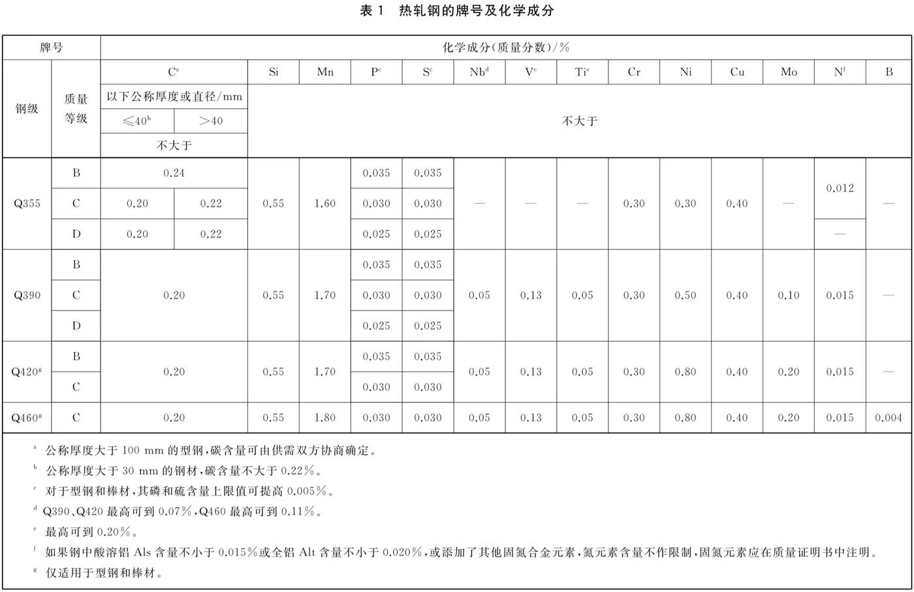

**表2 热轧状态交货钢材的碳当量（基于熔炼分析）**

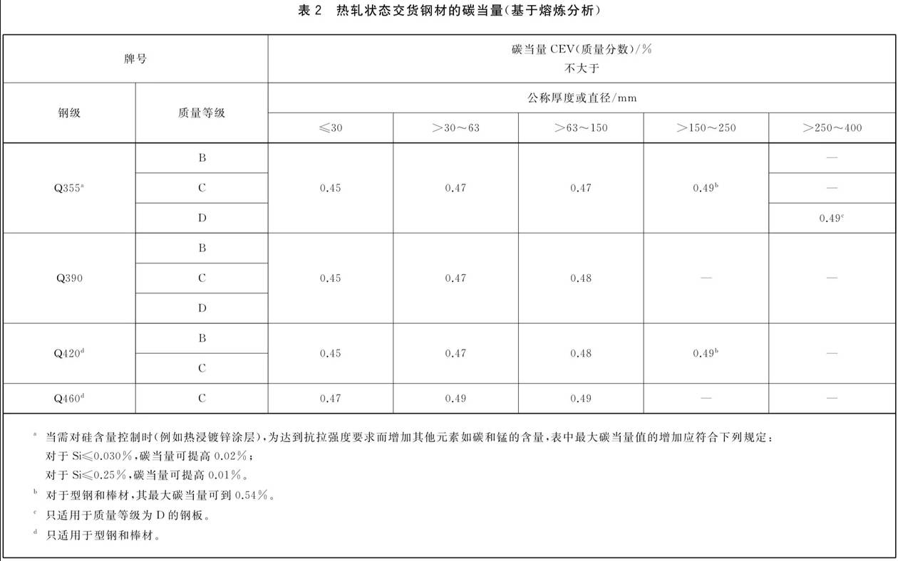

##### 正火、正火轧制钢的牌号及化学成分

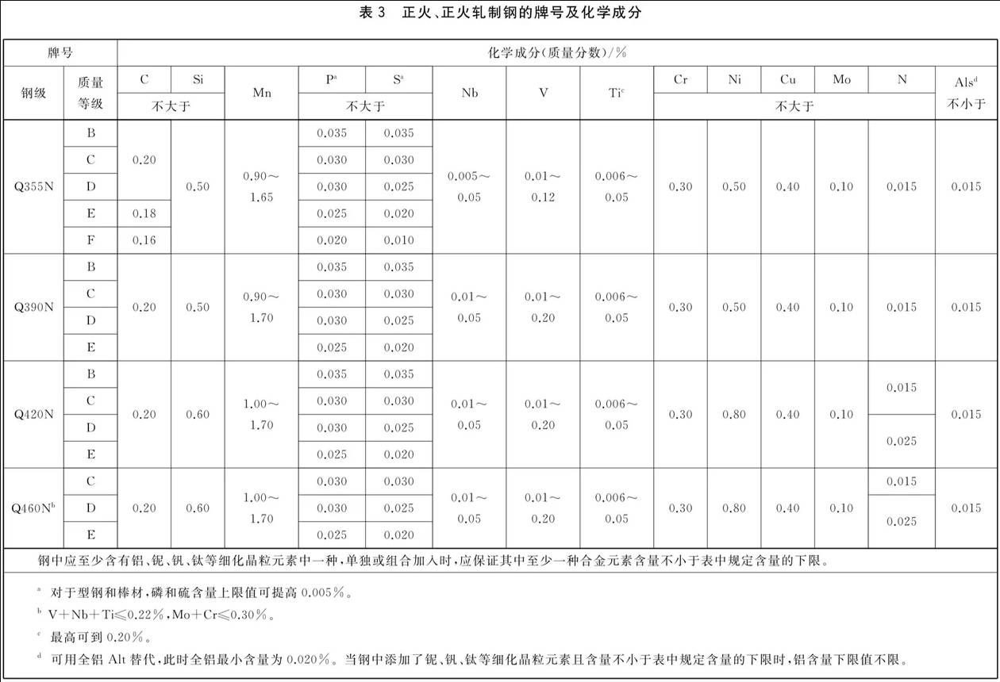

##### 正火 、正火轧制状态交货钢材的碳当量(基于熔炼分析)

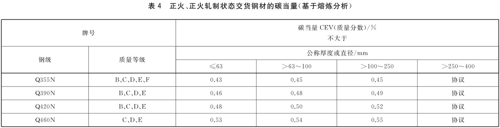

##### 热机械轧制钢的牌号及化学成分

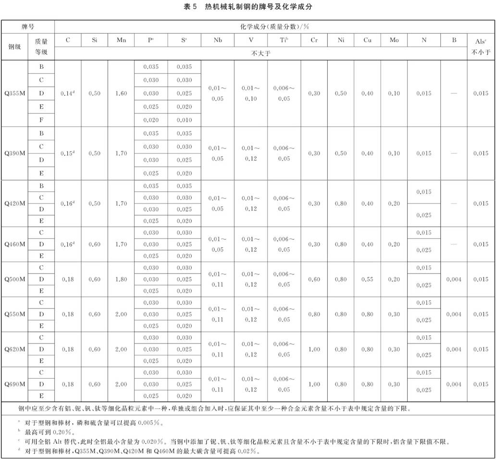

##### 热轧钢材的拉伸性能

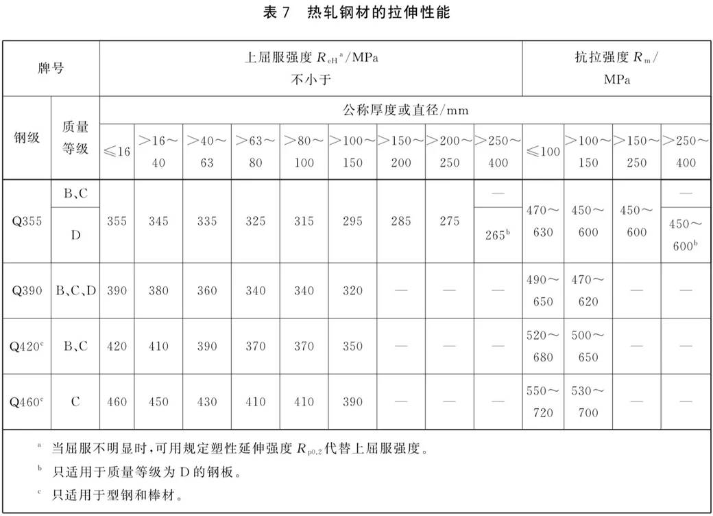

##### 热轧钢材的伸长率

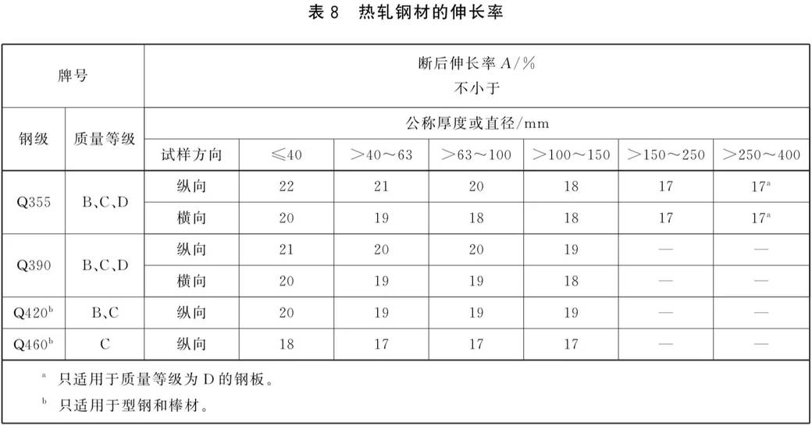

##### 正火、正火轧制钢材的拉伸性能

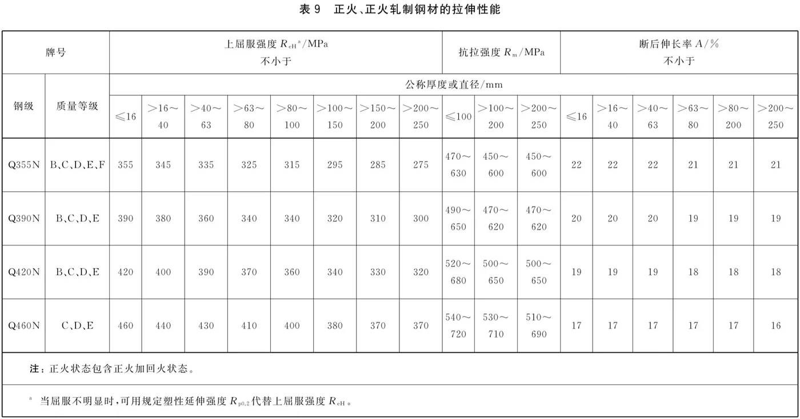

##### 热机械轧制(TMCP)钢材的拉伸性能

钢材的拉伸性能.jpg)

##### 国内外标准牌号对照表

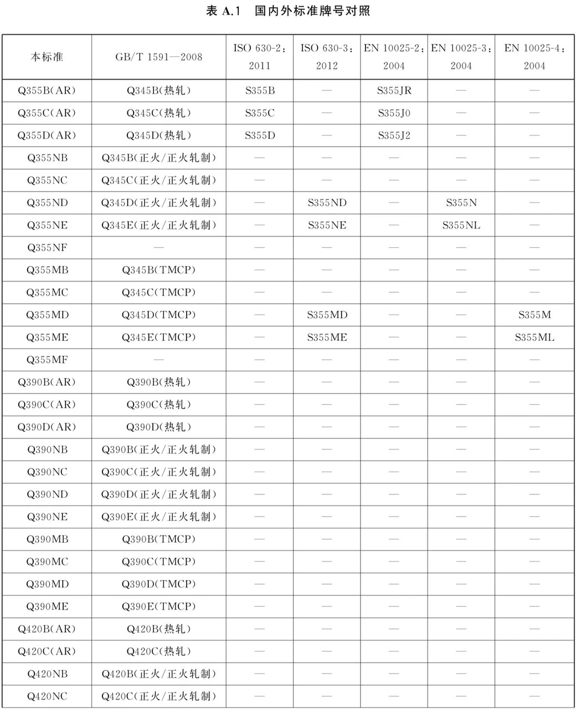

#### 低合金高强度结构钢(摘自GB/T 1591-2008)

##### 低合金高强度结构钢的化学成分

| 牌号 | 质量等级 | 化学成分①②(质量分数)/% |       |       |        |        |        |        |        |        |        |        |        |        |        |        |
| ---- | -------- | ---------------------- | ----- | ----- | ------ | ------ | ------ | ------ | ------ | ------ | ------ | ------ | ------ | ------ | ------ | ------ |
|      |          | C                      | Si    | Mn    | P      | S      | Nb     | V      | Ti     | Cr     | Ni     | Cu     | N      | Mo     | B      | Als    |
|      |          |                        |       |       | 不大于 | 不大于 | 不大于 | 不大于 | 不大于 | 不大于 | 不大于 | 不大于 | 不大于 | 不大于 | 不大于 | 不小于 |
| Q345 | A        | ≤0.20                  | ≤0.50 | ≤1.70 | 0.035  | 0.035  | 0.07   | 0.15   | 0.20   | 0.30   | 0.50   | 0.30   | 0.012  | 0.10   | —      | —      |
|      | B        | ≤0.20                  | ≤0.50 | ≤1.70 | 0.035  | 0.035  | 0.07   | 0.15   | 0.20   | 0.30   | 0.50   | 0.30   | 0.012  | 0.10   | —      | —      |
|      | C        | ≤0.20                  | ≤0.50 | ≤1.70 | 0.030  | 0.030  | 0.07   | 0.15   | 0.20   | 0.30   | 0.50   | 0.30   | 0.012  | 0.10   | —      | 0.015  |
|      | D        | ≤0.18                  | ≤0.50 | ≤1.70 | 0.030  | 0.025  | 0.07   | 0.15   | 0.20   | 0.30   | 0.50   | 0.30   | 0.012  | 0.10   | —      | 0.015  |
|      | E        | ≤0.18                  | ≤0.50 | ≤1.70 | 0.025  | 0.020  | 0.07   | 0.15   | 0.20   | 0.30   | 0.50   | 0.30   | 0.012  | 0.10   | —      | 0.015  |
| Q390 | A        | ≤0.20                  | ≤0.50 | ≤1.70 | 0.035  | 0.035  | 0.07   | 0.20   | 0.20   | 0.30   | 0.50   | 0.30   | 0.015  | 0.10   | —      | —      |
|      | B        | ≤0.20                  | ≤0.50 | ≤1.70 | 0.035  | 0.035  | 0.07   | 0.20   | 0.20   | 0.30   | 0.50   | 0.30   | 0.015  | 0.10   | —      | —      |
|      | C        | ≤0.20                  | ≤0.50 | ≤1.70 | 0.030  | 0.030  | 0.07   | 0.20   | 0.20   | 0.30   | 0.50   | 0.30   | 0.015  | 0.10   | —      | 0.015  |
|      | D        | ≤0.20                  | ≤0.50 | ≤1.70 | 0.030  | 0.025  | 0.07   | 0.20   | 0.20   | 0.30   | 0.50   | 0.30   | 0.015  | 0.10   | —      | 0.015  |
|      | E        | ≤0.20                  | ≤0.50 | ≤1.70 | 0.025  | 0.020  | 0.07   | 0.20   | 0.20   | 0.30   | 0.50   | 0.30   | 0.015  | 0.10   | —      | 0.015  |
| Q420 | A        | ≤0.20                  | ≤0.50 | ≤1.70 | 0.035  | 0.035  | 0.07   | 0.20   | 0.20   | 0.30   | 0.80   | 0.30   | 0.015  | 0.20   | —      | —      |
|      | B        | ≤0.20                  | ≤0.50 | ≤1.70 | 0.035  | 0.035  | 0.07   | 0.20   | 0.20   | 0.30   | 0.80   | 0.30   | 0.015  | 0.20   | —      | —      |
|      | C        | ≤0.20                  | ≤0.50 | ≤1.70 | 0.030  | 0.030  | 0.07   | 0.20   | 0.20   | 0.30   | 0.80   | 0.30   | 0.015  | 0.20   | —      | 0.015  |
|      | D        | ≤0.20                  | ≤0.50 | ≤1.70 | 0.030  | 0.025  | 0.07   | 0.20   | 0.20   | 0.30   | 0.80   | 0.30   | 0.015  | 0.20   | —      | 0.015  |
|      | E        | ≤0.20                  | ≤0.50 | ≤1.70 | 0.025  | 0.020  | 0.07   | 0.20   | 0.20   | 0.30   | 0.80   | 0.30   | 0.015  | 0.20   | —      | 0.015  |
| Q460 | C        | ≤0.20                  | ≤0.60 | ≤1.80 | 0.030  | 0.030  | 0.11   | 0.20   | 0.20   | 0.30   | 0.80   | 0.55   | 0.015  | 0.20   | 0.004  | 0.015  |
|      | D        | ≤0.20                  | ≤0.60 | ≤1.80 | 0.030  | 0.025  | 0.11   | 0.20   | 0.20   | 0.30   | 0.80   | 0.55   | 0.015  | 0.20   | 0.004  | 0.015  |
|      | E        | ≤0.20                  | ≤0.60 | ≤1.80 | 0.025  | 0.020  | 0.11   | 0.20   | 0.20   | 0.30   | 0.80   | 0.55   | 0.015  | 0.20   | 0.004  | 0.015  |
| Q500 | C        | ≤0.18                  | ≤0.60 | ≤1.80 | 0.030  | 0.030  | 0.11   | 0.12   | 0.20   | 0.60   | 0.80   | 0.55   | 0.015  | 0.20   | 0.004  | 0.015  |
|      | D        | ≤0.18                  | ≤0.60 | ≤1.80 | 0.030  | 0.025  | 0.11   | 0.12   | 0.20   | 0.60   | 0.80   | 0.55   | 0.015  | 0.20   | 0.004  | 0.015  |
|      | E        | ≤0.18                  | ≤0.60 | ≤1.80 | 0.025  | 0.020  | 0.11   | 0.12   | 0.20   | 0.60   | 0.80   | 0.55   | 0.015  | 0.20   | 0.004  | 0.015  |

注：1．本标准适用于一般结构和工程用低合金高强度结构钢钢板、钢带、型钢、钢棒等。

2．牌号表示方法：钢的牌号由代表屈服强度的汉语拼音字母、屈服强度数值、质量等级符号三个部分组成。例如：Q345D。其中：Q——钢的屈服强度的“屈”字汉语拼音的首位字母；345——屈服强度数值，单位为MPa；D——质量等级为D级。

  当需方要求钢板具有厚度方向性能时，则在上述规定的牌号后加上代表厚度方向(Z向)性能级别的符号，例如：Q345DZ15。

① 型材及棒材P、S含量可提高0.005%，其中A级钢上限可为0.045%。

② 当细化晶粒元素组合加入时，20(Nb+V+Ti)≤0.22%，20(Mo+ Cr)≤0.30%。

##### 低合金高强度结构钢的拉伸性能

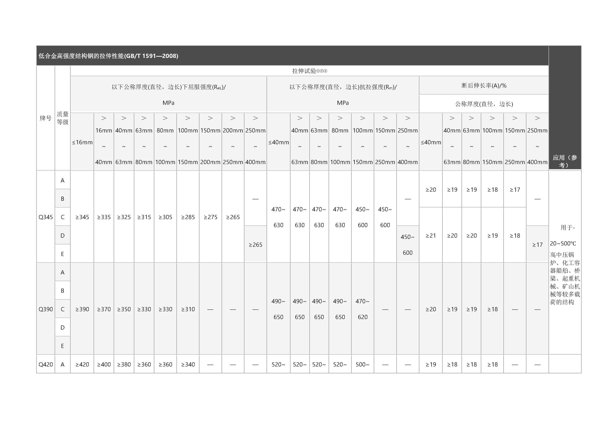

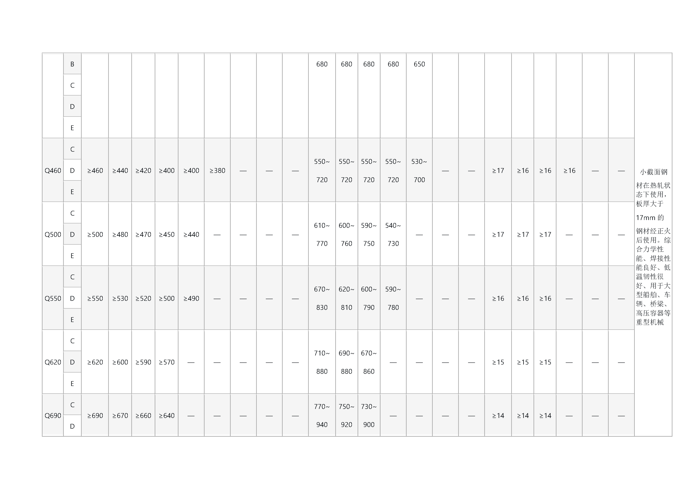

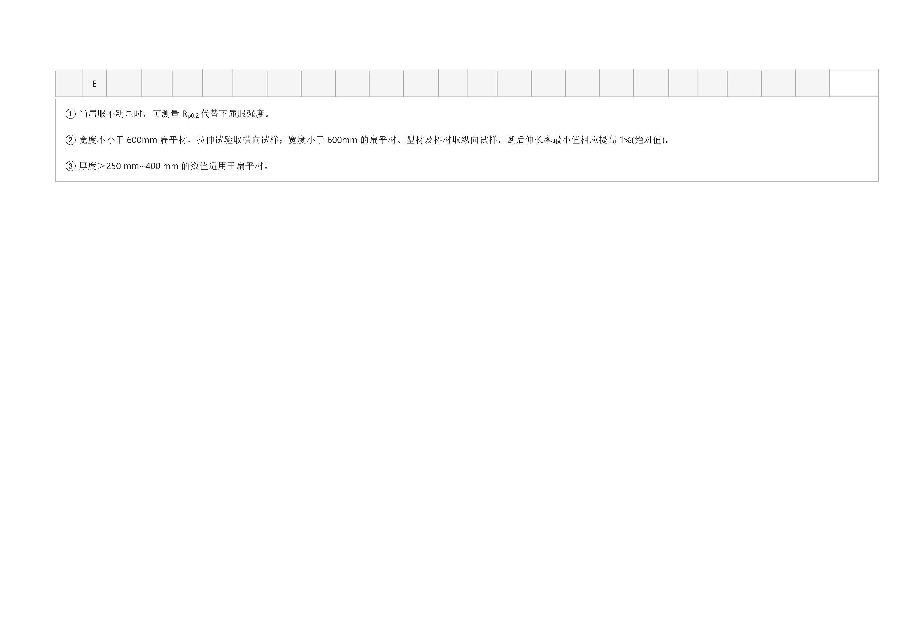

##### 低合金高强度结构钢(GB/T1591-1994)

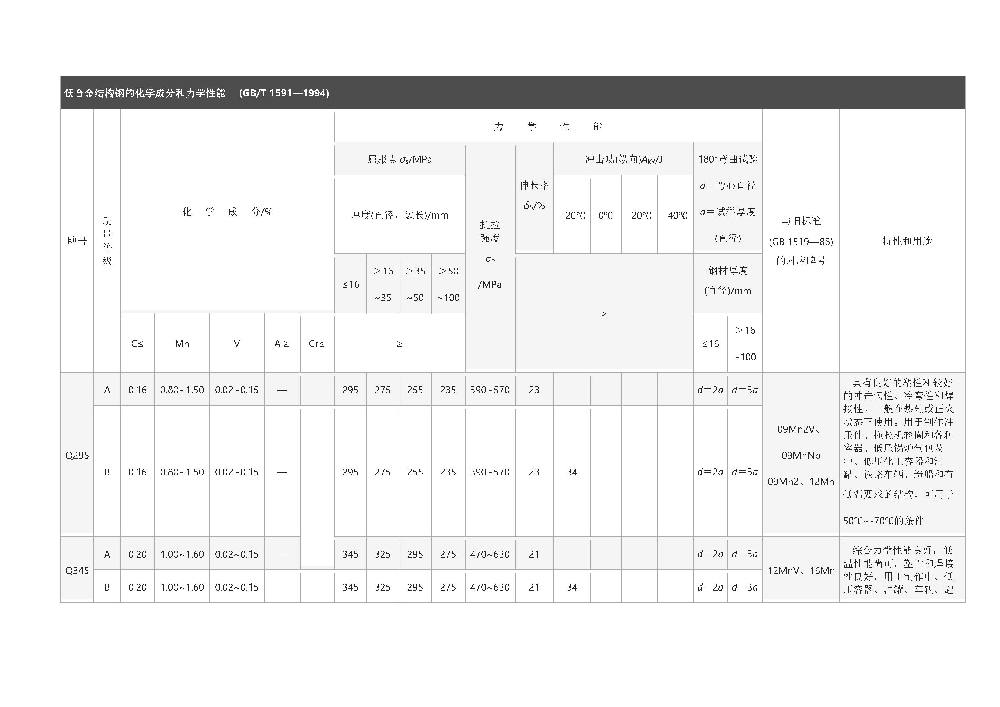

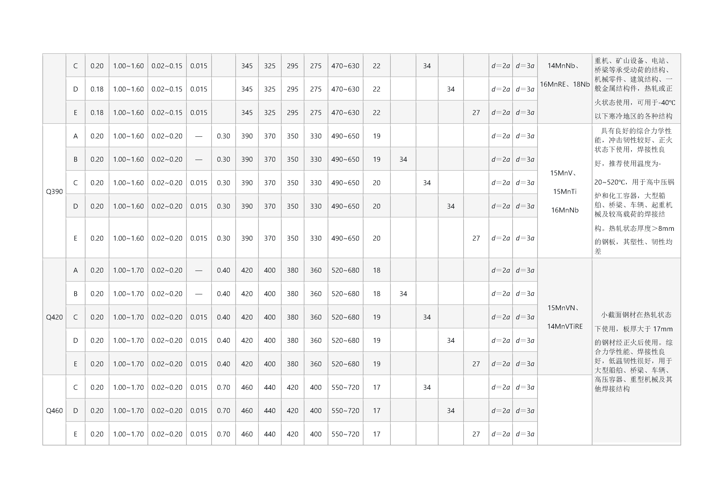

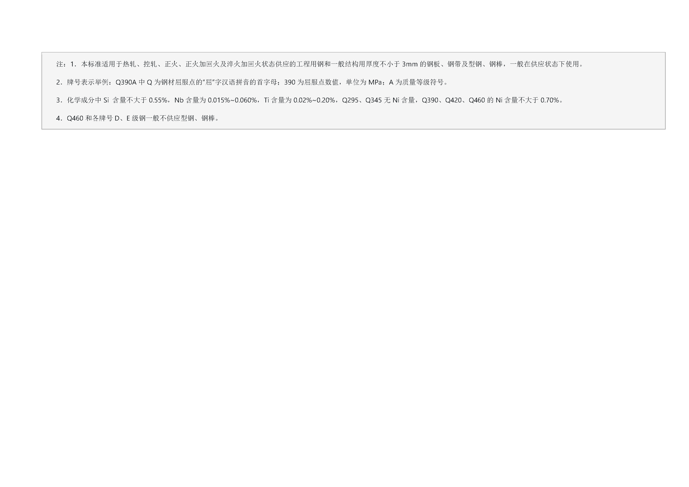

#### 低合金高强度结构钢(摘自GB/T 1591-1994)

##### 牌号和化学成分

注：表中的Al为全铝含量。如化验酸溶铝时，其含量ω应不小于0.010%。

| 牌号     | 质量等级 | 化学成分(质量分数%) |           |      |       |       |           |             |           |       |      |      |
| -------- | -------- | ------------------- | --------- | ---- | ----- | ----- | --------- | ----------- | --------- | ----- | ---- | ---- |
|          |          | C ≤                 | Mn        | Si ≤ | P ≤   | S ≤   | V         | Nb          | Ti        | Al ≥  | Cr ≤ | Ni ≤ |
| **Q295** | A        | 0.16                | 0.80~1.50 | 0.55 | 0.045 | 0.045 | 0.02~0.15 | 0.015~0.060 | 0.02~0.20 | -     | -    | -    |
| **Q295** | B        | 0.16                | 0.80~1.50 | 0.55 | 0.04  | 0.04  | 0.02~0.15 | 0.015~0.060 | 0.02~0.20 | -     | -    | -    |
| **Q345** | A        | 0.2                 | 1.00~1.60 | 0.55 | 0.045 | 0.045 | 0.02~0.15 | 0.015~0.060 | 0.02~0.20 | -     | -    | -    |
| **Q345** | B        | 0.2                 | 1.00~1.60 | 0.55 | 0.04  | 0.04  | 0.02~0.15 | 0.015~0.060 | 0.02~0.20 | -     | -    | -    |
| **Q345** | C        | 0.2                 | 1.00~1.60 | 0.55 | 0.035 | 0.035 | 0.02~0.15 | 0.015~0.060 | 0.02~0.20 | 0.015 | -    | -    |
| **Q345** | D        | 0.18                | 1.00~1.60 | 0.55 | 0.03  | 0.03  | 0.02~0.15 | 0.015~0.060 | 0.02~0.20 | 0.015 | -    | -    |
| **Q345** | E        | 0.18                | 1.00~1.60 | 0.55 | 0.025 | 0.025 | 0.02~0.15 | 0.015~0.060 | 0.02~0.20 | 0.015 | -    | -    |
| **Q390** | A        | 0.2                 | 1.00~1.60 | 0.55 | 0.045 | 0.045 | 0.02~0.20 | 0.015~0.060 | 0.02~0.20 | -     | 0.3  | 0.7  |
| **Q390** | B        | 0.2                 | 1.00~1.60 | 0.55 | 0.04  | 0.04  | 0.02~0.20 | 0.015~0.060 | 0.02~0.20 | -     | 0.3  | 0.7  |
| **Q390** | C        | 0.2                 | 1.00~1.60 | 0.55 | 0.035 | 0.035 | 0.02~0.20 | 0.015~0.060 | 0.02~0.20 | 0.015 | 0.3  | 0.7  |
| **Q390** | D        | 0.2                 | 1.00~1.60 | 0.55 | 0.03  | 0.03  | 0.02~0.20 | 0.015~0.060 | 0.02~0.20 | 0.015 | 0.3  | 0.7  |
| **Q390** | E        | 0.2                 | 1.00~1.60 | 0.55 | 0.025 | 0.025 | 0.02~0.20 | 0.015~0.060 | 0.02~0.20 | 0.015 | 0.3  | 0.7  |
| **Q420** | A        | 0.2                 | 1.00~1.70 | 0.55 | 0.045 | 0.045 | 0.02~0.20 | 0.015~0.060 | 0.02~0.20 | -     | 0.4  | 0.7  |
| **Q420** | B        | 0.2                 | 1.00~1.70 | 0.55 | 0.04  | 0.04  | 0.02~0.20 | 0.015~0.060 | 0.02~0.20 | -     | 0.4  | 0.7  |
| **Q420** | C        | 0.2                 | 1.00~1.70 | 0.55 | 0.035 | 0.035 | 0.02~0.20 | 0.015~0.060 | 0.02~0.20 | 0.015 | 0.4  | 0.7  |
| **Q420** | D        | 0.2                 | 1.00~1.70 | 0.55 | 0.03  | 0.03  | 0.02~0.20 | 0.015~0.060 | 0.02~0.20 | 0.015 | 0.4  | 0.7  |
| **Q420** | E        | 0.2                 | 1.00~1.70 | 0.55 | 0.025 | 0.025 | 0.02~0.20 | 0.015~0.060 | 0.02~0.20 | 0.015 | 0.4  | 0.7  |
| **Q460** | C        | 0.2                 | 1.00~1.70 | 0.55 | 0.035 | 0.035 | 0.02~0.20 | 0.015~0.060 | 0.02~0.20 | 0.015 | 0.7  | 0.7  |
| **Q460** | D        | 0.2                 | 1.00~1.70 | 0.55 | 0.03  | 0.03  | 0.02~0.20 | 0.015~0.060 | 0.02~0.20 | 0.015 | 0.7  | 0.7  |
| **Q460** | E        | 0.2                 | 1.00~1.70 | 0.55 | 0.025 | 0.025 | 0.02~0.20 | 0.015~0.060 | 0.02~0.20 | 0.015 | 0.7  | 0.7  |

##### 力学和工艺性能

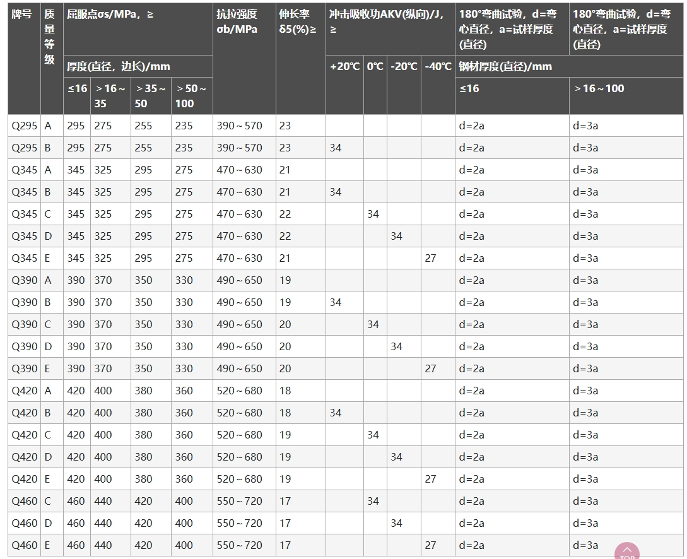

##### 特性和应用(1)

| 牌号 | 主要特性                                                     | 应用举例                                                     |
| ---- | ------------------------------------------------------------ | ------------------------------------------------------------ |
| Q295 | 钢中只含有极少量的合金元素，强度不高，但有良好的塑性、冷弯、焊接及耐蚀性能 | 建筑结构，工业厂房，低压锅炉，低、中压化工容器，油罐，管道，起重机，拖拉机，车辆及对强度要求不高的一般工程结构 |
| Q345 | 综合力学性能好，焊接性、冷、热加工性能和耐蚀性能均好，C、D、E级钢具有良好的低温韧性 | 船舶，锅炉，压力容器，石油储罐，桥梁，电站设备．起重运输机械及其他较高载荷的焊接结构件 |
| Q390 | 综合力学性能好，焊接性、冷、热加工性能和耐蚀性能均好，C、D、E级钢具有良好的低温韧性 | 船舶，锅炉，压力容器，石油储罐，桥梁，电站设备．起重运输机械及其他较高载荷的焊接结构件 |
| Q420 | 强度高，特别是在正火或正火加回火状态有较高的综合力学性能     | 大型船舶，桥梁，电站设备，中、高压锅炉，高压容器，机车车辆，起重机械，矿山机械及其他大型焊接结构件： |
| Q460 | 强度最高，在正火，正火加回火或淬火加回火状态有很高的综合力学性能，全部用铝补充脱氧，质量等级为C、D、E级，可保证钢的良好韧性 | 备用钢种，用于各种大型工程结构及要求强度高．载荷大的轻型结构 |

##### 特性和应用(2)

| 牌号      | 主要特征                                                     | 应用举例                                                     |
| --------- | ------------------------------------------------------------ | ------------------------------------------------------------ |
| 09MnV     | 具有良好的塑性、韧性、冷弯性能、冷热压力加工性能和焊接性能，且有一定的耐蚀性能。通常在热轧和正火状态下使用 | 用于制造各种容器、螺旋焊管、拖拉机轮圈、农机结构件、建筑结构、车辆用冲压件和船体等 |
| 09MnNb    | 具有良好的塑性、韧性、冷弯性能、冷热压力加工性能和焊接性能，且有一定的耐蚀性能。通常在热轧和正火状态下使用 | 用于制造各种容器、螺旋焊管、拖拉机轮圈、农机结构件、建筑结构、车辆用冲压件和船体等 |
| 12Mn      | 具有良好的综合力学性能、焊接性能、冷弯性能和冷、热压力加工性能、中温(＜400℃)和低温性能、冶炼工艺简单、成本低、常在轧制状态下使用，正火状态力学性能更好一些 | 已大量用于制造低压锅炉、车辆、容器、油罐、造船等焊接结构     |
| 18Nb      | 含铌半镇静钢，具有镇静钢的优点，但材料利用率高。综合力学性能和低温冲击韧度良好。焊接性能和冷、热压力加工性能良好 | 用于建筑结构、化工容器、管道、起重机械、鼓风机等             |
| 12MnV     | 性能与12Mn相似，但由于钒的作用，该钢具有较高的强韧性。一般在热轧或正火状态下使用 | 主要用于船体、车辆、桥梁、农机构件和一般钢结构               |
| 14MnNb    | 具有良好的综合力学性能、焊接性能、压力加工性能。一般在热轧或正火状态下使用 | 主要用作建筑结构、低凡锅炉、化工容器、桥梁等焊接结构。使用温度为-20～450℃ |
| 16Mn      | 具有良好的综合力学性能、低温冲击韧度、冷冲压、切削加工性、焊接性能等。16Mn钢的综合性能明显优于Q235A，但缺口敏感性较大，在带有缺口时，16Mn的疲劳强度低于Q235A。该钢在热轧或正火状态下使用，正火状态具有较好塑性、冲击韧性、冷压成形性能 | 广泛用于受动载荷作用的焊接结构，如桥梁、车辆、船舶、管道、锅炉、大容器、油罐、重则机械没备、矿山机械、电站、厂房结构、-40℃的低温压力容器等 |
| 16MnRE    | 性能与16Mn相近，但由于稀土元素对钢液的净化作用，该钢具有更好的韧性和冷弯性能 | 主要用途与16Mn钢相同                                         |
| 15MnV     | 强度高于16Mn，在520℃时有一定的热稳定性、缺口敏感性和时效敏感性较16Mn大，冷加工变形性较差。使用温度在-20～520℃。该钢一般在热轧或正火状态下使用，正火状态有较好冲击韧度 | 用于制造高、中压石油、化工容器、锅炉汽包、桥梁、船体、起重机、较高负荷的焊接结构、锅炉钢管，也可作为低碳淬火马氏体钢使用 |
| 15MnTi    | 性能和用途与15MnV钢相近。正火处理的冷冲压性能和焊接性能优于15MnV和16Mn钢，可以代替15MnV制造承受动载荷的构件： | 主要用途与15MnV相同。此外可用作汽轮机的蜗壳和汽轮发电机的弹簧板等 |
| 16MnNb    | 焊接性能、冷、热加工性能和低温冲击韧性均优于16Mn，一般在热轧和正火状态下使用 | 用于制造容器、管道及重型机械的焊接结构件                     |
| 14MnVTiRE | 具有很高的低温冲击韧度，良好的综合力学性能和焊接性能。一般在热轧或正火状态下使用 | 用于制造高压容器、重型机械的焊接结构件、桥梁、船体、低温钢结构等 |
| 15MnVN    | 综合力学性能优于15MnV，具有良好的焊接性能和冷、热压力加工性能。但冷加工时对缺口的敏感性较大 | 用于车辆、船舶、中、高压锅炉、容器、桥梁等焊接结构           |

##### 新旧牌号对照

注：尾数b为半镇静钢。

| 新牌号 | 旧牌号                                                 |
| ------ | ------------------------------------------------------ |
| Q295   | 09MnV、09MnNb、09Mn2、12Mn                             |
| Q345   | 18Nb、09MnCuPTi、10MnSiCu、12MnV、14MnNb、16Mn、16MnRE |
| Q390   | 10MnPNbRE、15MnV、                                     |
| Q420   | 14MnVTiRE、15MnVN                                      |
| Q460   | －                                                     |

##### 中外牌号对照

| 中国GB/T700 | 国际标准 ISO  | 原苏联 гOCT | 美国 ASTM          | 美国\|UNS | 日本JIS        | 德国DIN                         | 英国BS                         | 法国NF                           |
| ----------- | ------------- | ----------- | ------------------ | --------- | -------------- | ------------------------------- | ------------------------------ | -------------------------------- |
| Q295-A      |               | 295         | Gr·42(σs290)       |           | SPFC490        | 15Mo3                           |                                | A50                              |
| Q295-A      |               | 295         | Gr·A(σs290)        |           | SPFC490        | PH295                           |                                | A50                              |
| Q295-B      |               |             |                    |           |                |                                 |                                |                                  |
| Q345-A      | E355CC(σs355) | 345         | Gr·50              |           | SPFC590(σs355) | Fe510C(σs355)                   | Fe510C(σs355)                  | Fe510C(σs355)                    |
| Q345-B      | E355DD(σs355) |             | Gr·B               |           |                | Fe510D1(σs355)                  | Fe510D1(σs355)                 | Fe510D1(σs355)                   |
| Q345-C      | E355E(σs355)  |             | Gr·C               |           |                | Fe510D2(σs355)                  | Fe510D2(σs355)                 | Fe510D2(σs355)                   |
| Q345-D      |               |             | Gr·D               |           |                | Fe510DD1(σs355)                 | Fe510DD1(σs355)                | Fe510DD1(σs355)                  |
| Q345-E      |               |             | Gr·A，A808M，Type7 |           |                | Fe510DD2(σs355)，PH355，(σs355) | Fe510DD2(σs355)，50EE，(σs355) | Fe510DD2(σs355)，E355-Ⅱ，(σs355) |
| Q390-A      | E390CC        | 390         |                    |           | STKT540        |                                 |                                |                                  |
| Q390-B      |               |             |                    |           |                |                                 |                                |                                  |
| Q390-C      | E390DD        |             |                    |           |                |                                 |                                | A550-Ⅰ(σs400)                    |
| Q390-D      |               |             |                    |           |                |                                 | 50F                            |                                  |
| Q390-E      | E390E         |             |                    |           |                |                                 |                                |                                  |
| Q420A       | E420CC        |             | 60(σs415)          |           | SEV295         |                                 |                                | E420-Ⅰ                           |
| Q420B       | E420DD        |             | Gr·E(σs415)        |           | SEV345         |                                 |                                | E420T-Ⅱ                          |
| Q420C       | E420E         |             | Gr·B(σs415)        |           |                |                                 |                                |                                  |
| Q420D       |               |             | Type7(σs415)       |           |                |                                 |                                |                                  |
| Q420E       |               |             |                    |           |                |                                 |                                |                                  |
| Q460C       | E460DD        |             | 65(σs450)          |           | SM570          |                                 |                                | E460T-Ⅱ                          |
| Q460D       | E460E         |             |                    |           | SMA570W        |                                 |                                |                                  |
| Q460E       |               |             |                    |           | SWA570P        |                                 |                                |                                  |

## 易切削结构钢(摘自GB/T 8731-1988)

#### 易切削结构钢的牌号和化学成分

注：1.Y45Ca钢中残余元素Ni、Cr、Cu的质量分数不大于0.25%；供热压力加工用时，铜的质量分数不大于0.20%。供方能保证不大于此值时可不做分析。
2.Y40Mn以热轧或冷拉后高温回火状态交货，其他钢号以热轧或冷拉状态交货，交货状态应在合同中注明。根据需方要求也可按其他状态交货，其力学性能指标由供需双方协商。

| 牌号  | C化学成分(质量分数)(%) | Si化学成分(质量分数)(%) | Mn化学成分(质量分数)(%) | S化学成分(质量分数)(%) | P化学成分(质量分数)(%) | Pb化学成分(质量分数)(%) | Ca化学成分(质量分数)(%) |
| ----- | ---------------------- | ----------------------- | ----------------------- | ---------------------- | ---------------------- | ----------------------- | ----------------------- |
| Y12   | 0.08～0.16             | 0.15～0.35              | 0.70～1.00              | 0.10～0.20             | 0.08～0.15             | －                      | －                      |
| Y12Pb | 0.08～0.16             | ≤0.15                   | 0.70～1.00              | 0.15～0.25             | 0.05～0.10             | 0.15～0.35              | －                      |
| Y15   | 0.10～0.18             | ≤0.15                   | 0.80～1.20              | 0.23～0.33             | 0.05～0.10             | －                      | －                      |
| Y15Pb | 0.10～0.18             | ≤0.15                   | 0.80～1.20              | 0.23～0.33             | 0.05～0.10             | 0.15～0.35              | －                      |
| Y20   | 0.17～0.25             | 0.15～0.35              | 0.70～1.00              | 0.08～0.15             | ≤0.06                  | －                      | －                      |
| Y30   | 0.27～0.35             | 0.15～0.35              | 0.70～1.00              | 0.08～0.15             | ≤0.06                  | －                      | －                      |
| Y30   | 0.27～0.35             | 0.15～0.35              | 0.70～1.00              | 0.08～0.15             | ≤0.06                  | －                      | －                      |
| Y40Mn | 0.37～0.45             | 0.15～0.35              | 1.20～1.55              | 0.20～0.30             | ≤0.05                  | －                      | －                      |
| Y45Ca | 0.42～0.50             | 0.20～0.40              | 0.60～0.90              | 0.04～0.08             | ≤0.04                  | －                      | 0.002～0.006            |

#### 易切削结构热轧条钢和盘钢的力学性能

| 牌号  | 抗拉强度σb/MPa | 断后伸长率δ5(%)≥ | 断面收缩率ψ(%)≥ | 布氏硬度HBS≤ |
| ----- | -------------- | ---------------- | --------------- | ------------ |
| Y12   | 350～540       | 22               | 36              | 170          |
| Y12Pb | 390～540       | 22               | 36              | 170          |
| Y15   | 390～540       | 22               | 36              | 170          |
| Y15Pb | 390～540       | 22               | 36              | 170          |
| Y20   | 450～600       | 20               | 30              | 175          |
| Y30   | 510～655       | 15               | 25              | 187          |
| Y35   | 510～655       | 14               | 22              | 187          |
| Y40Mn | 590～735       | 14               | 20              | 207          |
| Y45Ca | 600～745       | 12               | 26              | 241          |

#### 易切削结构钢的特性和应用

| 牌号  | 主要特性                                                     | 应用举例                                                     |
| ----- | ------------------------------------------------------------ | ------------------------------------------------------------ |
| Y12   | 硫、磷复合低碳易切削结构钢，是现有易切钢中含磷最多的一个钢种。可切削性较15钢有明显改善，用自动机床加工Y12钢的标准件时，切削速度可达60m/min，粗糙度Ra为6.3。热加工材料性能有明显的方向性，通常多以冷扎状态交货 | 常代替15钢制造对力学性能要求不高的各种机器和仪器仪表零件，如螺栓、螺母、销钉、轴、管接头、火花塞外壳等 |
| Y12Pb | 含铅易切削钢。铅以微粒弥散分布于基体组织中，由于铅的熔点低(327℃)，切削热使钢中的铅呈熔融状态，起到断屑、润滑和降低加工硬化等作用。有优越的切削加工性能，日不存在性能上的方向性 | 用于制造较重要的机械零件、精密仪表零件等                     |
| Y15   | 硫、磷复合高硫、低硅易切削结构钢。该钢含硫量比Y12钢高64％，可切削性明显高于Y12钢。用自动机床切削加时，其切削速度可稳定在60m/min，粗糙度Ra为3.2，生产效率比Y12钢提高30％～50％ | 制造要求可切削性高的不重要的标准件，如螺栓、螺母、管接头、弹簧座等 |
| Y15Pb | 含铅易切削钢。可切削性比Y12Pb钢更优越，且强度稍高            | 制造对强度要求较高的重要机械零件、精密仪表零件等             |
| Y20   | 低硫、磷复合易切削结构钢，其可切削性能比20钢高30％～40％，而低于Y12钢，但力学性能优于Y12钢。该钢可进行渗碳处理 | 制造仪器、仪表零件，特别是要求表面硬而耐磨，心部韧性好的仪器、仪表、轴类等渗碳零件 |
| Y30   | 低硫、磷复合易切削结构钢。可切削性能优于30钢，可提高生产效率30％～40％。淬裂敏感性与30钢相当或略低，可根据零件形状复杂程度选择适当的淬火介质。热处理工艺与30钢基本相同 | 用于制造要求强度较高的非热处理标准件，但小零件可进行调质处理，以提高零件的使用寿命 |
| Y35   | 同Y30，但强度稍高                                            | 同Y30                                                        |
| Y40Mn | 高硫中碳易切削结构钢。有较好的可切削性能，以其加工机床丝杠为例，粗挑扣切削速度可达70m/min，精挑扣切削速度可达150m／min，刀具寿命达4h，断屑性能良好，粗糙度Ra为0.8，与45钢比，可提高刀具寿命4倍，提高生产效率30％左右。该钢还有较高的强度和硬度 | 适于加工要求强度高的机床零部件如丝杠、光杠、花键轴、齿条、销子等 |
| Y45Ca | 钙硫复合易切削结构钢。加钙后改变了钢中夹杂物的组成，获得了CaO－Al2O3-SiO2系低熔点火杂物和复合氧化物及(Ca·Mn)S共晶混合物，从而使Y45Ca具有优良的可切削性能。正常切削加工速度可达150m／min以上，比45钢提高切削速度1倍以上，可使生产效率提高1～2倍；在中低速切削加工时，也具有良好的可切削性能，比45钢提高生产效率30％。该钢热处理后还具有良好的力学性能 | 用于制造较重要的机器结构什，如机床的齿轮轴、花键轴、拖拉机传动轴等热处理零件和非热处理件。也常用于自动机床上切削加了高强度标准件，如螺钉、螺母等 |

#### 易切削结构钢中外牌号对照

| 中国      | 国际标准      | 原苏联 | 美国                  | 美国          | 日本          | 德国               | 英国                        | 法国                |
| --------- | ------------- | ------ | --------------------- | ------------- | ------------- | ------------------ | --------------------------- | ------------------- |
| GB/T 8731 | ISO           | ГOCT   | ASTM                  | UNS           | JIS           | DIN                | BS                          | NF                  |
| Y12       | 10S20 4       | A12    | 1211 C1211 B1112 1109 | C12110 G11090 | SUMl2 SUM21   | 10S20              | 210M15 220M07               | 13MF4 10F 10F1      |
| Y12Pb     | 11SMnPb28 4Pb | －     | 12L13                 | G12134        | SUM22L        | 10SPb20            |                             | AD37Pb 10Pb2 10PbF2 |
| Y15       | 1lSMn28 6     | －     | 1213 1119 B1113       | G12130 G11190 | SUM25 SUM22   | 10S20 15S20 95Mn28 | 220M07 230M07 210A15 240M07 | 15F2                |
| Y15Pb     | 11SMnPb28     | ACl4   | 12L14                 | G12144        | SUM22L SUM24L | 9SMnPb28           |                             | 10PbF2 S250Pb       |
| Y20       | －            | A20    | 1117                  | G11170        | SUM32         | 1C22               | 1C22                        | 1C22                |
| Y20       | －            | －     | C1120                 | －            | SUM31         | 22S20              | En7                         | 18MF5 20F2          |
| Y30       | C30ea         | A30    | 1132 C1126            | G11320        | －            | 1C30               | 1C30                        | 1C30                |
| Y35       | C35ea         | A35    | 1137                  | G11370        | SUM41         | 1C35 35S20         | 1C35 212M36 212A37          | 1C35 35MF6          |
| Y40Mn     | 44SMn28 9     | A40Г   | 1144 114l             | G11440 G11410 | SUM43 SUM42   | 35MF4 40S20        | 226M44 225M44 225M36 212M44 | 45MF6.3 45MF4 40M5  |
| Y45Ca     | －            | －     | －                    | －            | －            | 1C45               | 1C45                        | 1C45                |

## 弹簧钢(摘自GB/T 1222)

#### 弹簧钢(摘自GB/T 1222-2007)

##### 弹簧钢的化学成分

| 序号 | 化学成分(质量分数)/% |           |           |           |           |           |           |               |        |        |        |        |
| ---- | -------------------- | --------- | --------- | --------- | --------- | --------- | --------- | ------------- | ------ | ------ | ------ | ------ |
|      | 钢号 ²               | C         | Si        | Mn        | Cr        | V         | W         | B             | Ni     | Cu①    | P      | S      |
|      |                      |           |           |           |           |           |           |               | 不大于 | 不大于 | 不大于 | 不大于 |
| 1    | 65                   | 0.62~0.70 | 0.17~0.37 | 0.50~0.80 | ≤0.25     | -         | -         | -             | 0.25   | 0.25   | 0.035  | 0.035  |
| 2    | 70                   | 0.62~0.75 | 0.17~0.37 | 0.50~0.80 | ≤0.25     | -         | -         | -             | 0.25   | 0.25   | 0.035  | 0.035  |
| 3    | 85                   | 0.82~0.90 | 0.17~0.37 | 0.50~0.80 | ≤0.25     | -         | -         | -             | 0.25   | 0.25   | 0.035  | 0.035  |
| 4    | 65Mn                 | 0.62~0.70 | 0.17~0.37 | 0.90~1.20 | ≤0.25     | -         | -         | -             | 0.25   | 0.25   | 0.035  | 0.035  |
| 5    | 55SiMnVB             | 0.52~0.60 | 0.70~1.00 | 1.00~1.30 | ≤0.35     | 0.08~0.16 | -         | 0.0005~0.0035 | 0.35   | 0.25   | 0.035  | 0.035  |
| 6    | 60Si2Mn              | 0.56~0.64 | 1.50~2.00 | 0.70~1.00 | ≤0.35     | -         | -         | -             | 0.35   | 0.25   | 0.035  | 0.035  |
| 7    | 60Si2MnA             | 0.56~0.64 | 1.60~2.00 | 0.70~1.00 | ≤0.35     | -         | -         | -             | 0.35   | 0.25   | 0.025  | 0.025  |
| 8    | 60Si2CrA             | 0.56~0.64 | 1.40~1.80 | 0.70~1.00 | 0.70~1.00 | -         | -         | -             | 0.35   | 0.25   | 0.025  | 0.025  |
| 9    | 60Si2CrVA            | 0.56~0.64 | 1.40~1.80 | 0.70~1.00 | 0.90~1.20 | 0.10~0.20 | -         | -             | 0.35   | 0.25   | 0.025  | 0.025  |
| 10   | 55SiCrA              | 0.52~0.60 | 1.20~1.60 | 0.50~0.80 | 0.50~0.80 | -         | -         | -             | 0.35   | 0.25   | 0.025  | 0.025  |
| 11   | 55CrMnA              | 0.52~0.60 | 0.17~0.37 | 0.65~0.95 | 0.65~0.95 | -         | -         | -             | 0.35   | 0.25   | 0.025  | 0.025  |
| 12   | 60CrMnA              | 0.56~0.64 | 0.17~0.37 | 0.70~1.00 | 0.70~1.00 | -         | -         | -             | 0.35   | 0.25   | 0.025  | 0.025  |
| 13   | 50CrVA               | 0.46~0.54 | 0.17~0.37 | 0.50~0.80 | 0.80~1.10 | 0.10~0.20 | -         | -             | 0.35   | 0.25   | 0.025  | 0.025  |
| 14   | 60CrMnBA             | 0.56~0.64 | 0.17~0.37 | 0.70~1.00 | 0.70~1.00 |           |           | 0.0005~0.0040 | 0.35   | 0.25   | 0.025  | 0.025  |
| 15   | 30W4Cr2VA            | 0.26~0.34 | 0.17~0.37 | ≤0.40     | 2.00~2.50 | 0.50~0.80 | 4.00~4.50 |               | 0.35   | 0.25   | 0.025  | 0.025  |

注：1.GB/T1222适用于热轧，锻制和冷拉圆、方、扁、盘条（不包括油淬-回火弹簧用盘条YB/T 5365）及异形截面弹簧钢钢材。热轧圆、方钢应符合 GB/T 702的规定，冷拉圆钢应符合GB/T 905的规定。锻制圆、方钢应符合GB/T 908的规定。盘条应符合GB/T 14981的规定。热轧扁钢的尺寸见后面型材。

2.表中力学性能指标是采用热处理毛坯制成试样测定的纵向力学性能，适用于截面尺寸不大于80mm的棒材，以及厚度不大于

40mm的扁钢。

3.直径或边长、厚度大于上条范围者，允许其断后伸长率、断面收缩率较本表规定分别降低1%及5%。

4.所有牌号交货状态均可冷拉+热处理或冷拉，布氏硬度HBW不大于321或供需双方协商。

5.55SiMnVB应进行淬透性试验，试验应符合本标准规定。28MnSiB的化学成分见原标准附录B1力学性能见原标准附录表B2。30W4Cr2VA除抗拉强度Rm外，其他力学性能检验结果仅供参考，不作交货依据。

| 牌号    | 化学成分(质量分数)/% |           |           |        |               |        |        |        |        |
| ------- | -------------------- | --------- | --------- | ------ | ------------- | ------ | ------ | ------ | ------ |
|         | C                    | Si        | Mn        | Cr     | B             | Ni     | Cu     | P      | S      |
|         |                      | 不大于    | 不大于    | 不大于 | 不大于        | 不大于 | 不大于 | 不大于 | 不大于 |
| 28MnSiB | 0.24~0.32            | 0.60~1.00 | 1.20~1.60 | ≤0.25  | 0.0005~0.0035 | 0.35   | 0.25   | 0.035  | 0.035  |

##### 弹簧钢的力学性能

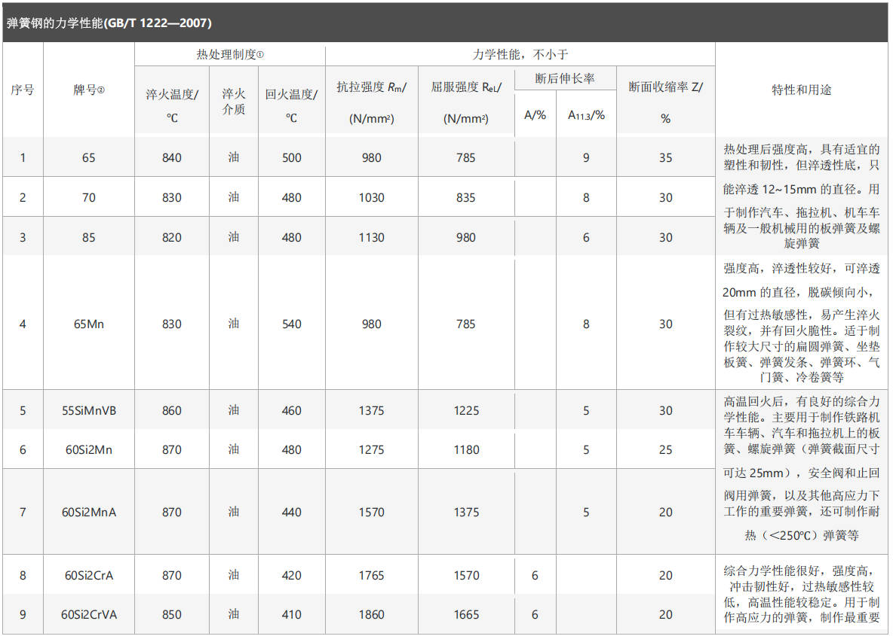

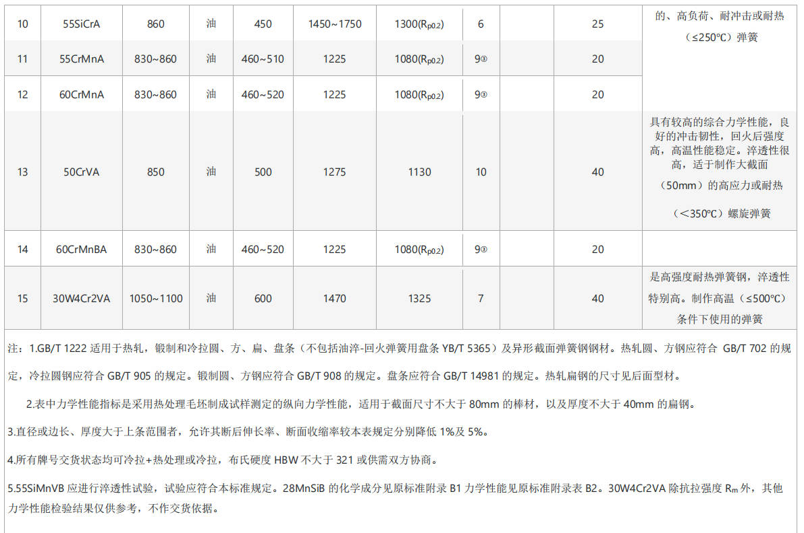

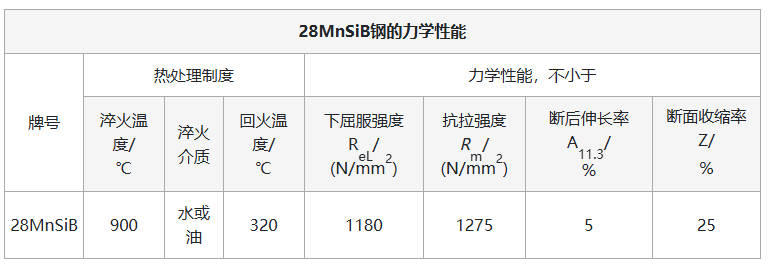

##### 钢材交货状态的硬度

| 组号 | 牌号                                                  | 交货状态      | 布氏硬度 HBW 不大于 |
| ---- | ----------------------------------------------------- | ------------- | ------------------- |
| 1    | 65、70                                                | 热轧          | 285                 |
| 2    | 85、65Mn                                              | 热轧          | 302                 |
| 3    | 60Si2Mn、60Si2MnA、50CrVA、55SiMnVB、55CrMnA、60CrMnA | 热轧          | 321                 |
| 4    | 60Si2CrA、60Si2CrVA、60CrMnBA、55SiCrA、30W4Cr2VA     | 热轧          | 供需双方协商        |
| 4    | 60Si2CrA、60Si2CrVA、60CrMnBA、55SiCrA、30W4Cr2VA     | 热轧 + 热处理 | 321                 |
| 5    | 所有牌号                                              | 冷拉 + 热处理 | 321                 |
| 6    | 所有牌号                                              | 冷拉          | 供需双方协商        |

##### 弹簧钢(GB/T1222-1984)

**弹簧钢的化学成分和力学性能** **(****GB****/****T 1222****—****1984****)**

| 钢号      | 化学成分% |           |           |           |      |      |       |       |                            |
| --------- | --------- | --------- | --------- | --------- | ---- | ---- | ----- | ----- | -------------------------- |
|           | C         | Si        | Mn        | Cr        | Ni ≤ | Cu ≤ | P ≤   | S ≤   | 其他                       |
| 65        | 0.62~0.70 | 0.17~0.37 | 0.50~0.80 | ≤0.25     | 0.25 | 0.25 | 0.035 | 0.035 |                            |
| 70        | 0.62~0.75 | 0.17~0.37 | 0.50~0.80 | ≤0.25     | 0.25 | 0.25 | 0.035 | 0.035 |                            |
| 85        | 0.82~0.90 | 0.17~0.37 | 0.50~0.80 | ≤0.25     | 0.25 | 0.25 | 0.035 | 0.035 |                            |
| 65Mn      | 0.62~0.70 | 0.17~0.37 | 0.90~1.20 | ≤0.25     | 0.25 | 0.25 | 0.035 | 0.035 |                            |
| 55Si2Mn   | 0.52~0.60 | 1.50~2.00 | 0.60~0.90 | ≤0.35     | 0.35 | 0.25 | 0.035 | 0.035 |                            |
| 55Si2MnB  | 0.52~0.60 | 1.50~2.00 | 0.60~0.90 | ≤0.35     | 0.35 | 0.25 | 0.035 | 0.035 | B 0.0005~0.0040            |
| 60Si2Mn   | 0.56~0.64 | 1.50~2.00 | 0.60~0.90 | ≤0.35     | 0.35 | 0.25 | 0.035 | 0.035 |                            |
| 60Si2MnA  | 0.56~0.64 | 1.60~2.00 | 0.60~0.90 | ≤0.35     | 0.35 | 0.25 | 0.035 | 0.035 |                            |
| 60Si2CrA  | 0.56~0.64 | 1.40~1.80 | 0.40~0.70 | 0.70~1.00 | 0.35 | 0.25 | 0.030 | 0.030 |                            |
| 60Si2CrVA | 0.56~0.64 | 1.40~1.80 | 0.40~0.70 | 0.90~1.20 | 0.35 | 0.25 | 0.030 | 0.030 | V 0.10~0.20                |
| 55CrMnA   | 0.52~0.60 | 0.17~0.37 | 0.65~0.95 | 0.65~0.95 | 0.35 | 0.25 | 0.030 | 0.030 |                            |
| 60CrMnA   | 0.56~0.64 | 0.17~0.37 | 0.70~1.00 | 0.70~1.00 | 0.35 | 0.25 | 0.030 | 0.030 |                            |
| 60CrMnMoA | 0.56~0.64 | 0.17~0.37 | 0.70~1.00 | 0.70~0.90 | 0.35 | 0.25 | 0.030 | 0.030 | Mo 0.25~0.35               |
| 55SiMnVB  | 0.52~0.60 | 0.70~1.00 | 1.00~1.30 | ≤0.35     | 0.35 | 0.25 | 0.040 | 0.040 | V 0.08~0.16B 0.0005~0.0035 |
| 50CrVA    | 0.46~0.54 | 0.17~0.37 | 0.50~0.80 | 0.80~1.10 | 0.35 | 0.25 | 0.030 | 0.030 | V 0.10~0.20                |
| 30W4Cr2VA | 0.26~0.34 | 0.17~0.37 | ≤0.40     | 2.00~2.50 | 0.35 | 0.25 | 0.030 | 0.030 | W 4.00~4.50V 0.50~0.80     |
| 60CrMnBA  | 0.56~0.64 | 0.17~0.37 | 0.70~1.00 | 0.70~1.00 | 0.35 | 0.25 | 0.030 | 0.030 | B 0.0005~0.0040            |

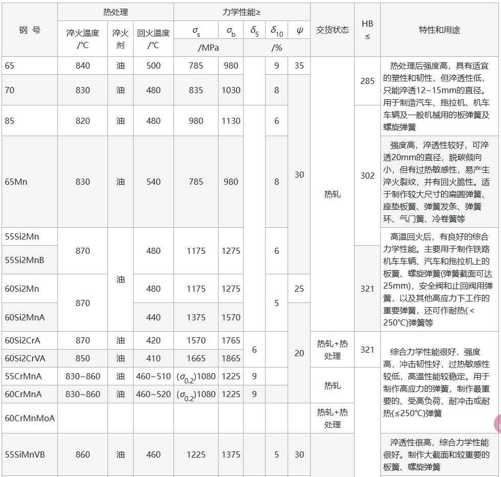

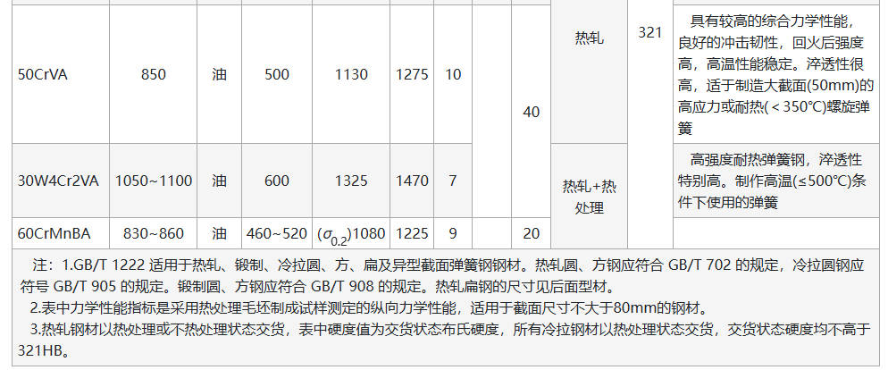

#### 弹簧钢(摘自GB/T 1222-1984)

##### 弹簧钢的牌号和化学成分

注：1.钢应用平炉、氧气转炉或电弧炉冶炼。
2.当用平炉或转炉冶炼时，不带“A”钢的硫、磷含量W均不得大于0.040%。
3.根据需方要求(在合同中注明)，钢中的残余铜含量W不大于0.20%。

| 序号 | 牌号      | **化学成分质量分数(%)** |           |           |           |                              |      |      |       |       |
| ---- | --------- | ----------------------- | --------- | --------- | --------- | ---------------------------- | ---- | ---- | ----- | ----- |
| 序号 | 牌号      | C                       | Si        | Mn        | Cr        | 其他                         | Ni ≤ | Cu≤  | P ≤   | S ≤   |
| 1    | 65        | 0.62~0.70               | 0.17~0.37 | 0.50~0.80 | ≤0.25     |                              | 0.25 | 0.25 | 0.035 | 0.035 |
| 2    | 70        | 0.62~0.75               | 0.17~0.37 | 0.50~0.80 | ≤0.25     |                              | 0.25 | 0.25 | 0.035 | 0.035 |
| 3    | 85        | 0.82~0.90               | 0.17~0.37 | 0.50~0.80 | ≤0.25     |                              | 0.25 | 0.25 | 0.035 | 0.035 |
| 4    | 65Mn      | 0.62~0.70               | 0.17~0.37 | 0.90~1.20 | ≤0.25     |                              | 0.25 | 0.25 | 0.035 | 0.035 |
| 5    | 55Si2Mn   | 0.52~0.60               | 1.50~2.00 | 0.60~0.90 | ≤0.35     |                              | 0.35 | 0.25 | 0.035 | 0.035 |
| 6    | 55Si2MnB  | 0.52~0.60               | 1.50~2.00 | 0.60~0.90 | ≤0.35     | B 0.0005~0.004               | 0.35 | 0.25 | 0.035 | 0.035 |
| 7    | 55SiMnVB  | 0.52~0.60               | 0.70~1.00 | 1.00~1.30 | ≤0.35     | V 0.08~0.16, B 0.0005~0.0035 | 0.35 | 0.25 | 0.035 | 0.035 |
| 8    | 60Si2Mn   | 0.56~0.64               | 1.50~2.00 | 0.60~0.90 | ≤0.35     |                              | 0.35 | 0.25 | 0.035 | 0.035 |
| 9    | 60Si2MnA  | 0.56~0.64               | 1.50~2.00 | 0.60~0.90 | ≤0.35     |                              | 0.35 | 0.25 | 0.03  | 0.03  |
| 10   | 60Si2CrA  | 0.56~0.64               | 1.40~1.80 | 0.40~0.70 | 0.70~1.00 |                              | 0.35 | 0.25 | 0.03  | 0.03  |
| 11   | 60Si2CrVA | 0.56~0.64               | 1.40~1.80 | 0.40~0.70 | 0.90~1.20 | V 0.10~0.20                  | 0.35 | 0.25 | 0.03  | 0.03  |
| 12   | 55CrMnA   | 0.52~0.60               | 0.17~0.37 | 0.65~0.95 | 0.65~0.95 |                              | 0.35 | 0.25 | 0.03  | 0.03  |
| 13   | 60CrMnA   | 0.56~0.64               | 0.17~0.37 | 0.70~1.00 | 0.70~1.00 |                              | 0.35 | 0.25 | 0.03  | 0.03  |
| 14   | 60CrMnMoA | 0.56~0.64               | 0.17~0.37 | 0.70~1.00 | 0.70~0.90 | Mo 0.25~0.35                 | 0.35 | 0.25 | 0.03  | 0.03  |
| 15   | 50CrVA    | 0.46~0.54               | 0.17~0.37 | 0.50~0.80 | 0.80~1.10 | V 0.10~0.20                  | 0.35 | 0.25 | 0.03  | 0.03  |
| 16   | 60CrMnBA  | 0.56~0.64               | 0.17~0.37 | 0.70~1.00 | 0.70~1.00 | B 0.0005~0.004               | 0.35 | 0.25 | 0.03  | 0.03  |
| 17   | 30W4Cr2VA | 0.26~0.34               | 0.17~0.37 | ≤0.40     | 2.00~2.50 | V 0.5~0.8, W 4~4.5           | 0.35 | 0.25 | 0.03  | 0.03  |

##### 弹簧钢的力学性能

注：1.表中所列力学性能适用于截面尺寸≤80mm的钢材，≥80mm者允许其δ、ψ值较表内的规定分别降低1个单位(δ)及5个单位(ψ)。
2.除规定热处理温度上下限外，表中热处理温度允许偏差为：淬火5=20℃、回火±50℃，根据需方特殊要求，回火可按±30℃进行。
3.热轧钢材以热处理或不热处理状态交货，冷拉钢材以热处理状态交货。
4.30W4Cr2VA钢除δb外，其他性能检验结果供参考。
5.带*号的55SiMnVB钢热轧材的交货状态下的硬度值HBS不大于341的，其质量如不超过交货量的10％时，允许交货。

| 序号 | 牌号      | 淬火温度 /℃ | 淬火介质 | 回火温度 /℃ | σs/MPa    | σb/MPa | δ5(%) | δ10(%) | ψ(%) | 交货状态                      | 交货状态下布氏硬度 HBS ≤ |
| ---- | --------- | ----------- | -------- | ----------- | --------- | ------ | ----- | ------ | ---- | ----------------------------- | ------------------------ |
| 1    | 65        | 480         | 油       | 500         | 785       | 980    | -     | 9      | 35   | 热轧 / 冷拉 + 热处理          | 285                      |
| 2    | 70        | 830         | 油       | 480         | 835       | 1030   | -     | 8      | 30   | 热轧 / 冷拉 + 热处理          | 321                      |
| 3    | 85        | 820         | 油       | 480         | 980       | 1130   | -     | 6      | 30   | 热轧 / 冷拉 + 热处理          | 302                      |
| 4    | 65Mn      | 830         | 油       | 540         | 785       | 980    | -     | 8      | 30   | 热轧 / 冷拉 + 热处理          | 321                      |
| 5    | 55Si2Mn   | 870         | 油       | 480         | 1175      | 1275   | -     | 6      | 30   | 热轧 / 冷拉 + 热处理          | 321                      |
| 6    | 55Si2MnB  | 870         | 油       | 480         | 1175      | 1275   | -     | 6      | 30   | 热轧 */ 冷拉 + 热处理         | 321                      |
| 7    | 55SiMnVB  | 860         | 油       | 460         | 1225      | 1375   | -     | 5      | 30   | 热轧 */ 冷拉 + 热处理         | 321                      |
| 8    | 60Si2Mn   | 870         | 油       | 480         | 1175      | 1275   | -     | 5      | 25   | 热轧 */ 冷拉 + 热处理         | 321                      |
| 9    | 60Si2MnA  | 870         | 油       | 440         | 1375      | 1570   | -     | 5      | 20   | 热轧 */ 冷拉 + 热处理         | 321                      |
| 10   | 60Si2CrA  | 870         | 油       | 420         | 1570      | 1765   | 6     | -      | 20   | 热轧 + 热处理 / 冷拉 + 热处理 | 321                      |
| 11   | 60Si2CrVA | 850         | 油       | 410         | 1665      | 1865   | 6     | -      | 20   | 热轧 + 热处理 / 冷拉 + 热处理 | 321                      |
| 12   | 55CrMnA   | 830~860     | 油       | 460~510     | σ0.2 1080 | 1225   | 9     | -      | 20   | 热轧 / 冷拉 + 热处理          | 321                      |
| 13   | 60CrMnA   | 830~860     | 油       | 460~520     | σ0.2 1080 | 1225   | 9     | -      | 20   | 热轧 / 冷拉 + 热处理          | 321                      |
| 14   | 60CrMnMoA | -           | -        | -           | -         | -      | -     | -      | -    | 热轧 + 热处理 / 冷拉 + 热处理 | 321                      |
| 15   | 50CrVA    | 850         | 油       | 500         | 1130      | 1275   | 10    | -      | 40   | 热轧 / 冷拉 + 热处理          | 321                      |
| 16   | 60CrMnBA  | 830~860     | 油       | 460~520     | σ0.2 1080 | 1225   | 9     | -      | 20   | 热轧 + 热处理 / 冷拉 + 热处理 | 321                      |
| 17   | 30W4Cr2VA | 1050~1100   | 油       | 600         | 1325      | 1470   | 7     | -      | 40   | 热轧 + 热处理 / 冷拉 + 热处理 | 321                      |

##### 弹簧钢的特性和应用

| 牌号                        | 主要特性                                                     | 应用举例                                                     |
| --------------------------- | ------------------------------------------------------------ | ------------------------------------------------------------ |
| 65、70                      | 经热处理及冷拔硬化后，可得到较高的强度和适当的韧性、塑性；在相同表面状态和完全淬透情况下，疲劳极限不比合金弹簧钢差。但淬透性低，尺寸较大，油中淬不透，水淬则变形。开裂倾向较大，只宜用于较小尺寸弹簧 | 调压调速弹簧、测力弹簧、一般机械上的圆、方螺旋弹簧或拉成钢丝作小型机械上的弹簧 |
| 85                          |                                                              | 汽车、拖拉机或火车等机械上承受振动的扁形板簧和圆形螺旋弹簧   |
| 65Mn                        | 锰提高淬透性，φ12mm 的钢材油中可以淬透，表面脱碳倾向比硅钢小，经热处理后的综合力学性能优于碳钢，但有过热敏感性和回火脆性 | 小尺寸各种扁、圆弹簧、座垫弹簧、弹簧发条，也可制做弹簧环、气门簧、离合器簧片、刹车弹簧、冷卷螺旋弹簧 |
| 55Si2Mn、55Si2MnB           | 硅和锰提高弹性极限和屈强比，提高淬透性，回火稳定性和抗松弛稳定性，过热敏感性也较小，但脱碳倾向较大，尤其是硅与碳含量较大，碳易于石墨化，使钢变脆 | 汽车、拖拉机、机车上的减振板簧和螺旋弹簧，汽缸安全阀，电力机车用升弓钩弹簧，止回阀簧，还可用作 250℃以下使用的螺旋弹簧 |
| 55SiMnVB                    | 合金元素含量低，淬透性比 60Si2Mn 高，韧性、塑性也较高，脱碳倾向小，回火稳定性良好，热加工性能好，成本低 | 代替 60Si2MnA 制作重型，中、小型汽车的板簧和其他中型断面的板簧和螺旋弹簧 |
| 60Si2Mn、60Si2MnA           | 钢的强度和弹性极限较 55Si2Mn 稍高，淬透性也较高，在油中临界淬透直径为 35~73mm，其他性能和 55Si2Mn 钢相同 | 汽车、拖拉机、机车上的减振板簧和螺旋弹簧，汽缸安全阀，止回阀簧，还可用作 250℃以下非腐蚀介质中的耐热弹簧 |
| 60Si2CrA、60Si2CrVA         | 与硅锰钢相比，当塑性相近时，具有较高的抗拉强度和屈服强度，尤其是 60Si2CrVA 有更高的弹性极限，钢的淬透性较大，有回火脆性 | 用于承受高压力及工作温度在 300~350℃以下的弹簧，如调速器弹簧、汽轮机汽封弹簧、破碎机用簧等 |
| 55CrMnA、60CrMnA、60CrMnMoA | 有较高强度、塑性和韧性、淬透性较好、过热敏感性比锰钢低、比硅锰钢高，脱碳倾向比硅锰钢小，回火脆性大 | 用于车辆、拖拉机上制作负荷较重，应力较大的板簧和直径较大的螺旋弹簧 |
| 50CrVA                      | 有良好的力学性能和工艺性能、淬透性较高。加入钒使钢的晶粒细化，降低过热敏感性，提高强度和韧性，具有高的疲劳强度，σ₀.₂/σb 的比值也高。是一种较高级的弹簧钢 | 用作较大截面的高负荷重要弹簧及工作温度 < 300℃的阀门弹簧、活塞弹簧、安全阀弹簧等 |
| 65Si2MnWA                   | 与 60Si2MnA 相比，在高温下有较高的高温强度和硬度，降低过热敏感性，增加了淬透性，特别是提高了承受冲击负荷的能力 | 用于承受高负荷或耐热 (≤350℃)、耐冲击负荷的大截面弹簧         |
| 30W4Cr2VA                   | 由于钨、铬、钒的作用，此钢有良好的室温和高温力学性能，有很高的淬透性和回火稳定性，热加工性能良好 | 用作工作温度 ≤500℃以下的耐热簧，如锅炉主安全阀弹簧、汽轮机汽封弹簧片等 |

##### 弹簧钢中外牌号对照

| 中国GB/T5216 | 国际标准ISO | 原苏联ГOTC | 美国ASTM    | 美国UNS       | 日本JSI                 | 德国DIN         | 英国BS         | 法国NF                        |
| ------------ | ----------- | ---------- | ----------- | ------------- | ----------------------- | --------------- | -------------- | ----------------------------- |
| 65           | Type DC     | 65         | 1064        | G10650        | SWRH67A,SWRH67B,SUP2    | C67,CK67        | 080A67,060A67  | FMR66,FMR68,XC65              |
| 70           | Type DC     | 70         | 1070        | G10700        | SWRH72A,SWRH72B,SWRS72B | CK75            | 070A72,060A72  | FMR66,FMR68,FMR70,FMR72, XC70 |
| 85           | Type DC     | 85         | 10841085    | G10840,G10850 | SUP3                    | CK85            | 060A8,080A86   | FMR86,XC85                    |
| 65Mn         | Type DC     | 65Г        | 1566,C1056  | G15660        | －                      | 65Mn4           | 080A67         | －                            |
| 55Si2Mn      | 56SiCr7     | 55C2Г      | 9255        | H92600        | SUP6,SUP7               | 55Si7           | 251H60,250A53  | 56SC7,55S7                    |
| 55Si2MnB     | －          | －         | －          | －            | －                      | －              | －             | －                            |
| 55SiMnVB     | －          | －         | －          | －            | －                      | －              | －             | －                            |
| 60Si2Mn      | 61SiCr7     | 60C2Г      | 9260        | H92600        | SUP6                    | －              | 251H60         | 61SC7                         |
| 60Si2Mn      | 6,7         | －         | －          | G92600        | SUP7                    | 60Si7,60SiMn5   | 250A58,250A61  | 60S7,60SC7                    |
| 60Si2MnA     | 61SiCr7     | 60C2A      | 9260H       | H92600        | SUP6,SUP7               | 60SICr7         | 251H60         | 61SC7                         |
| 60Si2CrA     | 55SiCr63    | 60C2XA     | －          | －            | SWOSC-V                 | 60SiCr7,67SiCr5 | 685H57         | 60SC7                         |
| 60Si2CrVA    | －          | 60C2XΦA    | －          | －            | －                      | －              | －             | －                            |
| 55CrMnA      | 55Cr3, 8    | －         | 5155        | H51550,G51550 | SUP9                    | 55Cr3           | 525A58, 527A60 | 55C3,55C2                     |
| 60CrMnA      | 55Cr3, 8    | －         | 5160        | H51600,G51600 | SUP9A,SUP11A            | 55Cr3           | 527H60,527A60  | 55Cr3                         |
| 60CrMnMoA    | 60CrMo33,12 | －         | 4161        | G41610,H41610 | SUP13                   | 51CrMoV4        | 705H60,805A60  | －                            |
| 50CrVA       | 51CrV4,13   | 50XΦA      | 6150,H51500 | G61500        | SUP10                   | 50CrV4          | 735A51         | 50CV4                         |
| 60CrMnBA     | 60CrB3,10   | －         | 51B60       | H51601,G51601 | SUP11A                  | 58CrMnB4        | －             | －                            |
| 30W4Cr2VA    | －          | －         | －          | －            | －                      | 30WCrV17.9      | －             | －                            |

## 耐候结构钢(摘自GB/T 4171-2008)

#### 耐候结构钢的化学成分

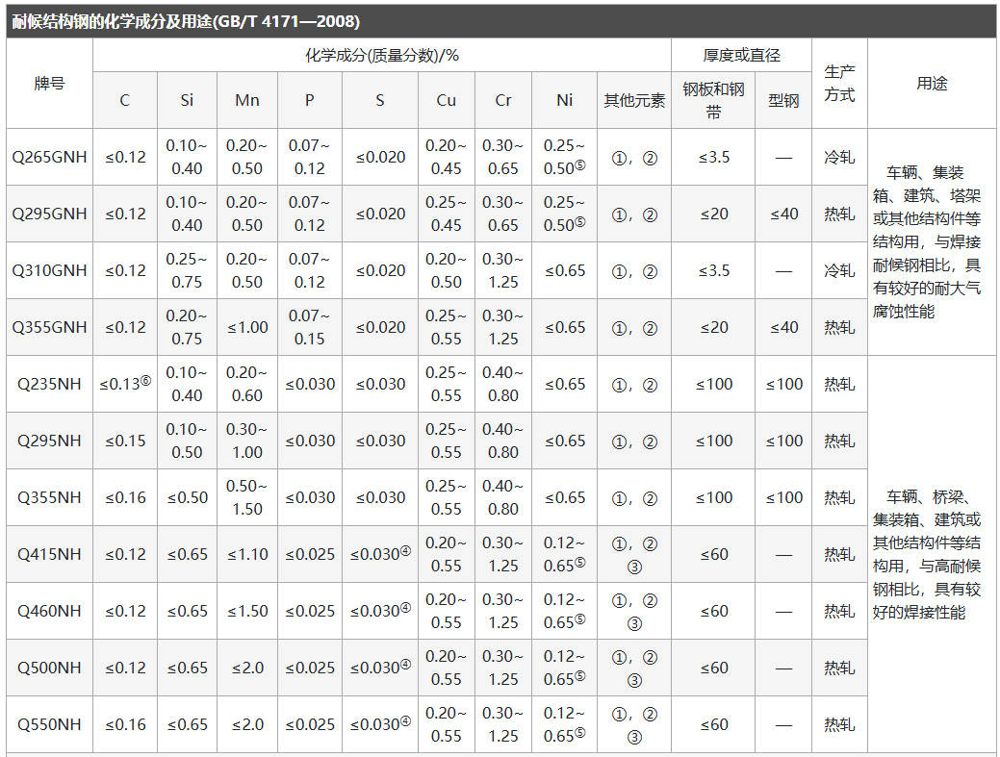

① 为了改善钢的性能，可以添加一种或一种以上的微量合金元素：Nb 0.015%~0.060%，V 0.02%~0.12%，Ti 0.02%~0.10%，Alt≥0.020%。若上述元素组合使用时，应至少保证其中一种元素含量达到上述化学成分的下限规定。

② 可以添加下列合金元素：Mo≤0.30%，Zr≤0.15%。

③ Nb、V、Ti等三种合金元素的添加总量不应超过0.22%。

④ 供需双方协商，S的含量可以不大于0.008%。

⑤ 供需双方协商，Ni含量的下限可不做要求。

⑥ 供需双方协商，C的含量可以不大于0.15%。

#### 耐候结构钢的力学性能和工艺性能

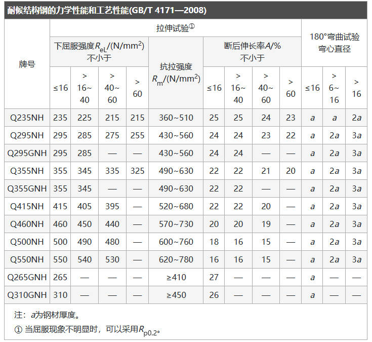

#### 耐候结构钢新旧牌号对照表

| GB/T 4171—2008 | GB/T 4171—2000 | GB/T 4172—2000 | GB/T 18982—2003 | TB/T 1979—2003 |
| -------------- | -------------- | -------------- | --------------- | -------------- |
| Q235NH         | —              | Q235NH         | —               | —              |
| Q295NH         | —              | Q295NH         | —               | —              |
| Q295GNH        | Q295GNHL       | —              | —               | 09CuPCrNi-B    |
| Q355NH         | —              | Q355NH         | —               | —              |
| Q355GNH        | Q345GNHL       | —              | —               | 09CuPCrNi-A    |
| Q415NH         | —              | —              | —               | —              |
| Q460NH         | —              | —              | —               | —              |
| Q500NH         | —              | —              | —               | —              |
| Q550NH         | —              | —              | —               | —              |
| Q265GNH        | Q295GNHL       | —              | —               | 09CuPCrNi-B    |
| Q310GNH        | —              | —              | Q310GNHLJ       | 09CuPCrNi-A    |

#### 耐候结构钢的牌号与国外相近牌号对照表

| GB/T 4171—2008 | ISO 4952:2006 | ISO 5952:2005 | EN 10025-5:2004           | JIS G 3114:2004              | JIS G 3125:2004 | ASTM A242M-04 | ASTM A588M-05 | ASTM A606-04 | ASTM A871M-03 |
| -------------- | ------------- | ------------- | ------------------------- | ---------------------------- | --------------- | ------------- | ------------- | ------------ | ------------- |
| Q235NH         | S235W         | HSA235W       | S235J0W，S235J2W          | SMA400AW，SMA400BW，SMA400CW | —               | —             | —             | —            | —             |
| Q295NH         | —             | —             | —                         | —                            | —               | —             | —             | —            | —             |
| Q295GNH        | —             | —             | —                         | —                            | —               | —             | —             | —            | —             |
| Q355NH         | S355W         | HSA355W2      | S355J0W，S355J2W，S355K2W | SMA490AW，SMA490BW，SMA490CW | —               | —             | Grade K       | —            | —             |
| Q355GNH        | S355WP        | HSA355W1      | S355J0WP，S355J2WP        | —                            | SPA-H           | Type1         | —             | —            | —             |
| Q415NH         | S415W         | —             | —                         | —                            | —               | —             | —             | —            | 60            |
| Q460NH         | S460W         | —             | —                         | SMA570W，SMA570P             | —               | —             | —             | —            | 65            |
| Q500NH         | —             | —             | —                         | —                            | —               | —             | —             | —            | —             |
| Q550NH         | —             | —             | —                         | —                            | —               | —             | —             | —            | —             |
| Q265GNH        | —             | —             | —                         | —                            | —               | —             | —             | —            | —             |
| Q310GNH        | —             | —             | —                         | —                            | SPA-C           | —             | —             | Type4        | —             |

注：1．本表只是钢级的对照，未包括牌号的质量等级。

2．A242M、A588M、A606等标准中只规定一个钢级，没有牌号，但有多个化学成分与其对应，本表只列出与本标准相似的化学成分的代号。