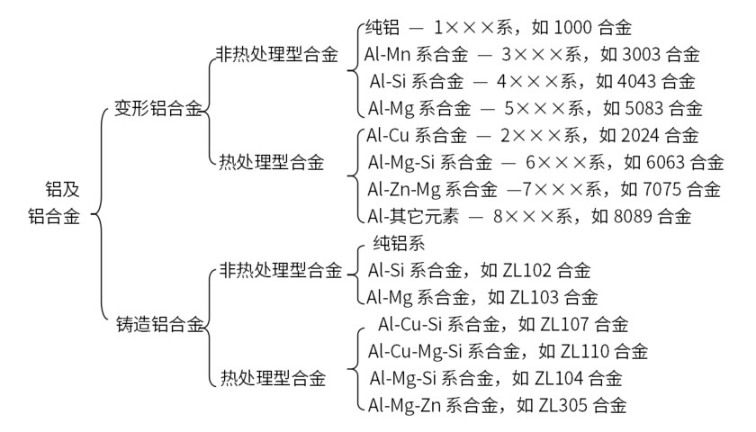

# 铝的特性、应用与分类

#### 铝的物理和力学性能

①估计值

| 物理性能 - 项目 1        | 数值 1 | 物理性能 - 项目 2               | 数值 2 | 力学性能 - 项目            | 数值  |
| ------------------------ | ------ | ------------------------------- | ------ | -------------------------- | ----- |
| 1. 密度 ρ(20℃) / (g/cm³) | 2.69   | 6. 比热容 f (20℃) / [J/(kg・K)] | 900    | 1. 抗拉强度 σb / MPa       | 40~50 |
| 2. 熔点 / ℃              | 600.4  | 7. 线胀系数 αL / (10⁻⁶/K)       | 23.6   | 2. 屈服强度 σ0.2 / MPa     | 15~20 |
| 3. 沸点 / ℃              | 2494   | 8. 热导率 λ / [W/(m・K)]        | 247    | 3. 断后伸长率 δ / %        | 50~70 |
| 4. 熔化热 / (kJ/mol)     | 10.47  | 9. 电阻率 ρ / (nΩ・m)           | 26.55  | 4. 硬度 HBS                | 20~35 |
| 5. 汽化热 / (kJ/mol)     | 291.4① | 10. 电导率 κ / (% IACS)         | 64.96  | 5. 弹性模量 (拉伸) E / GPa | 62    |

#### 铝的基本特性与应用范围

铝是元素周期表中第三周期主族元素，原子序数为13，原子量为26.9815。  

铝具有一系列比其他有色金属、钢铁、塑料和木材等更优良的特性，如密度小，仅为2.7 g / cm3，约为铜或钢的1/3； 良好的耐蚀性和耐候性；良好的塑性和加工性能；良好的导热性和导电性；良好的耐低温性能，对光热电波的反射率高、表面性能好；无磁性；基本无毒；有吸音性；耐酸性好；抗核辐射性能好；弹性系数小； 良好的力学性能；优良的铸造性能和焊接性能；良好的抗撞击性。此外，铝材的高温性能、成型性能、切削加工性、铆接性以及表面处理性能等也比较好。 因此，铝材在航天、航海、航空、汽车、交通运输、桥梁、建筑、电子电气、能源动力、冶金化工、农业排灌、机械制造、包装防腐、电器家具、日用文体等各个领域都获得了十分广泛的应用，下表列出了铝的基本特性及主要应用领域。

**铝的基本特性及主要应用领域**

| 基本特性                 | 主要特点                                                     | 主要应用领域举例                                             |
| ------------------------ | ------------------------------------------------------------ | ------------------------------------------------------------ |
| 质量轻                   | 铝的密度为 2.7 g/cm³，约为铜或铁的 1/3。是轻量化的良好材料   | 用于制造飞机、航天器、轨道车辆、汽车、船舶、桥梁、高层建筑、重型机械部件和质量轻的容器等 |
| 强度好                   | 铝的力学性能不如钢铁，但它的比强度高，可以添加铜、镁、锰、铬等合金元素，制成铝合金，再经热处理，而得到很高的强度。铝合金的强度比普通钢好，也可以和特殊钢媲美 | 用于制造桥梁（特别是吊桥、可动桥）、飞机、压力容器、集装箱、建筑结构材料、小五金等 |
| 加工容易                 | 铝的延展性优良，易于挤出形状复杂的中空型材和适于拉伸加工及其他各种冷热塑性成形 | 受力结构部件框架，一般用品及各种容器、光学仪器及其他形状复杂的精密零件 |
| 美观、适于各种表面处理   | 铝及其合金的表面有氧化膜，呈银白色，相当美观。如果经过氧化处理，其表面的氧化膜更牢固，而且还可以用着色和喷涂等方法，制造出各种颜色和光泽的表面 | 建筑用壁板、器具装饰、装饰品、标牌、门窗、幕墙、汽车和飞机蒙皮、仪表外壳及室内外装修材料等 |
| 导热、导电性好           | 导热、导电率仅次于铜，约为钢铁的 3~4 倍                      | 电线、母线接头、锅、电饭锅、热交换器、汽车散热器、电子元件等 |
| 对光、热、电波的反射性好 | 对光的反射率，抛光铝为 70%，高纯度铝经过电解抛光后为 94%，比银（92%）还高。铝对热辐射和电波也有很好的反射性能 | 照明器具、反射镜、屋顶瓦板、抛物面天线、冷藏库、冷冻库、投光器、冷暖器的隔热材料 |
| 没有磁性                 | 铝是非磁性体                                                 | 船上用的罗盘、天线、操舵室的器具等                           |
| 耐低温                   | 铝在温度低时，它的强度反而增加而无脆性，因此它是理想的低温装置材料 | 冷藏库、冷冻库、南极雪上车辆、氧及氢的生产装置               |

#### 铝及铝合金的分类

纯铝比较软，富有延展性，易于塑性成形。如果根据各种不同的用途，要求具有更高的强度和改善材料的组织和其他各种性能，可以在纯铝中添加各种合金元素，生产出满足各种性能和用途的铝合金。

铝合金可加工成板、带、条、箔、管、棒、型、线、自由锻件和模锻件等加工材(变形铝合金)，也可加工成铸件、压铸件等铸造材(铸造铝合金)。

