# 基于 InoProShop 平台程序设计规范

| 版本：V1.0                       |
| -------------------------------- |
| 规格说明：适用于 InoProShop 平台 |
| 附件：无                         |

## 历史变更

| 序号 | 作者   | 日期      | 详细                        |
| ---- | ------ | --------- | --------------------------- |
| 1    | 胡青松 | 2025.1.14 | 初版发行 (引用：IEC61131-3) |

# 一、导言

控制器编程人员的任务是开发尽可能易读和结构化的应用程序。 每个开发人员有自己的策略来实现这个任务，例如变量、块的命名或程序的注释方式。不同的开发人员使用不同的习惯，因此存在很多不同的程序风格，这些程序通常只能由各自的创建者来说明。

## 1.1 目标

以下章节中描述的规则和建议可以帮助您创建一个统一的、可维护和可复用的程序代码。特别在多个开发人员共同开发的情况下，建议规定项目范围内的术语以及统一的编程风格。通过这种方式，您可以在项目早期阶段检测并避免错误。

## 1.2 统一规则的优点

- 风格统一一致
- 易于阅读和理解
- 易于维护、可重用性强
- 简单快速的错误识别和纠正
- 多个程序员的高效协作

## 1.3 适用性

本文档适用于 InoProshop 平台的项目和库，这些项目和库的使用符合 IEC61131-3 的编程语言规范，全部为结构化文本（ST）

# 二、定义

## 2.1 规则 / 建议

本文件中的规定包含两个部分，一是建议，二是规则：

- 规则有一定约束力，必须遵循，它们对于可重用编程和高效编程是必不可少的。在特殊情况下，可能会违反规则，这种情况下必须证明是合理的并记录在案。
- 建议是规定，它支持程序代码的统一性，并起到支持的作用，总体上应遵循各项建议。但是，也有例外情况，为了更加高效或更佳的可读性，可能不遵守这一建议。

| 前缀 | 类别                                    |
| ---- | --------------------------------------- |
| ES   | Engineering System: 程序设计环境        |
| GL   | Globalization: 全球化                   |
| NF   | Nomenclature and formatting: 命名与格式 |
| RU   | Reusability: 重用性                     |
| AL   | Allocation: 对象的引用                  |
| SE   | Security: 安全                          |
| DA   | Design and architecture: 设计和体系结构 |
| PE   | Performance: 性能                       |

# 三、InoProshop 中的设置

### ES001 规则：用户界面语言 “中文”

用户界面语言设置成中文

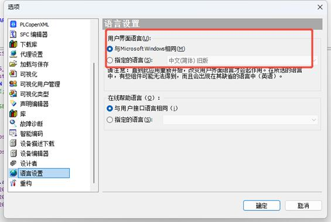

### ES002 建议：IEC 文本编辑器采用浅色主题

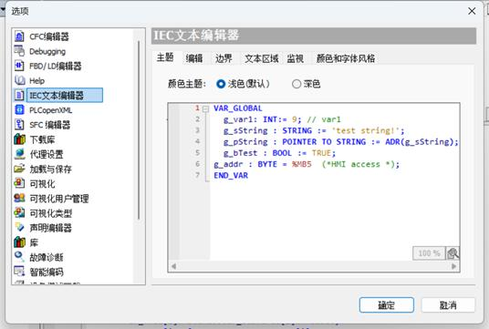

### ES003 建议：IEC 文本编辑器 TAB 字符宽度 4 字符

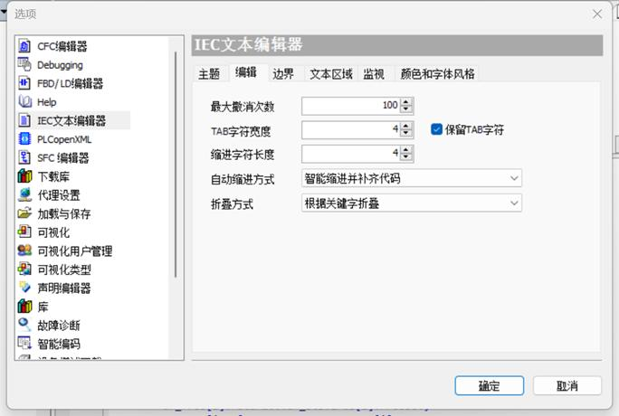

### ES004 建议：选择 Consolas 等宽字体

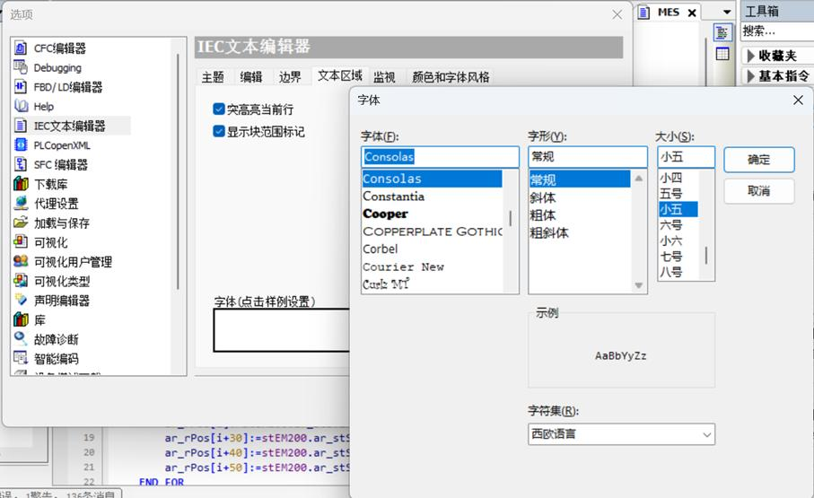

### ES005 建议：关闭自动声明

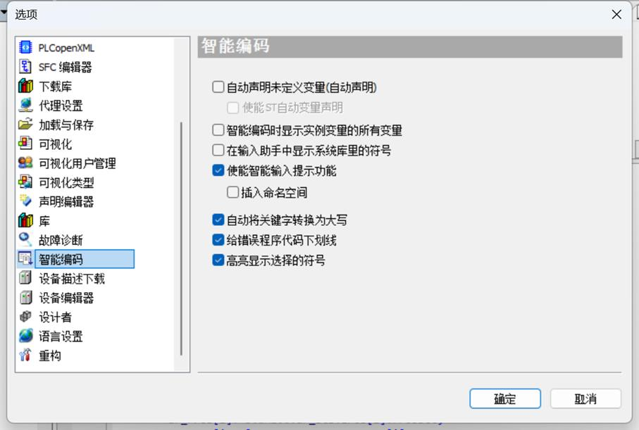

关闭自动声明的好处是：在移植一段未声明的程序段时，未规划好变量名称前，弹框不会每次弹出。

# 四、命名与格式

本章描述了命名和编写程序和注释的规则和建议。

### NF001 规则：唯一且一致的英文标识符

标识符（块、变量等）的名称必须使用英语。名称描述了标识符在源代码上下文中的含义，故特此加强了对标识符功能和用法的理解。

- 在所有函数块和 PLC 数据类型中相同的标识符需保持名称的一致性，并且应尽可能简短

- 相同功能的标识符具有相同的标识符名称，这也适用于大写字母

- 标识符名称可以由多个单词组合而成，单词的顺序必须与口语中的顺序相同

- 函数 (FC) 和函数块 (FB) 标识符应以动词开头，例如

   “FB_Get”，“FC_Set”，“FB_Put”，

   “FB_Find”，“FB_Search”，“FB_Calc”

- 如果使用标识符给数组命名，则名称使用复数，不可数名词保持其单数形式

  （“data”， “information”，“content”，“management”）

- 静态和临时布尔变量往往是状态指示变量，在这种情况下，以 “is”，“can” 或 “has” 开头的名称最容易理解

|                                | 正确命名           | 不正确命名        |
| ------------------------------ | ------------------ | ----------------- |
| 数组                           | databeltConveyors  | datasbeltConveyor |
| 静态和临时布尔变量用于表示状态 | isConnectedcanScan | connectedscan     |
| 其他布尔变量                   | enable             | setEnable         |

### NF002 规则：使用有意义的注释和属性

注释和属性字段应使用有意义的注释描述和信息，这包括：

- 块标题和块注释（同时参见 “NF003 规则：记录开发人员信息”）
- 块接口
- 网络标题与网络注释
- 块及其变量和常量
- PLC 数据类型及其变量
- PLC 变量表，PLC 变量和用户常量
- PLC 报警文本列表
- PLC 监控和报警
- 库属性

### NF003 规则：记录开发人员信息

每个块在程序代码（SCL/ST）或块注释（FBD）中包含一个块版本记录（Act00_Version），开发过程中最重要信息必须记录在案。

模板描述包含以下项目:

- 公司名称 /(C) 版权（年份）版权所有
- 项目名称
- 目标系统 - 带固件版本的 PLC（例如，AM320-0808TN 1.3.0.13)
- 工程环境 – InoProshop (V1.8.1.3)
- 使用限制
- 要求（如附加硬件）
- （可选）其他信息
- （可选）包含版本、日期、作者和修改说明的修改日志（对于安全块则包含安全签名）

FB或FC块标题的模版

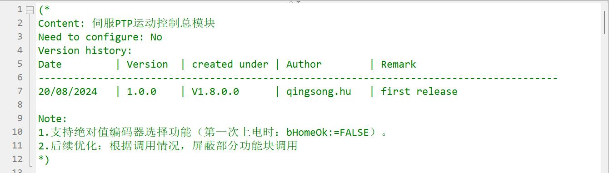

### NF004 规则：遵守库的前缀和结构

库的标识符具有前缀标识符 “L”

暂时还没用到自建库。

### NF005 规则：使用帕斯卡（PascalCasing）命名法

对象的标识符，例如:

- 功能块
- 软件单元，工艺对象，库，项目
- PLC 变量表
- PLC 数据类型
- 结构（“STRUCT”）
- PLC 报警文本列表
- 监控与强制表
- 轨迹和测量

都使用帕斯卡命名法编写。

帕斯卡命名使用以下规则：

- 第一个字符是大写字母
- 如果一个标识符是由多个单词组成的，那么每个单词的第一个字符是大写字母
- 对于单一概念的标识符的命名不使用分隔符（例如连字符或下划线）；为保证结构化和专业化，允许使用少量下划线（但不超过三个）

### NF006 规则：对代码元素使用驼峰命名规则 camelCasing

代码元素的标识符，如

- 变量
- PLC 变量
- 参数

都是使用驼峰规则。

驼峰规则使用以下规则:

- 第一个字符是非大写（小写）字母
- 如果一个标识符是由多个单词组成的，则后面单词的第一个字符大写
- 不允许使用分隔符（如连字符或下划线）进行分隔

例如：studentName、doSomething

### NF007 规则：使用前缀

- 变量按数据类型划分

| 前缀 | 类型        | 示例          |
| ---- | ----------- | ------------- |
| b    | BOOL        | bStart        |
| bt   | BYTE        | byData        |
| w    | WORD        | wError        |
| dw   | DWORD       | dwError       |
| i    | INT         | iState        |
| di   | DINT        | diStep        |
| ui   | UINT        | uiCountNumber |
| r    | REAL、LREAL | rPosition     |
| t    | TIME        | tDelayTime    |
| str  | STRING      | strBoat       |

| 结构体数据类型命名 | 前缀  |
| ------------------ | ----- |
| 结构体数据类型     | ST_   |
| 枚举结构体         | ENUM_ |
| FB 功能块          | FB_   |
| FC 功能块          | F_    |

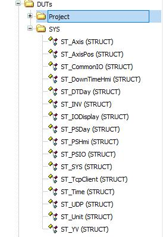

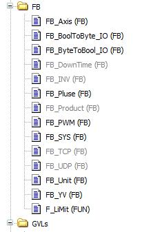

### NF008 规则：用大写字母表示常量标识符

常量（全局和局部常量）的名称完全用大写字母，为了区分和识别单个单词或缩写应该在单词或缩写中间添加下划线。

“TRUE” 和 “FALSE” 也是常量

枚举元素也是常数

### NF009 规则：限制标识符的字符集

对于所有对象和代码标识符，只使用拉丁字母（a-z，A-Z）和阿拉伯数字（0-9）以及下划线 “_”。

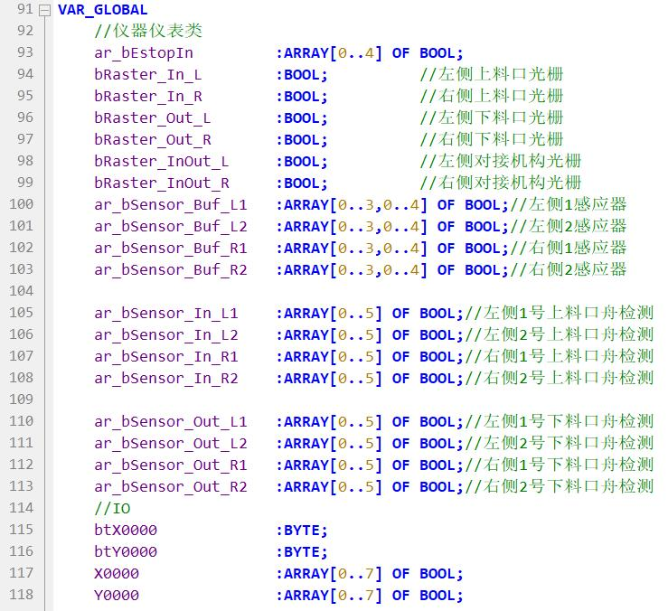

### NF010 建议：限制标识符的长度

标识符的总长度，包括前缀、后缀或库标识符，不得超过 24 个字符，结构体嵌套层数尽量小于等于三层。

说明：因为结构中的变量名是由许多标识符组成，所以代码位置处标识符的长度经常都会过长。

### NF011 建议：每个标识符仅使用一个缩写

为了实现最佳可读性，多个缩写不得连续使用。为了减少标识符中使用的字符量。

| 缩写 | 名称           |
| ---- | -------------- |
| Min  | Minimum        |
| Max  | Maximum        |
| Prev | Previous value |
| Avg  | Average        |
| Sum  | Total sum      |
| Ctrl | Control        |
| Pos  | Position       |
| R    | Rising edge    |
| F    | Falling edge   |
| Sim  | Simulated      |
| Diff | Difference     |
| Cnt  | Count          |
| Len  | Length         |
| Addr | Address        |
| Cmd  | Command        |
| Old  | Old value      |

### NF012 建议：使用 IF TRUE THEN ... END_IF 有意义的折叠代码

### NF013 规则：有意义地格式化 ST 代码

#### 使用行注释 “//”

有两种不同类型的注释:

- 块注释 “(*…*)”，用于描述一个函数或一个代码片段
- 行注释 “//” 描述单行代码，位于代码行的末尾或前面

若为了便于调试的目的进行代码屏蔽，则此时只允许使用行注释 “//”。

#### 运行符前后的空格

在运算符的前面和后面必须使用空格。

# 五、引用对象（分配）

本章介绍了内存管理和访问的规则和建议。

### AL001 规则：基于面向对象编程

在程序中，将每个流程或功能动作等封装成 FB 块，这样在上层结构中就不需要额外实例，利于库的管理和技术的积累。

### AL002 建议：定义从 0 到常数值的数组边界

数组边界从 0 开始，以一个符号常量作为数组的上边界结束。

- 对于块内部的数组，必须在块接口的本地数据中定义常量
- 对于全局数据块和 PLC 数据类型中的数组，用作上限的常数必须在 PLC 变量表中定义
- 常量以及用于访问数组元素的索引的数据类型应使用 INT

说明：数组索引以 0 开头有几个好处：（1）某些系统指令和数学运算是基于零开始工作的，例如模函数，通过这种方式，索引可以直接用于此类函数而无需进行任何调整。（2）防止数组越界，对于初次上电为 0 的变量会对数组造成越界，除非要对变量设置初值。

### AL003 建议：将数组参数声明为数组 [*]

如果必须将数组作为输入变量传入， 建议将其作为未指定大小的数组传入。

可通过系统函数 “UPPER_BOUND 和 “LOWER_BOUND” 可以确定大小和限值。

**示例:**

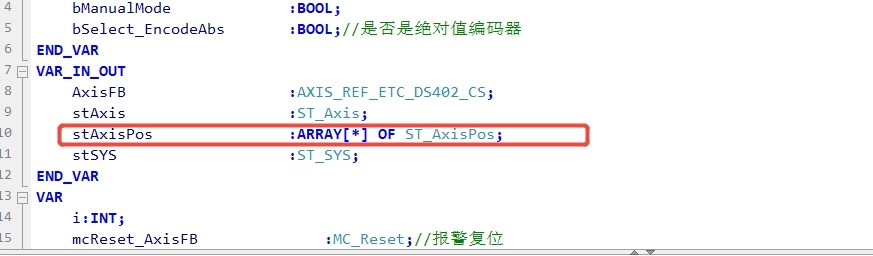

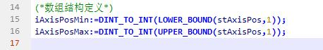

说明：这样做可以创建泛型程序结构。特别是在专有技术保护的块中，由于块接口中没有显式声明大小，因此不需要重新编译

### AL004 建议：指定所需的字符串长度

“String” 和 “WString” 总是保留存储 254 个字符所需的内存。 一个 “String” 最多可以包含 254 个字符，一个 “WString” 最多可以包含 16382 个字符。 建议使用符号常量将字符串限制在所需要的长度。

说明：此过程可防止系统分配过多的内存。此外，当传入每个形参赋值的字符串时，它还提供了性能优势。

### AL005 规定：FB 功能块内部不使用全局变量

创建 FB 功能块时，将程序中需要用到的外部变量以接口形式输入或输出或输入输出，禁止在功能块内部直接使用全局变量。

说明：使用接口的好处是可以整体替换，且对于变量的交叉引用易于方便查找。

# 六、可重用性

### RU001 规则：使用库进行版本控制

#### 版本号说明及使用

- 第一个发布的版本总是从 1.0.0 开始（见下表）。
- 第一个数字为最左边的数字。
- 软件版本号中的第三个数字的更改对功能或文档不受影响，例如错误修复。
- 若对库中的功能进行扩展，第二个数字将递增，第三个数字将重置。
- 对于新重大版本，如包含新功能或对以前版本不兼容的更改，增加第一个数字并重置第二个和第三个数字。

每个数字的范围在 0 到 99 之间。例：

| Library | FB1  | FB2  | 注释       |
| ------- | ---- | ---- | ---------- |
| 1.0.0   |      |      | 新版本发布 |
| 1.0.1   |      |      | 错误修复   |
| 1.0.2   |      |      | 功能优化   |
| 1.1.0   |      |      | 功能扩展   |
| 1.2.0   |      |      | 功能扩展   |
| 2.0.0   |      |      | 新功能     |

# 附：

PLC 示例程序

[程序框架.project](https://drive.weixin.qq.com/s?k=AJMABQdxAA8EyWnxC1)

HMI 示例程序

[石墨舟缓存1220](https://drive.weixin.qq.com/s?k=AJMABQdxAA8rmhdjSk)

功能块引脚介绍：
**系统类：**

FB_SYS: 

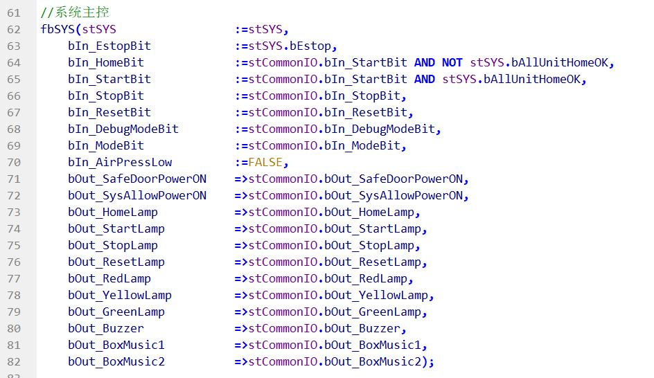

ST_CommonIO：

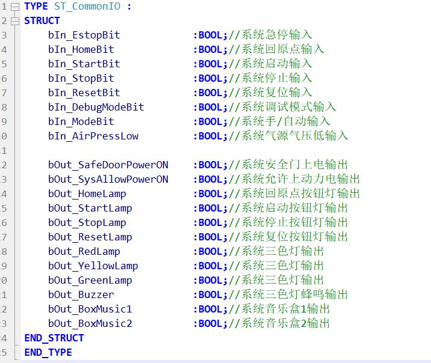

ST_SYS：

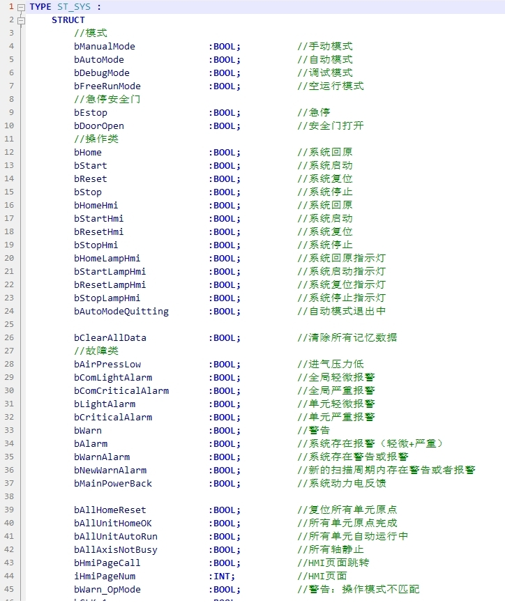

系统功能块与通用 io 配合使用，系统功能块主要是启动、停止、模式切换、安全、气压等信号采集，通过采集信号输出系统当前系统状态和按钮灯，三色灯等等显示性信息，通过 io 和系统程序获取系统内各个单元的信息，如下图示例：

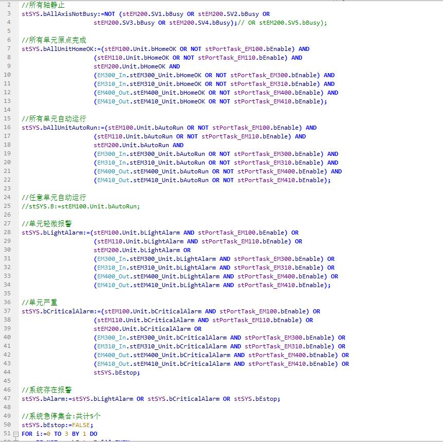

### 单元类：

在 PACKML 架构中，单元是构成设备的基本模块。它可以是一个独立的设备，如清洗机、镀膜机、缓存站等，也可以是一组协同工作的设备组件，如提升机构、对接机构、某个对接口等。这些单元是进行设备操作的最小可管理实体，它们通过标准的接口和通信协议与其他单元或控制系统进行交互。单元间交互参考下图 ST_Signal

FB_Unit：

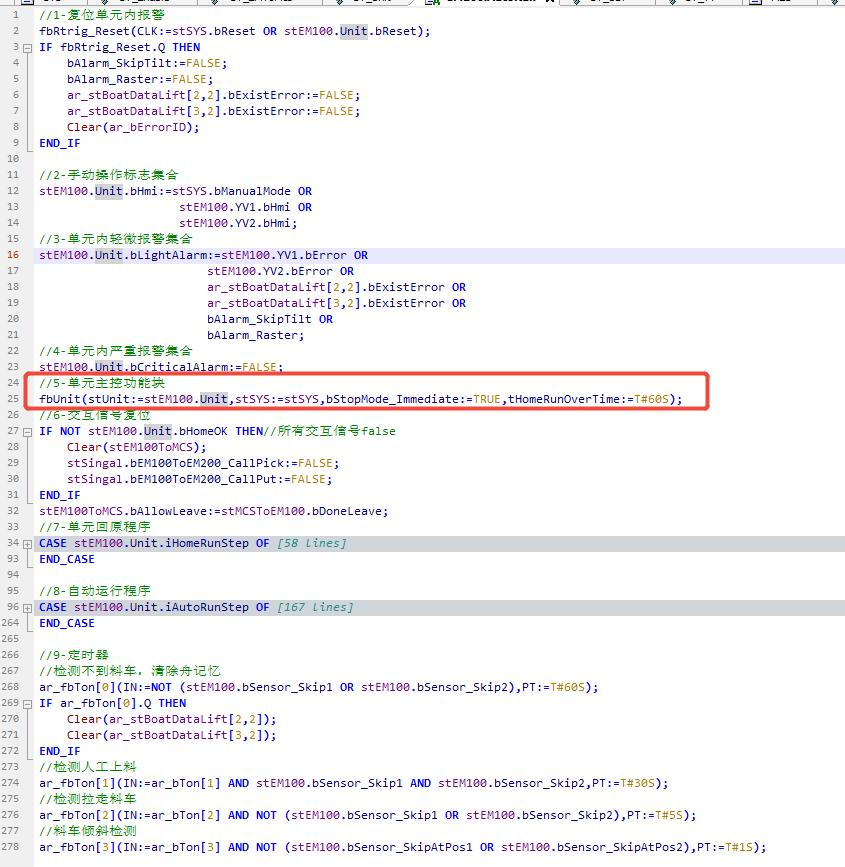

ST_Unit：

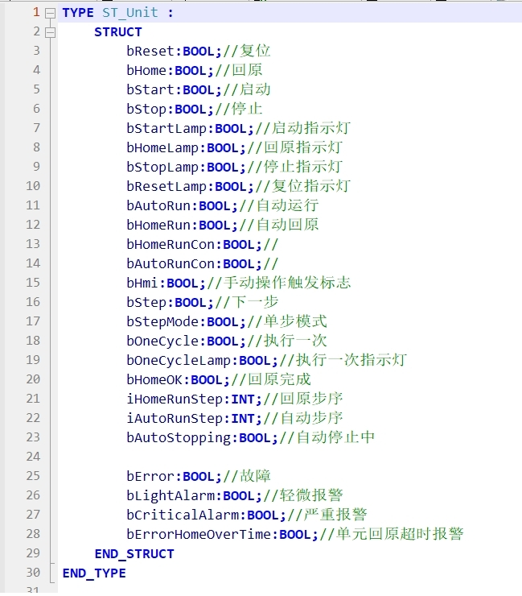

ST_Signal：

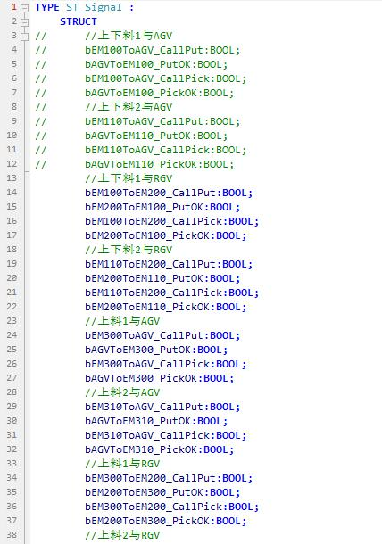

整个系统内包含多个单元，各个单元的主控模块，负责单个单元的启动停止报警等信息采集与控制；单元内包含基础的控制逻辑和运行流程，控制单元内执行器的动作以完成设备功能；如伺服，气缸，传感器等。

ST_Axis：

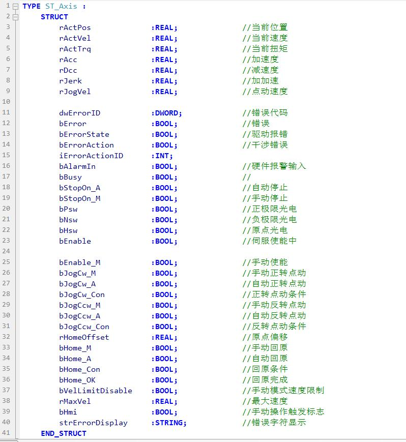

ST_AxisPos：

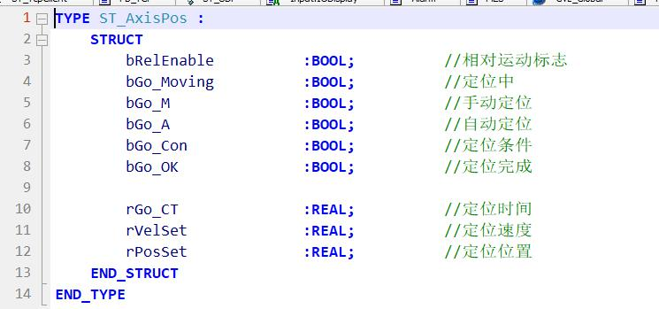

ST_YV:

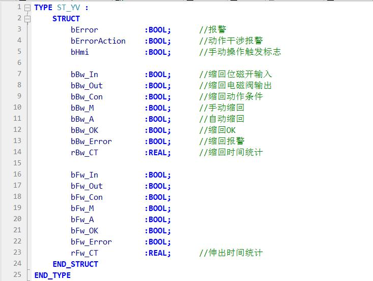

### 单元示例：EM100

创建一个单元的数据类型，包含最小单元内所有感应器，执行器等

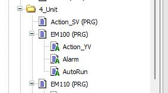

OK 在这些框架创建完成之后就可以开始各位的表演了

HMI相关：这里截取一部分说明。

详细介绍可以参考另外一篇文章：[石墨舟缓存使用手册](https://doc.weixin.qq.com/doc/w3_Ad8A7QZdAK4Fb47ER1BS8Sojows07?scode=AJMABQdxAA80bMoUP3Ad8A7QZdAK4)

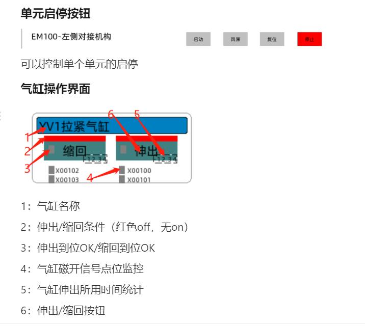

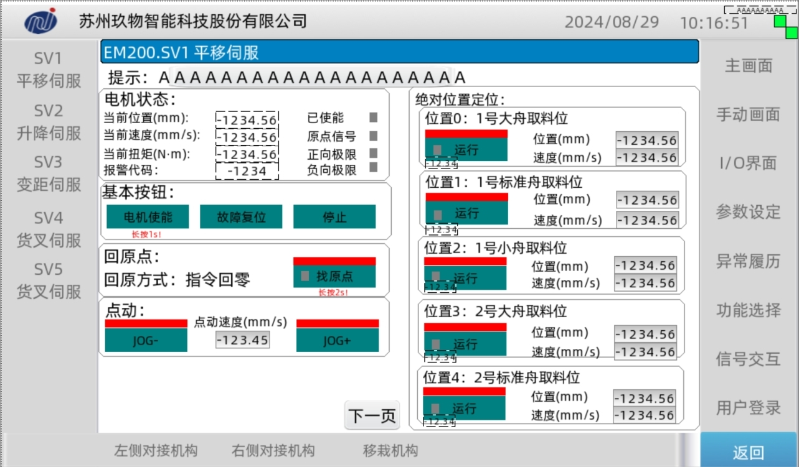

PS：标准都是人定的，本文内容仅供大家参考