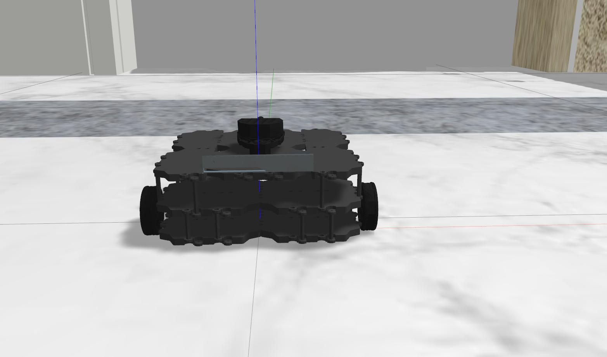

# 1.标题
#数量决定标题等级，最多可以支持到六级。#和标题内容之间需要有空格
#这是一级标题
##这是二级标题  
###这是三级标题  
####这是四级标题  
#####这是五级标题  
######这是六级标题  
# 2.换行
在Markdown里你不能直接换行，需要现在上一段文字后面加两个空格再回车才能换行。  
或者你可以直接按两次回车，但是这样的换行更类似于换段落，两端文字之间的行间距也会更大一点。
# 3.文本
***
三个星号可以产生一条分割线  
*这是斜体*  
**这是加粗**  
***这是斜体加加粗***  
这文本前后各加两个波浪线，能表示删除，如~~1111111111111111111~~
111  
* 一个星号可以产生一个圆点  
# 4.无序列表
* 星号可以  
- 减号也可以  
+ 加号也可以  
# 5.有序列表
1.第一项  
2.第二项  
* 2.1 第三项  
# 6.勾选框
需要注意的是勾选框的中括号需要用英文的，同时前面需要加上列表的符号，中括号之间需要输入空格或x分别表示未勾选和已勾选。  
* [ ] 勾选框
* [x] 勾选框1  
# 7.代码块
```
#include "JParams.h"
#include "JTransform.h"
#include "JRobot.h"
#include "JFault.h"
#include "JSafeModel.h"
#include "JRobotModel.h"
#include "JRobotSteer.h"
#include "JInfoArea.h"
```
```C++
#include "JParams.h"
#include "JTransform.h"
#include "JRobot.h"
#include "JFault.h"
#include "JSafeModel.h"
#include "JRobotModel.h"
#include "JRobotSteer.h"
#include "JInfoArea.h"
```
# 8.引用
> 概率论与数理统计
> > matlab
> > > ```
> > > 概率机器人
> > > ```
# 9.插入网页连接
可以直接把网址复制过来，但是不够美观，我们使用第二种方式。  
[ubuntu地址](https://ubuntu.com/)  
学习markdown，点击[这里](https://ubuntu.com/)  
# 10.插入图片
第一种是插入网络图片  
  
第二种是插入本地图片  
  
设置图片大小  
  
  
设置图片位置  
<center class ='img'>

</center>  

# 11.插入表格
在Markdown中也支持创建一个表格，使得数据的展示更加整齐有序。  
左对齐  
|序号|大小|
|:---|:---|
|1|30|

右对齐
|序号|大小|
|---:|---:|
|1|30|

居中对齐
|序号|大小|
|:---:|:---:|
|1|30|
# 12.注脚
front_laser_link[^1]，back_laser_link[^2]。  
[^1]前激光坐标系。  
[^2]后激光坐标系。  
# 13.HTML标签
我们也可以在Markdown文本中使用部分受支持的HTML标签，让文档内容更加个性化。  