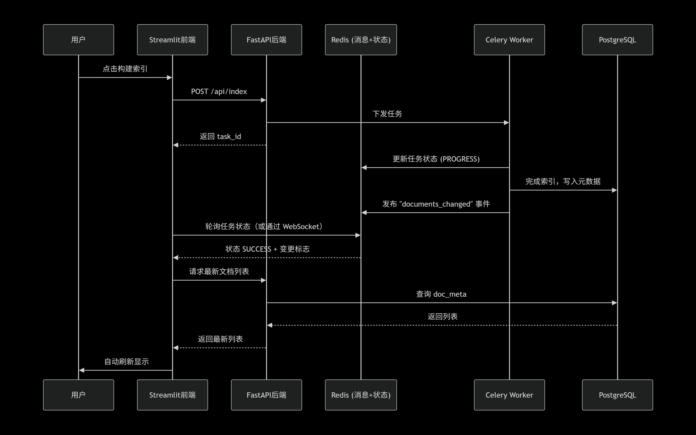

# **BrianRAG**
## 项目开发者：Brian
（以下是作者本人，不接受反驳）

https://img.shields.io/badge/python-3.10%252B-blue

https://img.shields.io/badge/License-Apache%25202.0-green.svg

https://img.shields.io/badge/Streamlit-1.30+-red

https://img.shields.io/badge/LangGraph-0.2.0+-orange

BrianRAG 是一个功能完备、可扩展的企业级本地知识库问答系统。它基于 RAG（检索增强生成） 架构，支持多格式文档、混合检索、知识图谱、多模态智能体、自我修正、异步索引、用户反馈闭环以及超参数自动调优等高级特性。所有处理均在本地完成，确保数据隐私与安全。

## 🔗 GitHub 仓库 | 📖 在线文档 | 🐛 问题反馈

#### ✨ 核心特性

📄 多格式文档支持：txt, pdf, md, docx, html, csv, 图片（jpg, png等）……

🔍 混合检索：BM25 关键词 + FAISS 向量检索，可调节权重 α

📊 知识图谱增强：自动提取实体关系，支持多跳推理与实体规范化

🖼️ 多模态理解：图文混合问答，支持表格/图表解析（Qwen2.5-VL）

🤖 智能体模式：基于 LangGraph 的自主决策与工具调用

🔄 自我修正：答案质量自评，低分时自动改写查询并重试

⚡ 异步索引：后台构建索引，前端不阻塞，实时进度条

👥 用户反馈闭环：👍/👎 按钮 + 评语，记录到 feedback.jsonl

🎛️ 超参数自动调优：基于 RAGAS 评估的离线参数搜索

🧩 语义缓存：相同问题秒级响应

🎨 可视化知识图谱：交互式实体关系图（pyvis）

🧪 可观测性：节点耗时日志、性能埋点、Prometheus 指标（可选）

🐳 数据库 PostgreSQL + pgvector（生产就绪）

🎨  FastAPI + Celery + Redis 

🧪 无状态检索器（每次检索实时同步数据库）,结构化元数据增强,查询意图识别与动态权重调整

🎛️ 完整的降级与容错机制,持久化与恢复,高级检索调试能力

🚀 快速开始

1️⃣ 环境要求
Python 3.10 – 3.11（推荐 3.10）

至少 16GB 内存（建议 32GB）

NVIDIA GPU（可选，推荐 8GB 以上显存）

Ollama 已安装并运行（用于本地模型）

2️⃣ 安装 bash
# 克隆仓库
git clone https://github.com/your-org/brianrag.git
cd brianrag

# 创建虚拟环境
python -m venv venv
source venv/bin/activate        # Linux/macOS
venv\Scripts\activate           # Windows

# 安装依赖
pip install -r requirements.txt

3️⃣ 下载基础模型

bash
ollama pull bge-m3:latest               # 嵌入模型

ollama pull qwen2.5:7b                  # LLM（主对话）

ollama pull qwen2.5-vl:7b               # 视觉模型（多模态）

ollama pull qwen2.5:3b                  # 三元组提取（轻量）

ollama pull qwen2.5:1.5b                # 检索语义，公式等（轻量模型）

以上模型为本地模型，建议外接模型，首先推荐deepseek R1 671b或者GPT模型最好

如果磁盘空间有限，可使用 qwen2.5:3b 作为 LLM 降级方案。

4️⃣ 配置

复制 config.example.py 为 config.py，根据实际修改模型路径、端口等。

关键配置项：python

# 检索
TOP_K = 5

ALPHA = 0.5

SCORE_THRESHOLD = 0.3

# 模型
EMBEDDING_MODEL = "bge-m3:latest"

LLM_MODEL = "qwen2.5:7b"

VISION_MODEL = "qwen2.5-vl:7b"

TRIPLE_EXTRACT_MODEL = "qwen2.5:3b"

# 图谱
ENABLE_GRAPH = True

GRAPH_HOPS = 1

ENABLE_ENTITY_NORMALIZATION = True

# 多模态智能体
ENABLE_MULTIMODAL = True

# 意图识别权重配置

INTENT_WEIGHT_FORMULA = 1.2

INTENT_WEIGHT_DEFINITION = 1.2

INTENT_WEIGHT_PROCEDURE = 1.2

# 上下文扩展配置

CONTEXT_EXPANSION_BEFORE = 1  

CONTEXT_EXPANSION_AFTER = 1  

## 其他参数见config_example副本

5️⃣ 启动 WebUI
bash
streamlit run webui/app.py
浏览器打开 http://localhost:8501。

6️⃣ 第一个问答
侧边栏 → 上传文档（支持拖拽多文件）

点击「构建索引」

等待处理完成（进度条实时显示）

下方输入问题 → 得到答案

📚 功能详解
文档上传与索引
支持格式：.txt, .pdf, .md, .docx, .html, .csv, .jpg, .png, .gif, .bmp

增量索引：勾选后仅处理新文件，避免全量重建

异步处理：后台线程执行，界面不卡顿

索引持久化：重启无需重建，索引目录 ./index

混合检索
BM25：关键词匹配（jieba 中文分词）

FAISS：向量相似度搜索（bge‑m3 生成 1024 维向量）

融合权重：alpha 控制 BM25 占比，1-alpha 为向量占比

相似度阈值：低于 score_threshold 的结果被过滤

知识图谱增强
实体关系抽取：调用轻量 LLM 提取三元组 (实体1, 关系, 实体2)

图存储：使用 NetworkX + pickle 持久化

多跳推理：GRAPH_HOPS 控制检索时扩展邻居跳数

实体规范化：启用 Splink 或相似度合并，消除同义词

可视化：pyvis 导出交互式 HTML，在“知识图谱”标签页查看

多模态智能体
基于 LangGraph 构建的多节点工作流：

问题分类：判断是纯文本还是图文/表格查询

路径路由：

纯文本 → 快速检索 + 生成

图文/表格 → 视觉处理器（图片描述 + 表格解析）

视觉处理：

图片 → 调用 Qwen2.5-VL 生成中文描述

Markdown 表格 → 提取为 DataFrame，转为自然语言

生成：混合上下文 + 原始答案生成

自我修正 (Self-Correction)
启用后，每次生成答案后调用评估模型打分（0~1）

若得分低于 SELF_CORRECTION_SCORE_THRESHOLD，自动改写查询并重复检索/生成

最大重试次数 SELF_CORRECTION_MAX_RETRIES

用户反馈与自动调优
反馈收集：每条答案下方 👍/👎 按钮，可填写评论，保存到 feedback.jsonl

参数调优：点击侧边栏「参数自动调优 (基于反馈)」→ 基于历史负面反馈或标准测试集，使用 RAGAS 评估所有参数组合，更新最优参数至 config.py

可观测性
日志：logs/brianrag.log，记录每个节点耗时、查询结果等

耗时装饰器：@timeit 自动记录函数执行时间

Prometheus 指标（可选）：/metrics 端点

图谱可视化
在「知识图谱」标签页，点击「生成并预览图谱」→ 下载 HTML 文件

支持交互式缩放、拖动、搜索节点

⚙️ 配置参考
完整配置见 config.py，以下为常用项说明：

配置项	默认值	说明
TOP_K	5	检索返回的文本块数量

ALPHA	0.5	BM25 权重（0~1）

SCORE_THRESHOLD	0.3	相似度过滤阈值

EMBEDDING_MODEL	bge-m3:latest	嵌入模型（Ollama）

LLM_MODEL	qwen2.5:7b	生成模型

VISION_MODEL	qwen2.5-vl:7b	视觉描述模型

TRIPLE_EXTRACT_MODEL	qwen2.5:3b	三元组提取轻量模型

ENABLE_GRAPH	True	启用知识图谱

ENABLE_MULTIMODAL	True	启用多模态智能体

ENABLE_SELF_CORRECTION	True	启用自我修正

ENABLE_RERANK	True	启用重排序（需要下载 reranker 模型）

RERANK_MODEL	D:/reranker/bge-reranker-v2-m3	本地重排序模型路径

GRAPH_HOPS	1	图谱多跳次数

ENABLE_ENTITY_NORMALIZATION	True	实体自动合并

🧱 项目结构

# 

##### 🧪 测试与调优

###### 运行单元测试（若有）

bash pytest tests/

###### 超参数自动调优

bash python tune_parameters.py

脚本会遍历预定义的参数网格，使用 RAGAS 评估每组参数的综合得分，并自动更新 config.py。

###### 评估数据集格式

evaluation/test_data.jsonl 每行一个 JSON 对象：

json {"question": "What is RAG?", "ground_truth": "Retrieval-Augmented Generation combines information retrieval and text generation."}

##### 🐳 Docker 部署（生产推荐） 构建镜像：

bash docker build -t brianrag:latest .

运行容器：

bash docker run -p 8501:8501 -v ./data:/app/data -v ./index:/app/index -v ./logs:/app/logs brianrag:latest
确保在 Docker 中 Ollama 服务可访问（可通过 host 网络或 --add-host host.docker.internal:host-gateway 连接宿主机 Ollama）。

🤝 贡献指南
欢迎提交 Issue 和 Pull Request。

Fork 本仓库

创建功能分支 (git checkout -b feature/amazing)

提交更改 (git commit -m 'Add amazing feature')

推送到分支 (git push origin feature/amazing)

创建 Pull Request

#### 📄 许可证 本项目自研代码部分使用 Apache 2.0 许可证，依赖的第三方库遵循其各自协议。

🙏 致谢
LangChain – 文档加载器、提示词模板

LangGraph – 智能体工作流

FAISS – 向量检索

Ollama – 本地模型部署

Qwen – 基础模型系列

RAGAS – 评估框架

Streamlit – WebUI 框架

📧 联系方式
项目负责人：Brian

问题反馈：GitHub Issues

BrianRAG
