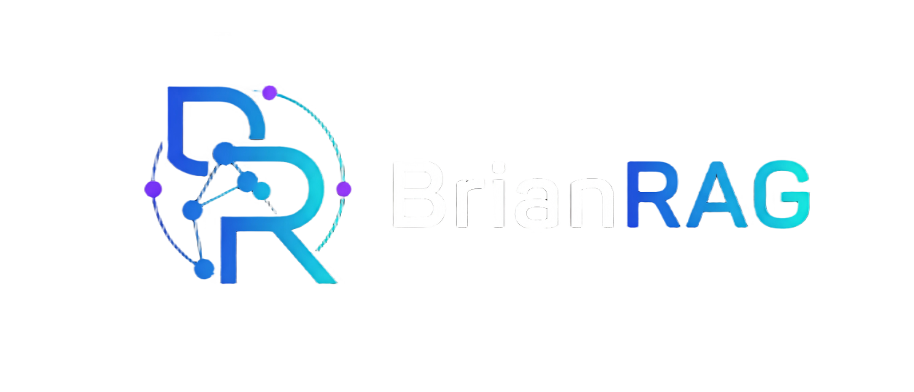

# BrianRAG

**Enterprise Knowledge Engine** — 本地优先、功能完备的 RAG 知识库问答系统。

[](https://www.python.org/)
[](https://www.apache.org/licenses/LICENSE-2.0)
[](https://fastapi.tiangolo.com/)
[](https://ollama.com/)
[](https://github.com/prodafe/BrianRAG/actions/workflows/ci.yml)
[](https://github.com/prodafe/BrianRAG)
[](https://github.com/prodafe/BrianRAG/releases)
[](https://github.com/astral-sh/ruff)

<p align="center">
  
</p>

混合检索（BM25 + 向量 + 知识图谱 RRF）· GraphRAG 社区摘要 · ReAct Agent 循环 · 多 Agent 协作（Planner/Retriever/Critic/ReAct）· 可视化工作流引擎 · Memory 系统 · 父子分块 · 30 文档格式 · 深度文档解析引擎 · PDF 版式分析 + 表格提取 · VLM 图片理解 · 12 Agent 工具 · PWA 离线 · i18n 中英双语 · 独立管理后台 · 暗黑模式切换 · RAGAS 自动化评估 · 全部本地运行。

---

## 快速开始

### 环境要求

- Python 3.10+
- PostgreSQL 15+ with pgvector
- Redis（可选，用于缓存）
- [Ollama](https://ollama.com/) 已安装并运行

### 1. 克隆并安装

```bash
git clone https://github.com/your-org/brianrag.git
cd brianrag
python -m venv .venv
source .venv/bin/activate   # Linux/macOS
.venv\Scripts\activate      # Windows
pip install -r requirements.txt
```

### 2. 下载模型

```bash
ollama pull bge-m3:latest          # 嵌入模型（1024维）
ollama pull qwen2.5:7b             # 主 LLM
ollama pull qwen2.5:3b             # 三元组提取 / 评估（轻量）
ollama pull qwen2.5:1.5b           # 意图分类 / 评估器（更轻量）
ollama pull qwen2.5-vl:7b          # 视觉模型（多模态，可选）
```

### 3. 配置

```bash
cp config_example.py config.py
# 编辑 config.py 修改数据库连接、模型名称等
```

关键配置：

| 配置项 | 默认值 | 说明 |
|--------|--------|------|
| `LLM_PROVIDER` | `ollama` | 可选 `openai` / `anthropic` |
| `LLM_MODEL` | `qwen2.5:7b` | 主对话模型 |
| `EMBEDDING_MODEL` | `bge-m3:latest` | 嵌入模型 |
| `TOP_K` | 5 | 检索返回数量 |
| `ALPHA` | 0.5 | BM25 融合权重 |
| `ENABLE_PREWARM` | True | 预训练缓存 |
| `ENABLE_RETRIEVAL_GATING` | True | 检索质量门控 |

### 4. 启动

```bash
# 先启动 Redis（可选，用于缓存和预训练）
# D:\redis\redis-server.exe

python run.py
# 浏览器打开 http://localhost:8000
```

前端提供沉浸式 Three.js 着陆页（8 个滚动叙事场景）→ 点击「进入 BrianRAG」打开 RAG 对话面板。

---

## 核心特性

### 混合检索

- **BM25** 关键词匹配（jieba 分词）
- **pgvector HNSW** 向量检索（bge-m3 嵌入，1024 维）
- **知识图谱 RRF** 三路融合
- **BGE Cross-encoder 重排序**
- **MMR 去重**保证结果多样性

### 智能体编排

- **ReAct Agent** 自主规划检索策略（Thought → Action → Observation 循环）
- **12 个内置工具**：calc/time/unit/search/code/api/file_read/wiki/scrape/sql/translate/json
- **并行工具执行** + 自动错误重试
- **LangGraph 多步推理**：检索→重排→生成→评估→改写
- **查询优化**：HyDE 假设文档 + 多查询融合（单次 LLM 调用完成）

### 多模态理解

- CLIP 视觉语义匹配
- Qwen2.5-VL 图片描述 + 表格提取
- Markdown 图片自动渲染

### 自我修正 & 降级

- 答案质量自评（0~1 分），低分自动重试
- **检索门控**：reranker 分 < 阈值时触发降级（放宽检索 → HyDE → 知识缺口响应）
- 优雅降级：CLIP 缺失 → 回退普通检索；模型不可用 → 友好提示

### 预训练缓存（Prewarm）

- 从已索引文档自动生成 QA 对
- 预计算答案存入 Redis(db=3) + 嵌入向量
- 用户查询时相似度匹配秒回（阈值 0.72）
- 启动时自动注册，支持手动触发

### 模型层可插拔

切换模型只需改 `config.py` 一行：

```python
LLM_PROVIDER = "ollama"  # 或 "openai" / "anthropic"
```

所有 LLM/Embedding 调用通过统一抽象层，无需改业务代码。

### GitHub 数据源

- `git clone` + 定时 `pull` + 文件 diff 检测
- 变更自动触发增量索引
- API：`POST /api/github/clone`、`POST /api/github/sync`、`GET /api/github/status`

### RAGAS 评估回路

- 独立评估模型（qwen2.5:1.5b）计算 Faithfulness + Answer Relevancy
- API：`POST /api/eval`、`GET /api/eval/results`、`GET /api/eval/status`
- 参数网格自动调优（`tune_parameters.py`）

### 文档解析

- **PDF 版式分析器**：多栏检测、阅读顺序排序、表格结构保留、标题层级识别、图片提取
- **深度文档解析引擎**：标题层级保留(H1-H6)、列表/公式/代码块/水平线全保留
- **表格语义提取**：列名 + 统计摘要(min/max/avg/median) + 行列数 + 列类型
- **Excel/CSV 多 sheet 解析**：保留 sheet 名称、列类型、数据采样
- **OCR 双引擎**：PaddleOCR + Tesseract，自动检测扫描件 PDF 并提取文字
- **图片 AI 描述**：Ollama vision 自动生成图片 caption 嵌入 chunk
- **电子邮件解析**：.eml 格式完整支持（发件人/主题/正文/HTML）
- 按 `##`/`###` 章节智能切分 + 语义分块（bge-m3 相似度检测话题边界）
- **Loader 插件注册表**：`@register_loader(['.xyz'])` 自定义解析器
- 支持 30 种格式：`.pdf` `.md` `.docx` `.html` `.csv` `.pptx` `.xlsx` `.eml` `.epub` `.odt` `.rtf` `.xml` `.json` `.py` `.sh` `.yml` `.toml` 等

### 多租户 & 安全

- **多租户权限系统**：租户/用户/API Key/RBAC 四级模型
- 3 种角色（admin/editor/viewer），5 种权限粒度
- 全链路 API Key 鉴权中间件
- 会话管理（Redis，7 天 TTL）

### 工具调用

- **12 个内置工具**：calc 计算器 / time 时间日期 / unit 单位换算 / search 网络搜索 / code 代码沙箱 / api HTTP调用 / file_read 文件读取 / wiki Wikipedia百科 / scrape 网页抓取 / sql 数据库查询 / translate 中英翻译 / json 格式化
- LLM 通过 `[TOOL:calc:2+3*4]` 格式调用，系统自动执行并重新生成
- 并行工具执行 + 自动错误重试 + 工具链推理
- `@register("name", "description")` 装饰器零侵入扩展

---

## 前端体验

着陆页特性：
- **Three.js 3D 粒子系统** + **GSAP 摄像机滚动引擎**（8 场景叙事）
- **marked.js + KaTeX** 完整 Markdown/公式渲染
- **Lenis 平滑滚动** + 场景进度指示点 + 键盘导航（↑↓←→）
- 响应式设计（桌面 + 移动端适配）

聊天面板特性：
- SSE 流式输出 + 分阶段加载指示（searching → generating）
- 4 种检索模式：RAG / Agent / Graph / Multimodal
- 可切换参数面板（Top-K、Alpha、Self-Correct、HyDE、MMR）
- 文档上传（拖拽/点击）+ 异步索引（进度轮询）
- 停止生成（Esc / Stop 按钮）+ 友好错误提示
- 复制 / 重新生成 / 👍👎 反馈 / 引用弹窗 / 置信度徽章
- 搜索历史 (localStorage 持久化) / 暗黑模式一键切换
- 3 级响应式适配 (桌面→平板→手机)

---

## API 概览

| 端点 | 方法 | 说明 |
|------|------|------|
| `/api/query` | POST | 同步查询 |
| `/api/query/stream` | GET | SSE 流式查询 |
| `/api/upload` | POST | 上传文档 |
| `/api/index` | POST | 构建索引 |
| `/api/documents` | GET | 列出已索引文档 |
| `/api/documents/{hash}` | DELETE | 删除文档 |
| `/api/prewarm/status` | GET | 预训练缓存状态 |
| `/api/prewarm/run` | POST | 手动运行预训练 |
| `/api/eval` | POST | 触发 RAGAS 评估 |
| `/api/eval/results` | GET | 查看评估结果 |
| `/api/github/sync` | POST | 同步 GitHub 仓库 |
| `/api/sessions` | POST/GET | 创建/列出会话 |
| `/api/sessions/{sid}` | GET/DELETE | 查看/删除会话+历史 |
| `/api/tenants` | POST/GET | 创建/列出多租户 |
| `/api/tenants/{tid}/users` | POST/GET | 管理用户+角色 |
| `/ws/progress/{task_id}` | WebSocket | 实时索引进度推送 |
| `/api/health` | GET | 健康检查（含 Redis/PG/Ollama 连通性） |

---

## 项目结构

```
brianrag/
├── api/main.py              # FastAPI 应用（所有 REST 端点）
├── core/
│   ├── rag_pipeline.py      # RAG 管线编排
│   ├── retriever.py         # 混合检索器
│   ├── generator.py         # 答案生成器
│   ├── query_optimizer.py   # 查询优化（HyDE/多查询）
│   ├── agents.py            # LangGraph 多模态智能体
│   ├── agent_loop.py        # ReAct Agent 循环 (NEW)
│   ├── multi_agent.py       # 多 Agent 编排 (Planner/Retriever/Critic/ReAct)
│   ├── tools.py             # 工具调用系统 (12 tools)
│   ├── workflow_engine.py   # Agent 可视化工作流引擎
│   ├── memory.py            # 用户记忆系统
│   ├── graph_builder.py     # 知识图谱构建与检索
│   ├── graph_workflow.py    # LangGraph 迭代 RAG 工作流
│   ├── reranker.py          # BGE Cross-encoder 重排序
│   ├── self_correction.py   # 答案质量自评与修正
│   ├── prewarm.py           # 预训练缓存引擎
│   ├── llm_provider.py      # LLM/Embedding 可插拔抽象层
│   ├── chunking.py          # 父子分块 + Table-aware
│   ├── intent_classifier.py # 意图分类
│   ├── model_router.py      # 模型智能路由
│   ├── metrics.py           # Prometheus 指标
│   └── telemetry.py         # OpenTelemetry 追踪
├── utils/
│   ├── document_loader.py   # 文档加载 (30 种格式)
│   ├── deep_doc_parser.py   # 深度文档解析引擎 (NEW)
│   ├── layout_analyzer.py   # PDF 版式分析器
│   ├── ocr.py               # OCR 引擎 (PaddleOCR + Tesseract)
│   ├── data_connectors.py   # 20 数据源连接器
│   ├── auth.py              # 多租户 + RBAC 权限系统
│   ├── session_manager.py   # Redis 会话管理
│   ├── github_sync.py       # GitHub 仓库同步
│   └── dir_watcher.py       # 文件系统监控
├── frontend/
│   ├── index.html           # Three.js 着陆页 + 聊天面板
│   ├── admin.html           # 独立管理后台
│   ├── styles/main.css      # 暗黑主题 + 3 响应式断点
│   ├── js/app.js            # SSE 流式 + 搜索历史 + 暗黑切换
│   └── js/i18n.js           # 60 键中英双语
├── tests/                   # 172 tests, 20 测试模块
├── config.py                # pydantic-settings 配置
└── run.py                   # 启动入口
```

---

## 配置参考（完整）

<details>
<summary>点击展开 config.py 所有配置项</summary>

| 配置项 | 默认值 | 说明 |
|--------|--------|------|
| `LLM_PROVIDER` | `ollama` | LLM 后端（ollama / openai / anthropic） |
| `LLM_MODEL` | `qwen2.5:7b` | 主生成模型 |
| `LLM_API_KEY` | `""` | API Key（OpenAI/Anthropic 时使用） |
| `EMBEDDING_MODEL` | `bge-m3:latest` | 嵌入模型 |
| `RERANK_MODEL` | — | BGE Reranker 本地路径 |
| `TOP_K` | 5 | 检索 top-k |
| `ALPHA` | 0.5 | BM25 融合权重 |
| `SCORE_THRESHOLD` | 0.3 | 向量相似度阈值 |
| `CHUNK_SIZE` | 800 | 文档分块大小 |
| `ENABLE_SEMANTIC_CHUNKING` | True | 语义分块 |
| `ENABLE_GRAPH` | True | 知识图谱 |
| `ENABLE_MULTIMODAL` | True | 多模态检索 |
| `ENABLE_RERANK` | True | 重排序 |
| `ENABLE_SELF_CORRECTION` | True | 自我修正 |
| `ENABLE_CACHE` | True | 语义缓存 |
| `ENABLE_RETRIEVAL_GATING` | True | 检索质量门控 |
| `GATING_SCORE_THRESHOLD` | 0.35 | 门控触发阈值 |
| `PREWARM_SIMILARITY_THRESHOLD` | 0.72 | 预训练缓存匹配阈值 |
| `LLM_EVALUATOR_MODEL` | `qwen2.5:1.5b` | 评估模型 |
| `GITHUB_REPO_URL` | `""` | 要同步的 GitHub 仓库 URL |
| `GITHUB_SYNC_INTERVAL` | 300 | 定时同步间隔（秒） |

</details>

---

## 开源

本项目基于 **Apache 2.0** 许可证开源。

### 参与贡献

欢迎任何形式的贡献！请先阅读 [CONTRIBUTING.md](CONTRIBUTING.md)。

- 🐛 [提交 Bug](https://github.com/prodafe/BrianRAG/issues/new?template=bug_report.yml)
- 💡 [建议功能](https://github.com/prodafe/BrianRAG/issues/new?template=feature_request.yml)
- 🔀 Fork → Feature Branch → Pull Request

### 引用

如果这个项目对你的研究有帮助，请引用：

```bibtex
@software{BrianRAG,
  author = {Brian},
  title = {BrianRAG: Enterprise Knowledge Engine},
  year = {2026},
  version = {2.2.0},
  url = {https://github.com/prodafe/BrianRAG}
}
```

## 致谢

LangChain · LangGraph · Ollama · Qwen · pgvector · BGE · RAGAS · Three.js · GSAP · FastAPI
